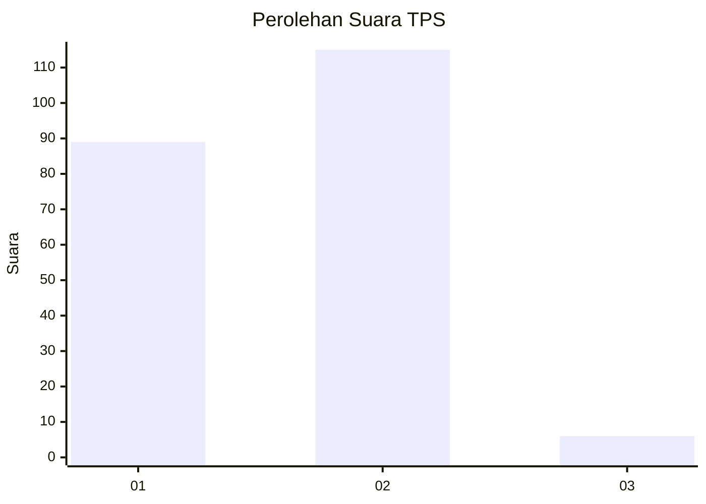
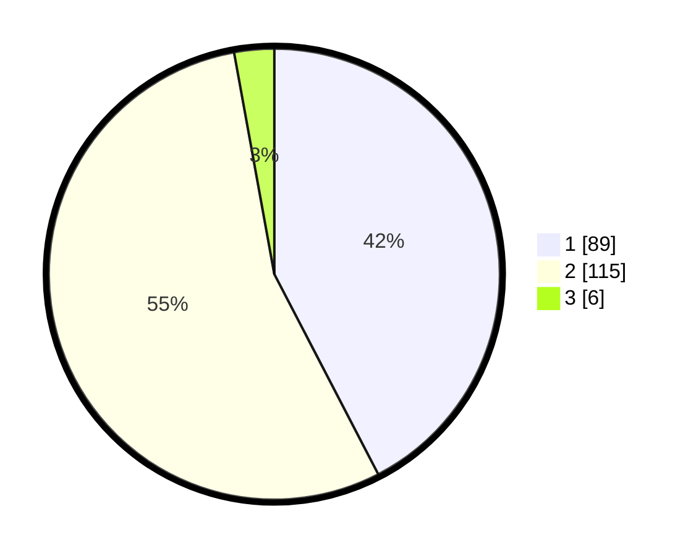

# Hasil

## Grafik

## Tabel

| No. | Nama Paslon    | Suara | Suara (raw) | Persentase |
|:--- |:-------------- | -----:| -----------:| ----------:|
| 1   | ANIES MUHAIMIN | 89    | [89][p-1]   | 42,38      |
| 2   | PRABOWO GIBRAN | 115   | [115][p-2]  | 54,76      |
| 3   | GANJAR MAHFUD  | 6     | [6][p-3]    | 2,86       |

[p-1]: https://github.com/gigit-pemilu/pemilu-2024/blob/main/pilpres/hitung-suara/sub/32-jawa-barat/sub/01-bogor/sub/24-ciawi/sub/2003-cibedug/sub/002-tps/sub/paslon-1.txt
[p-2]: https://github.com/gigit-pemilu/pemilu-2024/blob/main/pilpres/hitung-suara/sub/32-jawa-barat/sub/01-bogor/sub/24-ciawi/sub/2003-cibedug/sub/002-tps/sub/paslon-2.txt
[p-3]: https://github.com/gigit-pemilu/pemilu-2024/blob/main/pilpres/hitung-suara/sub/32-jawa-barat/sub/01-bogor/sub/24-ciawi/sub/2003-cibedug/sub/002-tps/sub/paslon-3.txt

## Foto C Plano

https://sirekap-obj-formc.kpu.go.id/98a6/pemilu/ppwp/32/01/24/20/03/3201242003002-20240215-083005--780b67f1-9fad-4d91-b1e0-ef5ec60dac1a.jpg

https://sirekap-obj-formc.kpu.go.id/98a6/pemilu/ppwp/32/01/24/20/03/3201242003002-20240214-204225--19267f9f-6ae9-44f0-9012-db455c3efd78.jpg

https://sirekap-obj-formc.kpu.go.id/98a6/pemilu/ppwp/32/01/24/20/03/3201242003002-20240214-204340--38a19dfe-2999-4c4e-98b8-4f7318e869c4.jpg

## Metadata

| Key        | Value               |
| ---------- | ------------------- |
| Time Stamp | 2024-02-15 09:00:24 |

