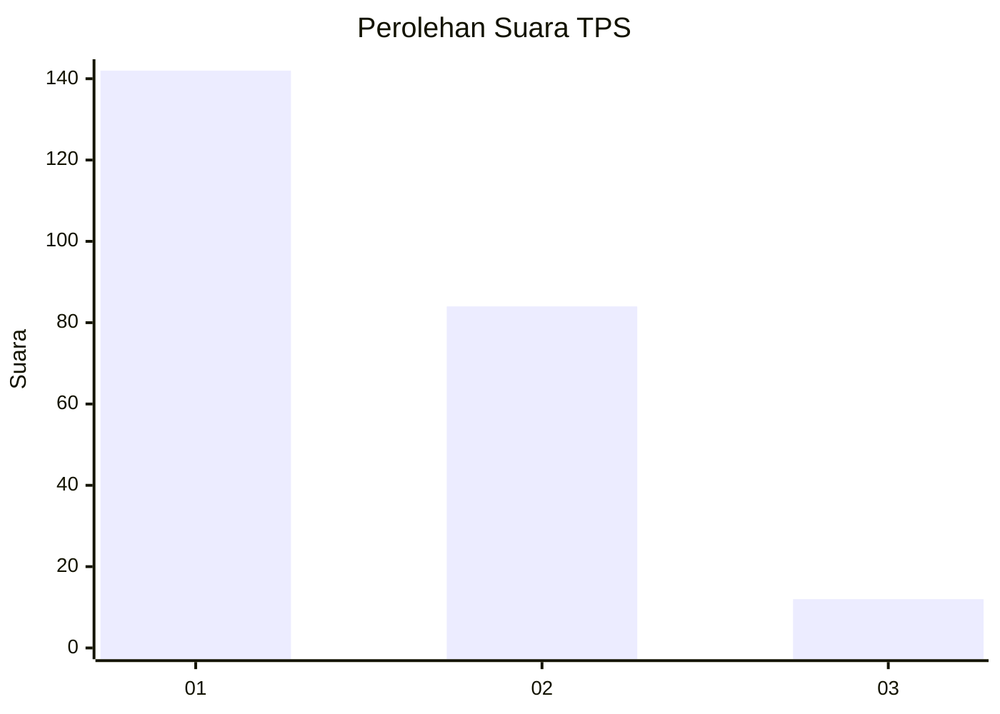
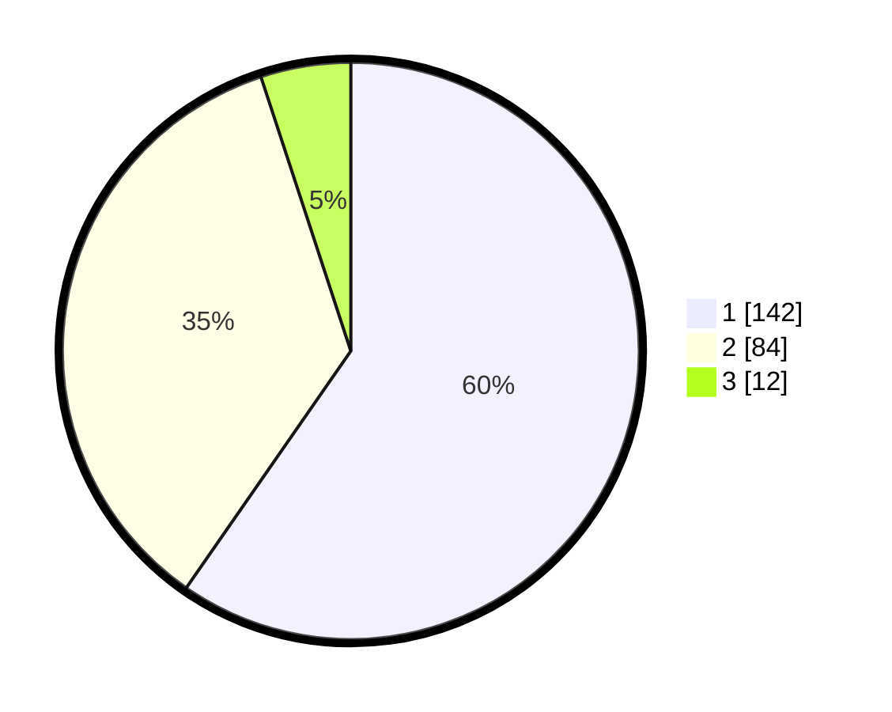

# Hasil

## Grafik

## Tabel

| No. | Nama Paslon    | Suara | Suara (raw) | Persentase |
|:--- |:-------------- | -----:| -----------:| ----------:|
| 1   | ANIES MUHAIMIN | 142   | [142][p-1]  | 59,66      |
| 2   | PRABOWO GIBRAN | 84    | [84][p-2]   | 35,29      |
| 3   | GANJAR MAHFUD  | 12    | [12][p-3]   | 5,04       |

[p-1]: https://github.com/gigit-pemilu/pemilu-2024/blob/main/pilpres/hitung-suara/sub/32-jawa-barat/sub/01-bogor/sub/24-ciawi/sub/2003-cibedug/sub/009-tps/sub/paslon-1.txt
[p-2]: https://github.com/gigit-pemilu/pemilu-2024/blob/main/pilpres/hitung-suara/sub/32-jawa-barat/sub/01-bogor/sub/24-ciawi/sub/2003-cibedug/sub/009-tps/sub/paslon-2.txt
[p-3]: https://github.com/gigit-pemilu/pemilu-2024/blob/main/pilpres/hitung-suara/sub/32-jawa-barat/sub/01-bogor/sub/24-ciawi/sub/2003-cibedug/sub/009-tps/sub/paslon-3.txt

## Foto C Plano

https://sirekap-obj-formc.kpu.go.id/f36f/pemilu/ppwp/32/01/24/20/03/3201242003009-20240215-012425--5324b5f1-992f-4bca-b2ab-7f9b5633fb35.jpg

https://sirekap-obj-formc.kpu.go.id/f36f/pemilu/ppwp/32/01/24/20/03/3201242003009-20240215-012517--12b0f892-4c3a-4888-9513-508a4e08458b.jpg

https://sirekap-obj-formc.kpu.go.id/f36f/pemilu/ppwp/32/01/24/20/03/3201242003009-20240215-012646--f40f512c-38ea-433f-b6dd-e9e25bd32ce1.jpg

## Metadata

| Key        | Value               |
| ---------- | ------------------- |
| Time Stamp | 2024-02-16 16:25:10 |

