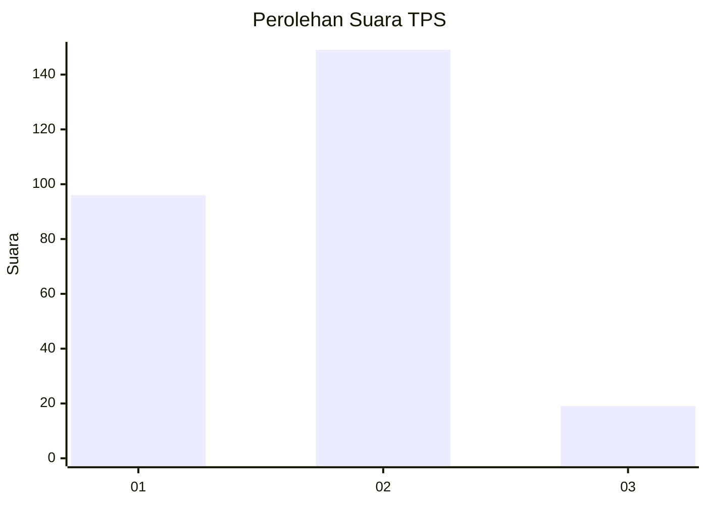

# Hasil

## Grafik

## Tabel

| No. | Nama Paslon    | Suara | Suara (raw) | Persentase |
|:--- |:-------------- | -----:| -----------:| ----------:|
| 1   | ANIES MUHAIMIN | 96    | [96][p-1]   | 36,36      |
| 2   | PRABOWO GIBRAN | 149   | [149][p-2]  | 56,44      |
| 3   | GANJAR MAHFUD  | 19    | [19][p-3]   | 7,20       |

[p-1]: https://github.com/gigit-pemilu/pemilu-2024/blob/main/pilpres/hitung-suara/sub/32-jawa-barat/sub/01-bogor/sub/24-ciawi/sub/2008-bendungan/sub/016-tps/sub/paslon-1.txt
[p-2]: https://github.com/gigit-pemilu/pemilu-2024/blob/main/pilpres/hitung-suara/sub/32-jawa-barat/sub/01-bogor/sub/24-ciawi/sub/2008-bendungan/sub/016-tps/sub/paslon-2.txt
[p-3]: https://github.com/gigit-pemilu/pemilu-2024/blob/main/pilpres/hitung-suara/sub/32-jawa-barat/sub/01-bogor/sub/24-ciawi/sub/2008-bendungan/sub/016-tps/sub/paslon-3.txt

## Foto C Plano

https://sirekap-obj-formc.kpu.go.id/e970/pemilu/ppwp/32/01/24/20/08/3201242008016-20240214-213628--2f070056-fc39-4fed-a7bf-113cbae93af0.jpg

https://sirekap-obj-formc.kpu.go.id/e970/pemilu/ppwp/32/01/24/20/08/3201242008016-20240215-174451--d15855b3-28ae-4214-95a4-a29774b3f756.jpg

https://sirekap-obj-formc.kpu.go.id/e970/pemilu/ppwp/32/01/24/20/08/3201242008016-20240214-202323--480e333c-39bf-413f-b3f1-1eb994bde149.jpg

## Metadata

| Key        | Value               |
| ---------- | ------------------- |
| Time Stamp | 2024-02-16 22:01:00 |

