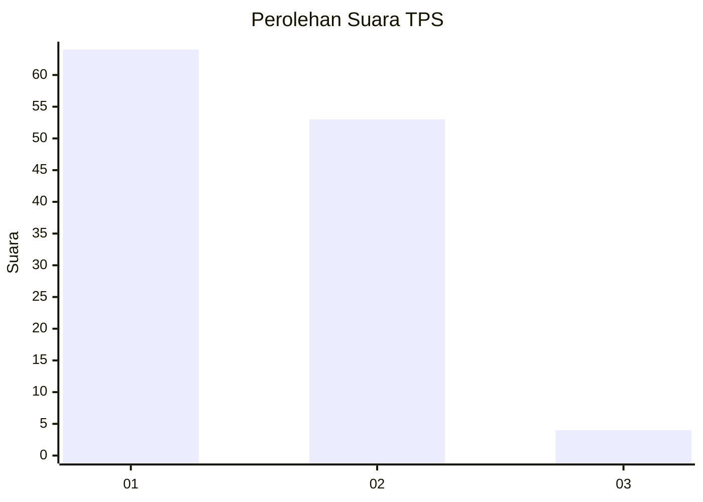
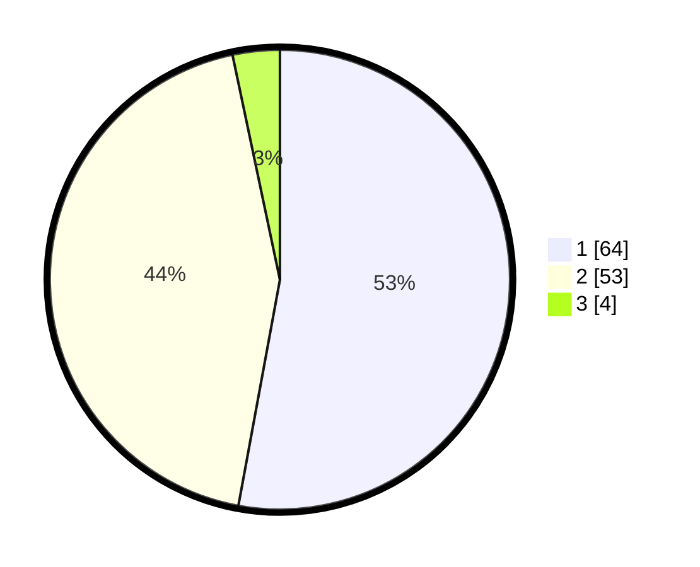

# Hasil

## Grafik

## Tabel

| No. | Nama Paslon    | Suara | Suara (raw) | Persentase |
|:--- |:-------------- | -----:| -----------:| ----------:|
| 1   | ANIES MUHAIMIN | 64    | [64][p-1]   | 52,89      |
| 2   | PRABOWO GIBRAN | 53    | [53][p-2]   | 43,80      |
| 3   | GANJAR MAHFUD  | 4     | [4][p-3]    | 3,31       |

[p-1]: https://github.com/gigit-pemilu/pemilu-2024/blob/main/pilpres/hitung-suara/sub/32-jawa-barat/sub/01-bogor/sub/24-ciawi/sub/2008-bendungan/sub/023-tps/sub/paslon-1.txt
[p-2]: https://github.com/gigit-pemilu/pemilu-2024/blob/main/pilpres/hitung-suara/sub/32-jawa-barat/sub/01-bogor/sub/24-ciawi/sub/2008-bendungan/sub/023-tps/sub/paslon-2.txt
[p-3]: https://github.com/gigit-pemilu/pemilu-2024/blob/main/pilpres/hitung-suara/sub/32-jawa-barat/sub/01-bogor/sub/24-ciawi/sub/2008-bendungan/sub/023-tps/sub/paslon-3.txt

## Foto C Plano

https://sirekap-obj-formc.kpu.go.id/2247/pemilu/ppwp/32/01/24/20/08/3201242008023-20240214-211432--3a57baf0-e42a-4fe5-b5f3-dd6f674857d2.jpg

https://sirekap-obj-formc.kpu.go.id/2247/pemilu/ppwp/32/01/24/20/08/3201242008023-20240214-211438--7dcd1968-20b3-4b31-9a39-4552fa4a8ca2.jpg

https://sirekap-obj-formc.kpu.go.id/2247/pemilu/ppwp/32/01/24/20/08/3201242008023-20240214-211443--c4d64b57-5e3b-49a3-8718-f01ca329e55d.jpg

## Metadata

| Key        | Value               |
| ---------- | ------------------- |
| Time Stamp | 2024-02-16 16:25:10 |

