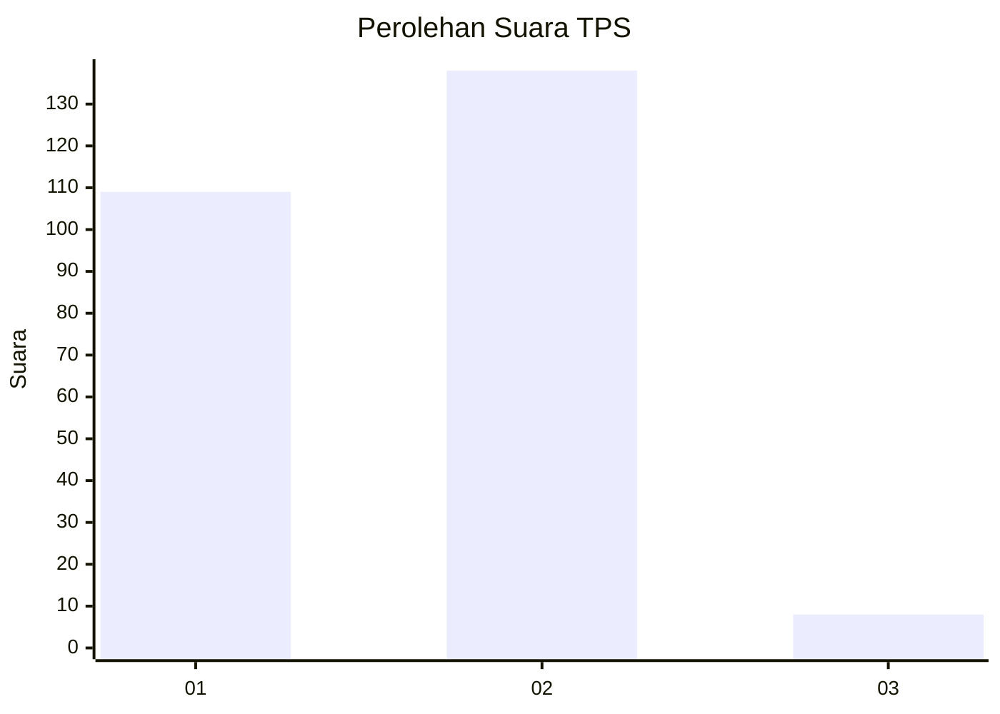
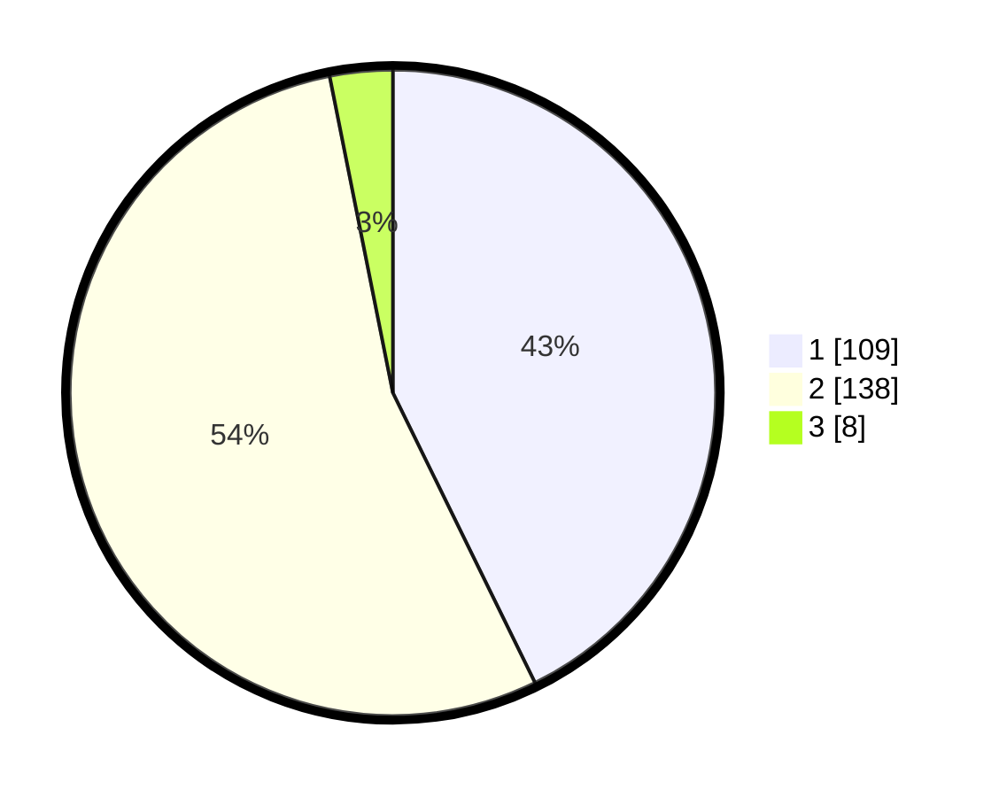

# Hasil

## Grafik

## Tabel

| No. | Nama Paslon    | Suara | Suara (raw) | Persentase |
|:--- |:-------------- | -----:| -----------:| ----------:|
| 1   | ANIES MUHAIMIN | 109   | [109][p-1]  | 42,75      |
| 2   | PRABOWO GIBRAN | 138   | [138][p-2]  | 54,12      |
| 3   | GANJAR MAHFUD  | 8     | [8][p-3]    | 3,14       |

[p-1]: https://github.com/gigit-pemilu/pemilu-2024/blob/main/pilpres/hitung-suara/sub/32-jawa-barat/sub/01-bogor/sub/24-ciawi/sub/2011-banjar-wangi/sub/003-tps/sub/paslon-1.txt
[p-2]: https://github.com/gigit-pemilu/pemilu-2024/blob/main/pilpres/hitung-suara/sub/32-jawa-barat/sub/01-bogor/sub/24-ciawi/sub/2011-banjar-wangi/sub/003-tps/sub/paslon-2.txt
[p-3]: https://github.com/gigit-pemilu/pemilu-2024/blob/main/pilpres/hitung-suara/sub/32-jawa-barat/sub/01-bogor/sub/24-ciawi/sub/2011-banjar-wangi/sub/003-tps/sub/paslon-3.txt

## Foto C Plano

https://sirekap-obj-formc.kpu.go.id/3e1e/pemilu/ppwp/32/01/24/20/11/3201242011003-20240215-073904--7bda6c90-0d85-4b09-81fc-608b86fed96a.jpg

https://sirekap-obj-formc.kpu.go.id/3e1e/pemilu/ppwp/32/01/24/20/11/3201242011003-20240215-073939--a4f6b365-876f-43f4-9e8f-578ebd0ca161.jpg

https://sirekap-obj-formc.kpu.go.id/3e1e/pemilu/ppwp/32/01/24/20/11/3201242011003-20240215-074027--dbe52902-f854-4510-b3b1-a5c3f70a8c73.jpg

## Metadata

| Key        | Value               |
| ---------- | ------------------- |
| Time Stamp | 2024-02-16 16:25:10 |

