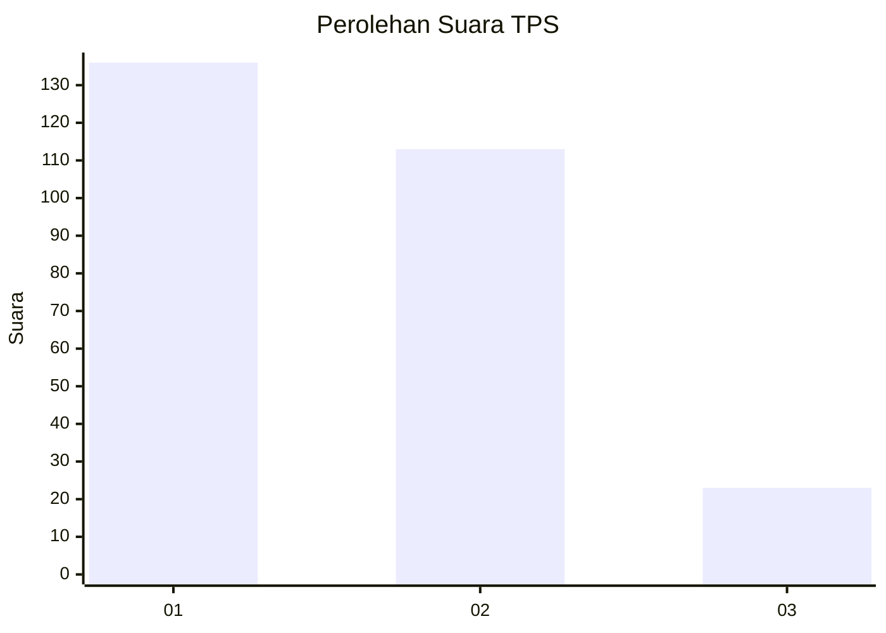
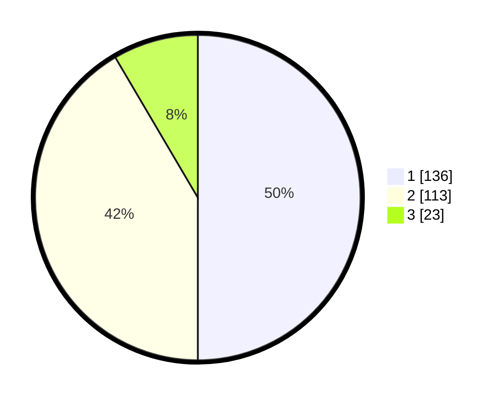

# Hasil

## Grafik

## Tabel

| No. | Nama Paslon    | Suara | Suara (raw) | Persentase |
|:--- |:-------------- | -----:| -----------:| ----------:|
| 1   | ANIES MUHAIMIN | 136   | [136][p-1]  | 50,00      |
| 2   | PRABOWO GIBRAN | 113   | [113][p-2]  | 41,54      |
| 3   | GANJAR MAHFUD  | 23    | [23][p-3]   | 8,46       |

[p-1]: https://github.com/gigit-pemilu/pemilu-2024-32-jawa-barat/blob/main/pilpres/hitung-suara/sub/32-jawa-barat/sub/01-bogor/sub/24-ciawi/sub/2011-banjar-wangi/sub/020-tps/sub/paslon-1.txt
[p-2]: https://github.com/gigit-pemilu/pemilu-2024-32-jawa-barat/blob/main/pilpres/hitung-suara/sub/32-jawa-barat/sub/01-bogor/sub/24-ciawi/sub/2011-banjar-wangi/sub/020-tps/sub/paslon-2.txt
[p-3]: https://github.com/gigit-pemilu/pemilu-2024-32-jawa-barat/blob/main/pilpres/hitung-suara/sub/32-jawa-barat/sub/01-bogor/sub/24-ciawi/sub/2011-banjar-wangi/sub/020-tps/sub/paslon-3.txt

## Foto C Plano

https://sirekap-obj-formc.kpu.go.id/0066/pemilu/ppwp/32/01/24/20/11/3201242011020-20240214-213040--60d77f1d-41f1-4620-9aa4-c94f34df2a5f.jpg

https://sirekap-obj-formc.kpu.go.id/0066/pemilu/ppwp/32/01/24/20/11/3201242011020-20240214-213122--9526537e-aad0-4a4d-b9a3-fc2a3d46388f.jpg

https://sirekap-obj-formc.kpu.go.id/0066/pemilu/ppwp/32/01/24/20/11/3201242011020-20240214-213236--28a3ce26-8e1c-4bd4-ace8-687f3d70f9ee.jpg

## Metadata

| Key        | Value               |
| ---------- | ------------------- |
| Time Stamp | 2024-02-16 16:25:10 |

