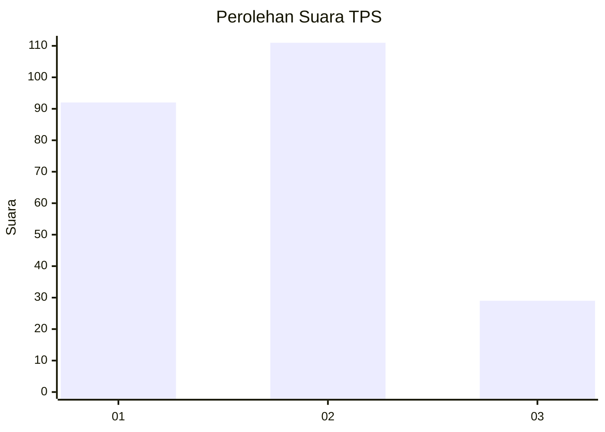
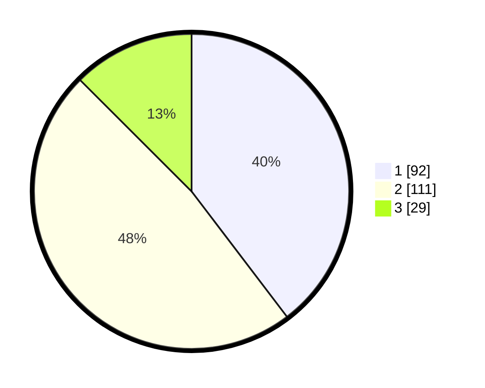

# Hasil

## Grafik

## Tabel

| No. | Nama Paslon    | Suara | Suara (raw) | Persentase |
|:--- |:-------------- | -----:| -----------:| ----------:|
| 1   | ANIES MUHAIMIN | 92    | [92][p-1]   | 39,66      |
| 2   | PRABOWO GIBRAN | 111   | [111][p-2]  | 47,84      |
| 3   | GANJAR MAHFUD  | 29    | [29][p-3]   | 12,50      |

[p-1]: https://github.com/gigit-pemilu/pemilu-2024/blob/main/pilpres/hitung-suara/sub/32-jawa-barat/sub/01-bogor/sub/25-cisarua/sub/1010-cisarua/sub/002-tps/sub/paslon-1.txt
[p-2]: https://github.com/gigit-pemilu/pemilu-2024/blob/main/pilpres/hitung-suara/sub/32-jawa-barat/sub/01-bogor/sub/25-cisarua/sub/1010-cisarua/sub/002-tps/sub/paslon-2.txt
[p-3]: https://github.com/gigit-pemilu/pemilu-2024/blob/main/pilpres/hitung-suara/sub/32-jawa-barat/sub/01-bogor/sub/25-cisarua/sub/1010-cisarua/sub/002-tps/sub/paslon-3.txt

## Foto C Plano

https://sirekap-obj-formc.kpu.go.id/ad69/pemilu/ppwp/32/01/25/10/10/3201251010002-20240219-083241--739e420a-fe07-421f-a48e-923d4cc05155.jpg

https://sirekap-obj-formc.kpu.go.id/ad69/pemilu/ppwp/32/01/25/10/10/3201251010002-20240219-083803--f47fa877-04b4-4c85-b82d-6cbf3774d7da.jpg

https://sirekap-obj-formc.kpu.go.id/ad69/pemilu/ppwp/32/01/25/10/10/3201251010002-20240219-083639--e7a36f08-5dbb-48ed-82b4-f592c898d12b.jpg

## Metadata

| Key        | Value               |
| ---------- | ------------------- |
| Time Stamp | 2024-02-19 10:00:00 |

