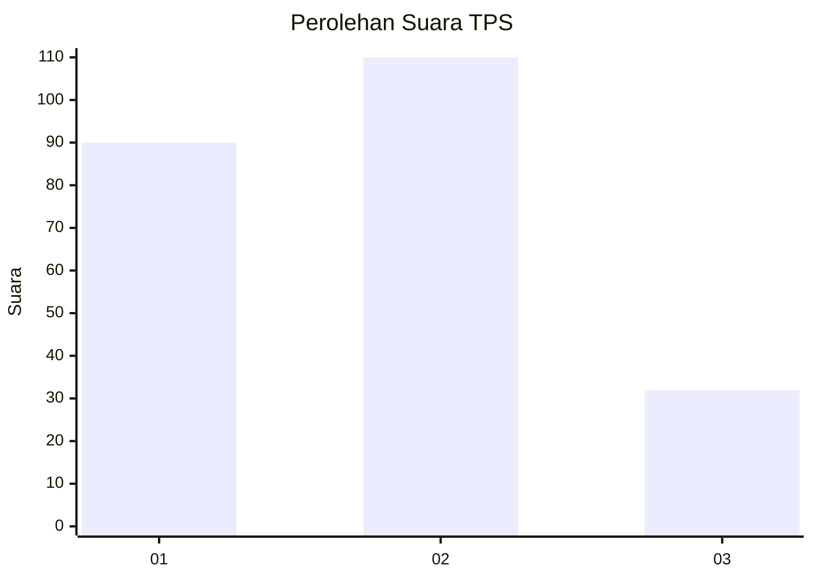
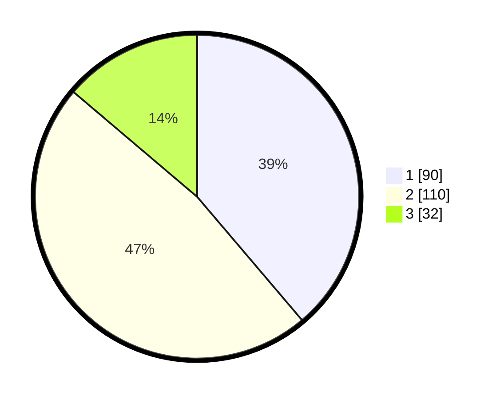

# Hasil

## Grafik

## Tabel

| No. | Nama Paslon    | Suara | Suara (raw) | Persentase |
|:--- |:-------------- | -----:| -----------:| ----------:|
| 1   | ANIES MUHAIMIN | 90    | [90][p-1]   | 38,79      |
| 2   | PRABOWO GIBRAN | 110   | [110][p-2]  | 47,41      |
| 3   | GANJAR MAHFUD  | 32    | [32][p-3]   | 13,79      |

[p-1]: https://github.com/gigit-pemilu/pemilu-2024/blob/main/pilpres/hitung-suara/sub/32-jawa-barat/sub/01-bogor/sub/25-cisarua/sub/1010-cisarua/sub/003-tps/sub/paslon-1.txt
[p-2]: https://github.com/gigit-pemilu/pemilu-2024/blob/main/pilpres/hitung-suara/sub/32-jawa-barat/sub/01-bogor/sub/25-cisarua/sub/1010-cisarua/sub/003-tps/sub/paslon-2.txt
[p-3]: https://github.com/gigit-pemilu/pemilu-2024/blob/main/pilpres/hitung-suara/sub/32-jawa-barat/sub/01-bogor/sub/25-cisarua/sub/1010-cisarua/sub/003-tps/sub/paslon-3.txt

## Foto C Plano

https://sirekap-obj-formc.kpu.go.id/3413/pemilu/ppwp/32/01/25/10/10/3201251010003-20240217-172808--36a77934-b56f-46e9-8aa1-ccd75a12bd2d.jpg

https://sirekap-obj-formc.kpu.go.id/3413/pemilu/ppwp/32/01/25/10/10/3201251010003-20240217-174620--37ffbafa-721b-42b0-acfe-f49d59e37975.jpg

https://sirekap-obj-formc.kpu.go.id/3413/pemilu/ppwp/32/01/25/10/10/3201251010003-20240217-182513--6fbab416-50b5-4fe2-b1ff-c54eb38e7e34.jpg

## Metadata

| Key        | Value               |
| ---------- | ------------------- |
| Time Stamp | 2024-02-22 09:00:00 |

