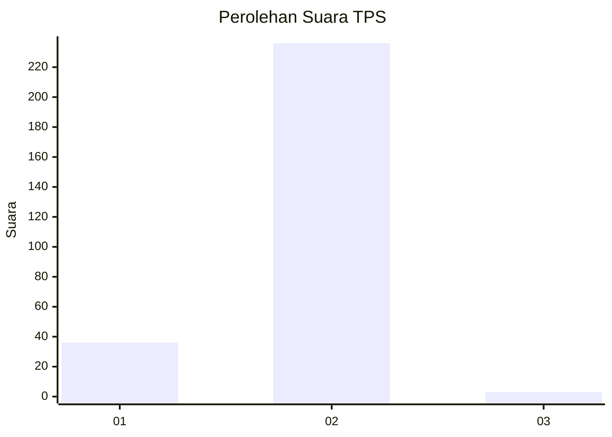
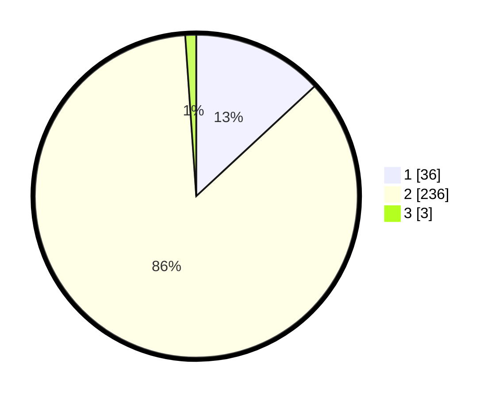

# Hasil

## Grafik

## Tabel

| No. | Nama Paslon    | Suara | Suara (raw) | Persentase |
|:--- |:-------------- | -----:| -----------:| ----------:|
| 1   | ANIES MUHAIMIN | 36    | [36][p-1]   | 13,09      |
| 2   | PRABOWO GIBRAN | 236   | [236][p-2]  | 85,82      |
| 3   | GANJAR MAHFUD  | 3     | [3][p-3]    | 1,09       |

[p-1]: https://github.com/gigit-pemilu/pemilu-2024/blob/main/pilpres/hitung-suara/sub/32-jawa-barat/sub/01-bogor/sub/25-cisarua/sub/2006-tugu-selatan/sub/007-tps/sub/paslon-1.txt
[p-2]: https://github.com/gigit-pemilu/pemilu-2024/blob/main/pilpres/hitung-suara/sub/32-jawa-barat/sub/01-bogor/sub/25-cisarua/sub/2006-tugu-selatan/sub/007-tps/sub/paslon-2.txt
[p-3]: https://github.com/gigit-pemilu/pemilu-2024/blob/main/pilpres/hitung-suara/sub/32-jawa-barat/sub/01-bogor/sub/25-cisarua/sub/2006-tugu-selatan/sub/007-tps/sub/paslon-3.txt

## Foto C Plano

https://sirekap-obj-formc.kpu.go.id/5a52/pemilu/ppwp/32/01/25/20/06/3201252006007-20240215-015349--24871d27-22a2-4c92-8ab1-fc60c2dc3fe1.jpg

https://sirekap-obj-formc.kpu.go.id/5a52/pemilu/ppwp/32/01/25/20/06/3201252006007-20240215-015506--e20b2e23-2f9f-4c49-b568-a3fd6545ca9a.jpg

https://sirekap-obj-formc.kpu.go.id/5a52/pemilu/ppwp/32/01/25/20/06/3201252006007-20240215-015606--4099e218-c21a-48e1-ba29-6b1c2aab1a3a.jpg

## Metadata

| Key        | Value               |
| ---------- | ------------------- |
| Time Stamp | 2024-02-16 16:25:10 |

