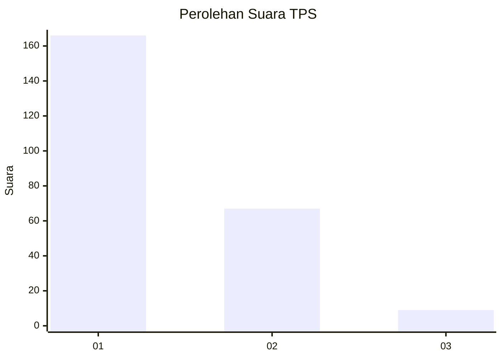
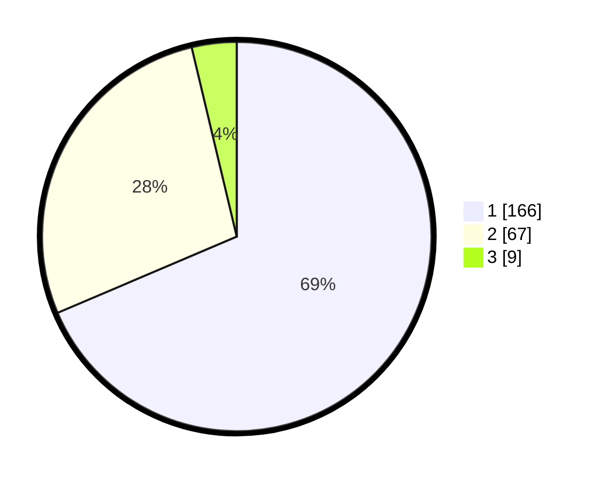

# Hasil

## Grafik

## Tabel

| No. | Nama Paslon    | Suara | Suara (raw) | Persentase |
|:--- |:-------------- | -----:| -----------:| ----------:|
| 1   | ANIES MUHAIMIN | 166   | [166][p-1]  | 68,60      |
| 2   | PRABOWO GIBRAN | 67    | [67][p-2]   | 27,69      |
| 3   | GANJAR MAHFUD  | 9     | [9][p-3]    | 3,72       |

[p-1]: https://github.com/gigit-pemilu/pemilu-2024-32-jawa-barat/blob/main/pilpres/hitung-suara/sub/32-jawa-barat/sub/01-bogor/sub/26-megamendung/sub/2001-sukamaju/sub/014-tps/sub/paslon-1.txt
[p-2]: https://github.com/gigit-pemilu/pemilu-2024-32-jawa-barat/blob/main/pilpres/hitung-suara/sub/32-jawa-barat/sub/01-bogor/sub/26-megamendung/sub/2001-sukamaju/sub/014-tps/sub/paslon-2.txt
[p-3]: https://github.com/gigit-pemilu/pemilu-2024-32-jawa-barat/blob/main/pilpres/hitung-suara/sub/32-jawa-barat/sub/01-bogor/sub/26-megamendung/sub/2001-sukamaju/sub/014-tps/sub/paslon-3.txt

## Foto C Plano

https://sirekap-obj-formc.kpu.go.id/d0c5/pemilu/ppwp/32/01/26/20/01/3201262001014-20240214-213207--c2b96fd0-363e-4f86-a331-bbad28550b9b.jpg

https://sirekap-obj-formc.kpu.go.id/d0c5/pemilu/ppwp/32/01/26/20/01/3201262001014-20240214-213315--c2a8e240-3629-4183-96c6-1b5174e7a20b.jpg

https://sirekap-obj-formc.kpu.go.id/d0c5/pemilu/ppwp/32/01/26/20/01/3201262001014-20240214-211359--2f91dede-e5af-46a3-8d7a-fde83f7dfa9d.jpg

## Metadata

| Key        | Value               |
| ---------- | ------------------- |
| Time Stamp | 2024-02-15 17:30:25 |

