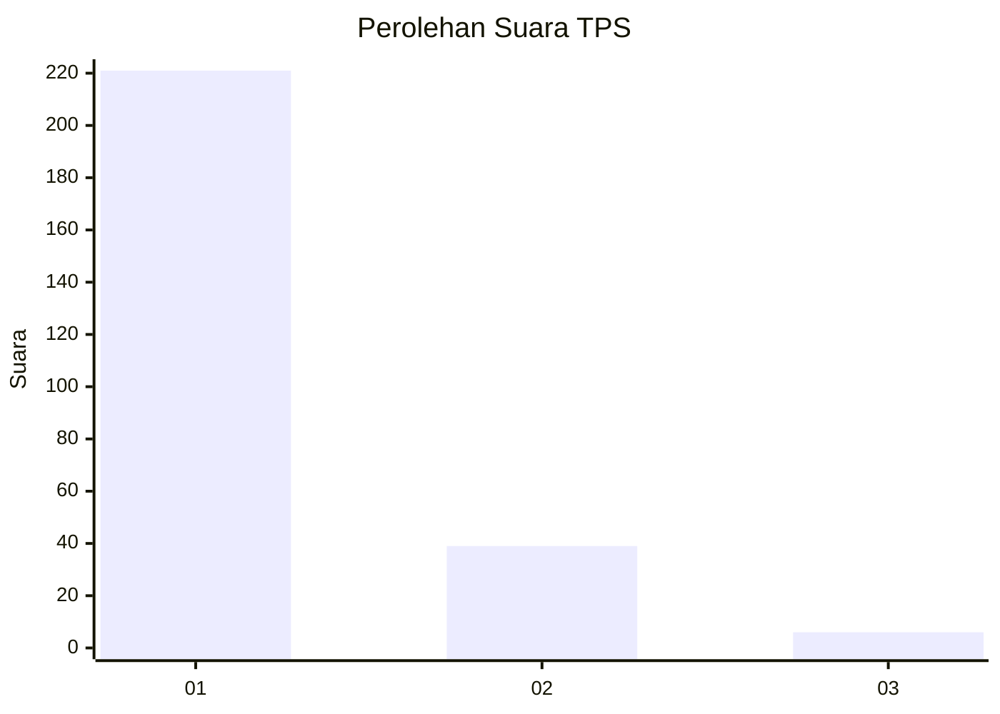
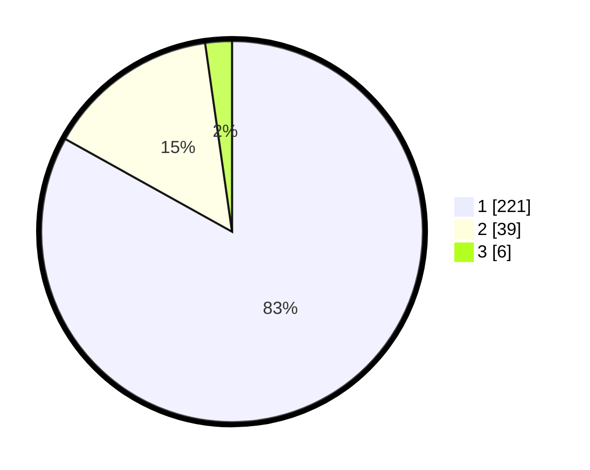

# Hasil

## Grafik

## Tabel

| No. | Nama Paslon    | Suara | Suara (raw) | Persentase |
|:--- |:-------------- | -----:| -----------:| ----------:|
| 1   | ANIES MUHAIMIN | 221   | [221][p-1]  | 83,08      |
| 2   | PRABOWO GIBRAN | 39    | [39][p-2]   | 14,66      |
| 3   | GANJAR MAHFUD  | 6     | [6][p-3]    | 2,26       |

[p-1]: https://github.com/gigit-pemilu/pemilu-2024/blob/main/pilpres/hitung-suara/sub/32-jawa-barat/sub/01-bogor/sub/26-megamendung/sub/2002-kuta/sub/005-tps/sub/paslon-1.txt
[p-2]: https://github.com/gigit-pemilu/pemilu-2024/blob/main/pilpres/hitung-suara/sub/32-jawa-barat/sub/01-bogor/sub/26-megamendung/sub/2002-kuta/sub/005-tps/sub/paslon-2.txt
[p-3]: https://github.com/gigit-pemilu/pemilu-2024/blob/main/pilpres/hitung-suara/sub/32-jawa-barat/sub/01-bogor/sub/26-megamendung/sub/2002-kuta/sub/005-tps/sub/paslon-3.txt

## Foto C Plano

https://sirekap-obj-formc.kpu.go.id/196d/pemilu/ppwp/32/01/26/20/02/3201262002005-20240214-155024--59f8a035-7413-46ee-acc7-d203026fd201.jpg

https://sirekap-obj-formc.kpu.go.id/196d/pemilu/ppwp/32/01/26/20/02/3201262002005-20240214-155344--e93b6d44-407d-42bf-86f3-e354e0f1beaa.jpg

https://sirekap-obj-formc.kpu.go.id/196d/pemilu/ppwp/32/01/26/20/02/3201262002005-20240214-155222--f9f6d57a-1c14-4438-8d36-b56ac5ee5926.jpg

## Metadata

| Key        | Value               |
| ---------- | ------------------- |
| Time Stamp | 2024-02-16 16:25:10 |

