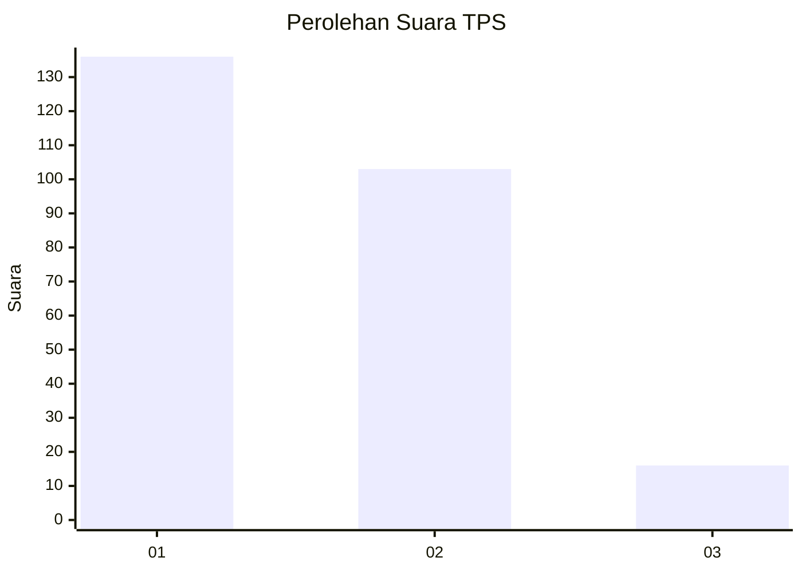
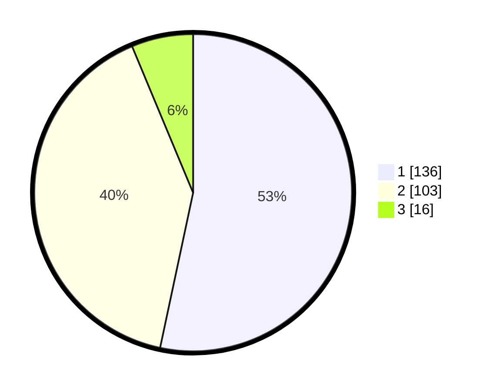

# Hasil

## Grafik

## Tabel

| No. | Nama Paslon    | Suara | Suara (raw) | Persentase |
|:--- |:-------------- | -----:| -----------:| ----------:|
| 1   | ANIES MUHAIMIN | 136   | [136][p-1]  | 53,33      |
| 2   | PRABOWO GIBRAN | 103   | [103][p-2]  | 40,39      |
| 3   | GANJAR MAHFUD  | 16    | [16][p-3]   | 6,27       |

[p-1]: https://github.com/gigit-pemilu/pemilu-2024/blob/main/pilpres/hitung-suara/sub/32-jawa-barat/sub/01-bogor/sub/26-megamendung/sub/2008-sukagalih/sub/006-tps/sub/paslon-1.txt
[p-2]: https://github.com/gigit-pemilu/pemilu-2024/blob/main/pilpres/hitung-suara/sub/32-jawa-barat/sub/01-bogor/sub/26-megamendung/sub/2008-sukagalih/sub/006-tps/sub/paslon-2.txt
[p-3]: https://github.com/gigit-pemilu/pemilu-2024/blob/main/pilpres/hitung-suara/sub/32-jawa-barat/sub/01-bogor/sub/26-megamendung/sub/2008-sukagalih/sub/006-tps/sub/paslon-3.txt

## Foto C Plano

https://sirekap-obj-formc.kpu.go.id/e893/pemilu/ppwp/32/01/26/20/08/3201262008006-20240214-211544--f7129b47-197e-4da9-9e83-80846c2599bf.jpg

https://sirekap-obj-formc.kpu.go.id/e893/pemilu/ppwp/32/01/26/20/08/3201262008006-20240214-211549--07fd27fe-6a47-4375-9adc-cd7864b31af0.jpg

https://sirekap-obj-formc.kpu.go.id/e893/pemilu/ppwp/32/01/26/20/08/3201262008006-20240214-211556--11933673-d4c1-4f32-85a1-1acfa028c409.jpg

## Metadata

| Key        | Value               |
| ---------- | ------------------- |
| Time Stamp | 2024-02-16 16:25:10 |

