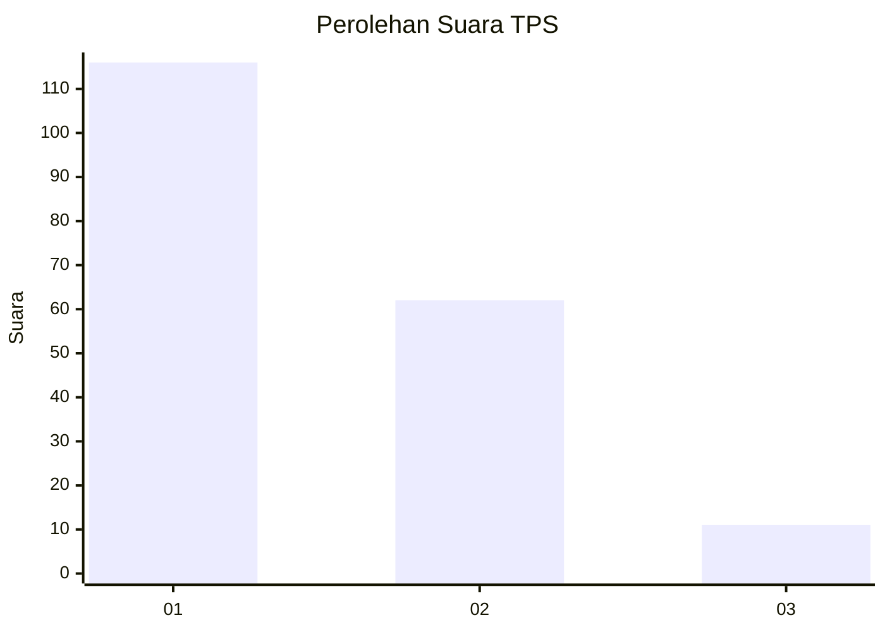
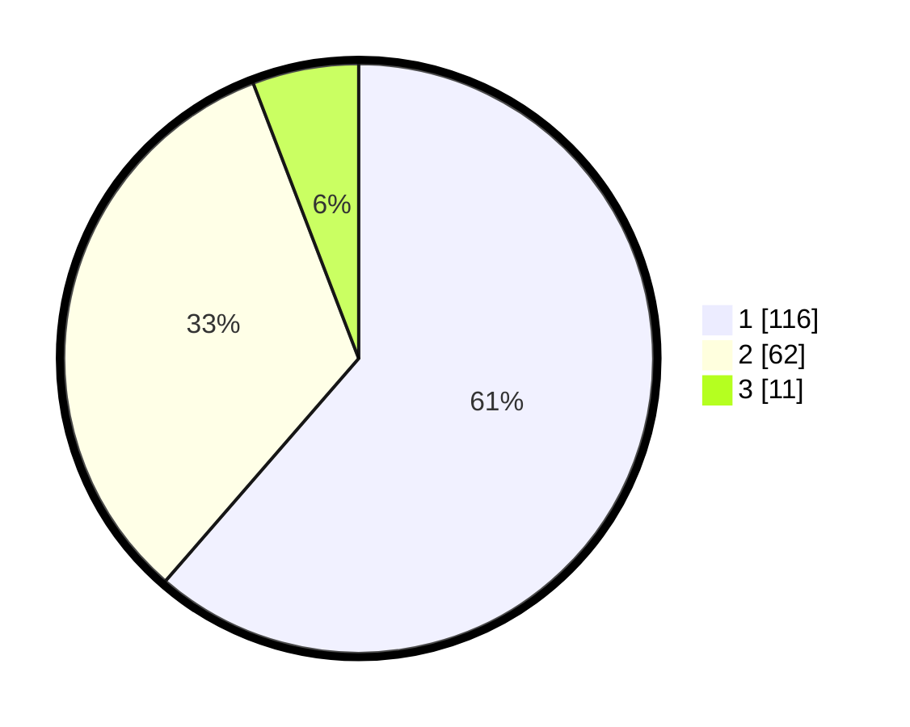

# Hasil

## Grafik

## Tabel

| No. | Nama Paslon    | Suara | Suara (raw) | Persentase |
|:--- |:-------------- | -----:| -----------:| ----------:|
| 1   | ANIES MUHAIMIN | 116   | [116][p-1]  | 61,38      |
| 2   | PRABOWO GIBRAN | 62    | [62][p-2]   | 32,80      |
| 3   | GANJAR MAHFUD  | 11    | [11][p-3]   | 5,82       |

[p-1]: https://github.com/gigit-pemilu/pemilu-2024-32-jawa-barat/blob/main/pilpres/hitung-suara/sub/32-jawa-barat/sub/01-bogor/sub/26-megamendung/sub/2008-sukagalih/sub/015-tps/sub/paslon-1.txt
[p-2]: https://github.com/gigit-pemilu/pemilu-2024-32-jawa-barat/blob/main/pilpres/hitung-suara/sub/32-jawa-barat/sub/01-bogor/sub/26-megamendung/sub/2008-sukagalih/sub/015-tps/sub/paslon-2.txt
[p-3]: https://github.com/gigit-pemilu/pemilu-2024-32-jawa-barat/blob/main/pilpres/hitung-suara/sub/32-jawa-barat/sub/01-bogor/sub/26-megamendung/sub/2008-sukagalih/sub/015-tps/sub/paslon-3.txt

## Foto C Plano

https://sirekap-obj-formc.kpu.go.id/831d/pemilu/ppwp/32/01/26/20/08/3201262008015-20240215-014041--fc0a51c4-0cb9-4401-b3bd-64db30ec5896.jpg

https://sirekap-obj-formc.kpu.go.id/831d/pemilu/ppwp/32/01/26/20/08/3201262008015-20240215-014917--278e28d7-0f6e-40fb-97e1-08143f771fd2.jpg

https://sirekap-obj-formc.kpu.go.id/831d/pemilu/ppwp/32/01/26/20/08/3201262008015-20240215-014751--caa4b50c-b1c1-4d46-a327-5b0a4860363d.jpg

## Metadata

| Key        | Value               |
| ---------- | ------------------- |
| Time Stamp | 2024-02-16 16:25:10 |

