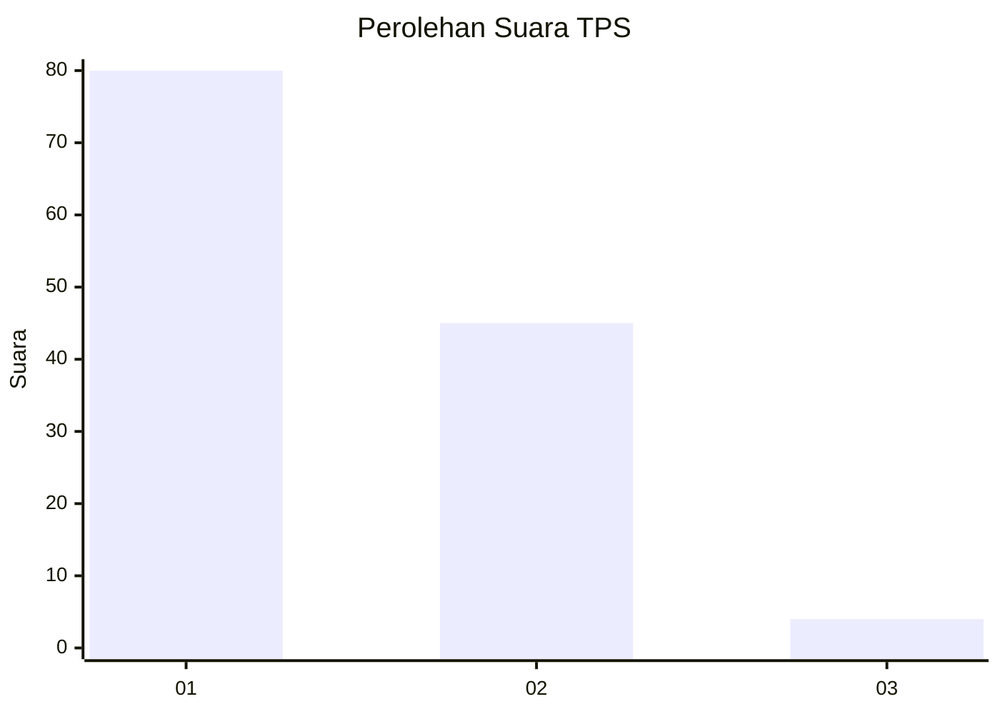
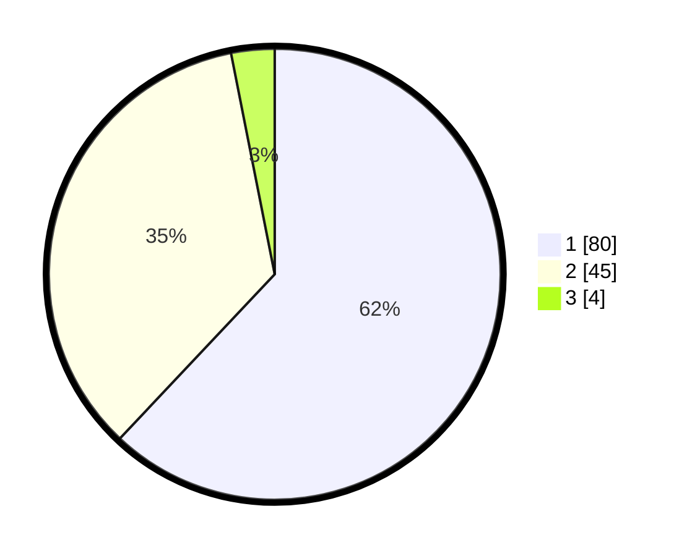

# Hasil

## Grafik

## Tabel

| No. | Nama Paslon    | Suara | Suara (raw) | Persentase |
|:--- |:-------------- | -----:| -----------:| ----------:|
| 1   | ANIES MUHAIMIN | 80    | [80][p-1]   | 62,02      |
| 2   | PRABOWO GIBRAN | 45    | [45][p-2]   | 34,88      |
| 3   | GANJAR MAHFUD  | 4     | [4][p-3]    | 3,10       |

[p-1]: https://github.com/gigit-pemilu/pemilu-2024/blob/main/pilpres/hitung-suara/sub/32-jawa-barat/sub/01-bogor/sub/26-megamendung/sub/2008-sukagalih/sub/021-tps/sub/paslon-1.txt
[p-2]: https://github.com/gigit-pemilu/pemilu-2024/blob/main/pilpres/hitung-suara/sub/32-jawa-barat/sub/01-bogor/sub/26-megamendung/sub/2008-sukagalih/sub/021-tps/sub/paslon-2.txt
[p-3]: https://github.com/gigit-pemilu/pemilu-2024/blob/main/pilpres/hitung-suara/sub/32-jawa-barat/sub/01-bogor/sub/26-megamendung/sub/2008-sukagalih/sub/021-tps/sub/paslon-3.txt

## Foto C Plano

https://sirekap-obj-formc.kpu.go.id/934b/pemilu/ppwp/32/01/26/20/08/3201262008021-20240214-203446--c0cebc6e-25ae-45a7-89c4-034edac34b89.jpg

https://sirekap-obj-formc.kpu.go.id/934b/pemilu/ppwp/32/01/26/20/08/3201262008021-20240214-194823--3775808a-17cd-4bc1-b078-6b7916b7bf1e.jpg

https://sirekap-obj-formc.kpu.go.id/934b/pemilu/ppwp/32/01/26/20/08/3201262008021-20240214-194930--a499edf2-468c-47a0-bd8c-a162c5bf275d.jpg

## Metadata

| Key        | Value               |
| ---------- | ------------------- |
| Time Stamp | 2024-02-14 21:46:01 |

