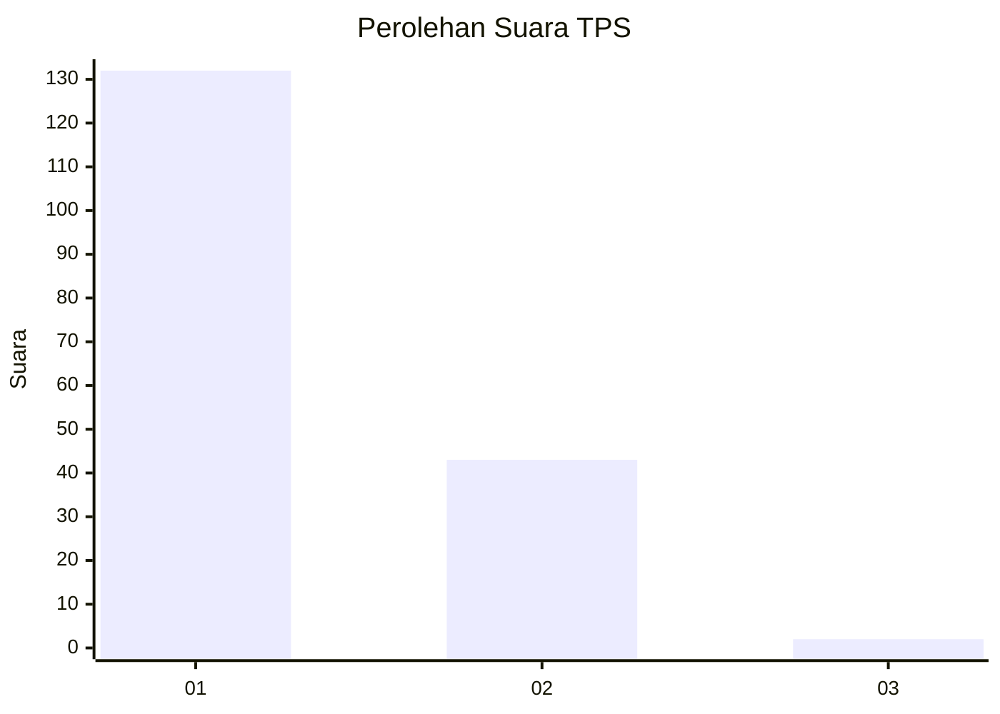
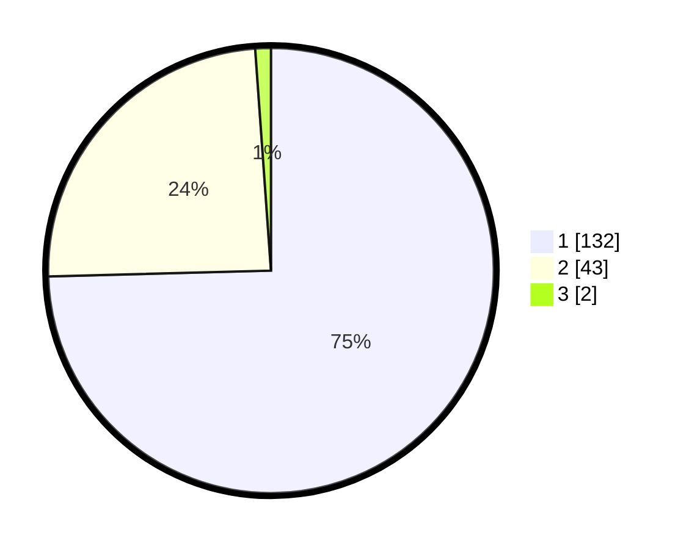

# Hasil

## Grafik

## Tabel

| No. | Nama Paslon    | Suara | Suara (raw) | Persentase |
|:--- |:-------------- | -----:| -----------:| ----------:|
| 1   | ANIES MUHAIMIN | 132   | [132][p-1]  | 74,58      |
| 2   | PRABOWO GIBRAN | 43    | [43][p-2]   | 24,29      |
| 3   | GANJAR MAHFUD  | 2     | [2][p-3]    | 1,13       |

[p-1]: https://github.com/gigit-pemilu/pemilu-2024-32-jawa-barat/blob/main/pilpres/hitung-suara/sub/32-jawa-barat/sub/01-bogor/sub/26-megamendung/sub/2012-pasir-angin/sub/019-tps/sub/paslon-1.txt
[p-2]: https://github.com/gigit-pemilu/pemilu-2024-32-jawa-barat/blob/main/pilpres/hitung-suara/sub/32-jawa-barat/sub/01-bogor/sub/26-megamendung/sub/2012-pasir-angin/sub/019-tps/sub/paslon-2.txt
[p-3]: https://github.com/gigit-pemilu/pemilu-2024-32-jawa-barat/blob/main/pilpres/hitung-suara/sub/32-jawa-barat/sub/01-bogor/sub/26-megamendung/sub/2012-pasir-angin/sub/019-tps/sub/paslon-3.txt

## Foto C Plano

https://sirekap-obj-formc.kpu.go.id/2e2f/pemilu/ppwp/32/01/26/20/12/3201262012019-20240215-014133--835fc4c6-86c0-4e68-8eea-4f95ee944a52.jpg

https://sirekap-obj-formc.kpu.go.id/2e2f/pemilu/ppwp/32/01/26/20/12/3201262012019-20240215-014031--320ca163-1a76-474b-a73c-9aefc33185c7.jpg

https://sirekap-obj-formc.kpu.go.id/2e2f/pemilu/ppwp/32/01/26/20/12/3201262012019-20240215-113232--283421ed-a34c-4f65-ac4c-8fa6390f77d7.jpg

## Metadata

| Key        | Value               |
| ---------- | ------------------- |
| Time Stamp | 2024-02-15 12:00:28 |

