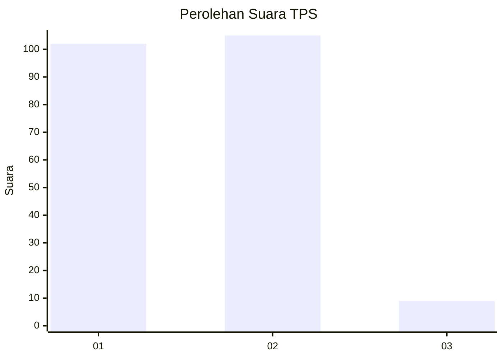
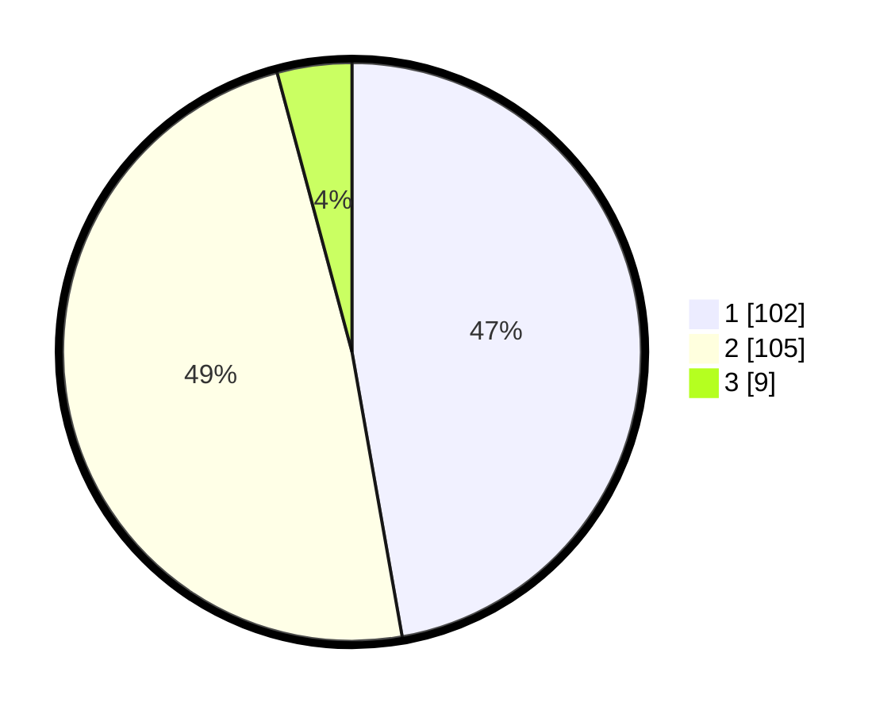

# Hasil

## Grafik

## Tabel

| No. | Nama Paslon    | Suara | Suara (raw) | Persentase |
|:--- |:-------------- | -----:| -----------:| ----------:|
| 1   | ANIES MUHAIMIN | 102   | [102][p-1]  | 47,22      |
| 2   | PRABOWO GIBRAN | 105   | [105][p-2]  | 48,61      |
| 3   | GANJAR MAHFUD  | 9     | [9][p-3]    | 4,17       |

[p-1]: https://github.com/gigit-pemilu/pemilu-2024/blob/main/pilpres/hitung-suara/sub/32-jawa-barat/sub/01-bogor/sub/27-caringin/sub/2005-ciherang-pondok/sub/008-tps/sub/paslon-1.txt
[p-2]: https://github.com/gigit-pemilu/pemilu-2024/blob/main/pilpres/hitung-suara/sub/32-jawa-barat/sub/01-bogor/sub/27-caringin/sub/2005-ciherang-pondok/sub/008-tps/sub/paslon-2.txt
[p-3]: https://github.com/gigit-pemilu/pemilu-2024/blob/main/pilpres/hitung-suara/sub/32-jawa-barat/sub/01-bogor/sub/27-caringin/sub/2005-ciherang-pondok/sub/008-tps/sub/paslon-3.txt

## Foto C Plano

https://sirekap-obj-formc.kpu.go.id/a62c/pemilu/ppwp/32/01/27/20/05/3201272005008-20240216-113549--acf7ac12-0d37-48ff-a475-42aeff812c51.jpg

https://sirekap-obj-formc.kpu.go.id/a62c/pemilu/ppwp/32/01/27/20/05/3201272005008-20240216-113556--a19f86a8-95e7-4ab6-9cb3-9b9e638e25d8.jpg

https://sirekap-obj-formc.kpu.go.id/a62c/pemilu/ppwp/32/01/27/20/05/3201272005008-20240216-113602--e0e3f9f5-cc4b-439f-bbbe-b6e201f5e322.jpg

## Metadata

| Key        | Value               |
| ---------- | ------------------- |
| Time Stamp | 2024-02-16 13:30:32 |

