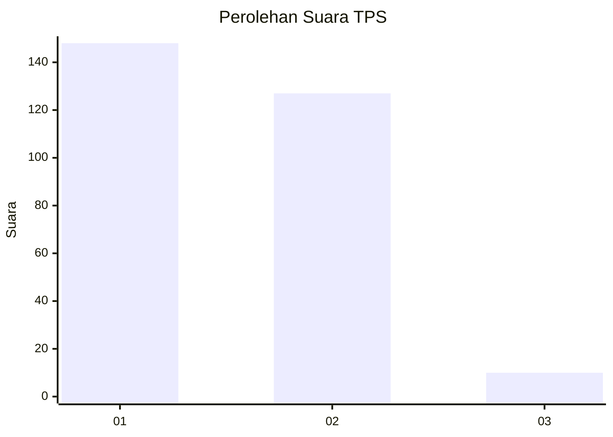
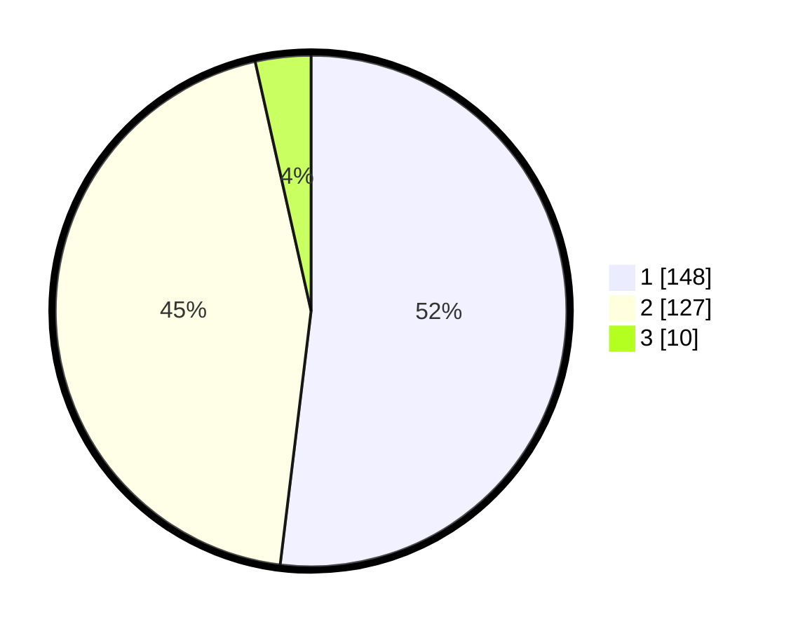

# Hasil

## Grafik

## Tabel

| No. | Nama Paslon    | Suara | Suara (raw) | Persentase |
|:--- |:-------------- | -----:| -----------:| ----------:|
| 1   | ANIES MUHAIMIN | 148   | [148][p-1]  | 51,93      |
| 2   | PRABOWO GIBRAN | 127   | [127][p-2]  | 44,56      |
| 3   | GANJAR MAHFUD  | 10    | [10][p-3]   | 3,51       |

[p-1]: https://github.com/gigit-pemilu/pemilu-2024-32-jawa-barat/blob/main/pilpres/hitung-suara/sub/32-jawa-barat/sub/01-bogor/sub/27-caringin/sub/2005-ciherang-pondok/sub/034-tps/sub/paslon-1.txt
[p-2]: https://github.com/gigit-pemilu/pemilu-2024-32-jawa-barat/blob/main/pilpres/hitung-suara/sub/32-jawa-barat/sub/01-bogor/sub/27-caringin/sub/2005-ciherang-pondok/sub/034-tps/sub/paslon-2.txt
[p-3]: https://github.com/gigit-pemilu/pemilu-2024-32-jawa-barat/blob/main/pilpres/hitung-suara/sub/32-jawa-barat/sub/01-bogor/sub/27-caringin/sub/2005-ciherang-pondok/sub/034-tps/sub/paslon-3.txt

## Foto C Plano

https://sirekap-obj-formc.kpu.go.id/a488/pemilu/ppwp/32/01/27/20/05/3201272005034-20240214-155803--44411fac-bdef-40fd-b53d-12880e6292f6.jpg

https://sirekap-obj-formc.kpu.go.id/a488/pemilu/ppwp/32/01/27/20/05/3201272005034-20240214-160056--eacf6150-5a94-4069-92b6-0012e10e4bc9.jpg

https://sirekap-obj-formc.kpu.go.id/a488/pemilu/ppwp/32/01/27/20/05/3201272005034-20240214-160055--22d61b41-3234-43b1-9d4b-e8f07a5d3c5e.jpg

## Metadata

| Key        | Value               |
| ---------- | ------------------- |
| Time Stamp | 2024-02-19 11:00:00 |

