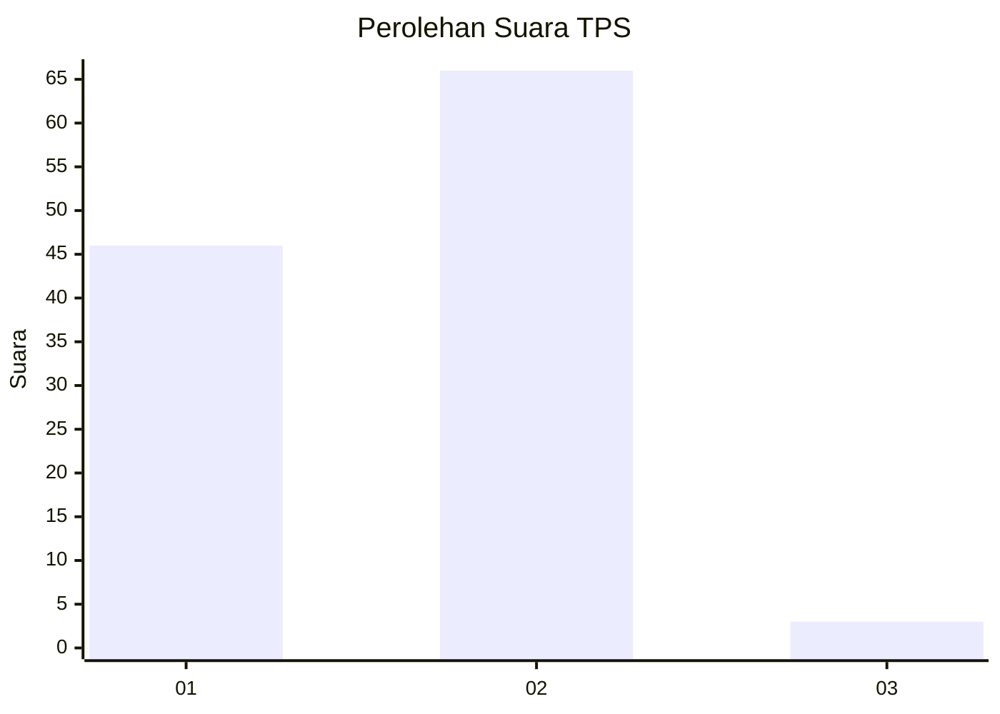
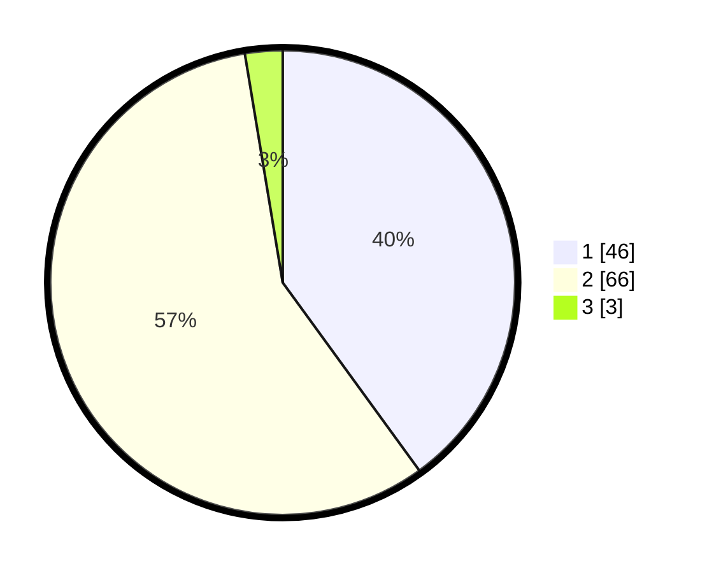

# Hasil

## Grafik

## Tabel

| No. | Nama Paslon    | Suara | Suara (raw) | Persentase |
|:--- |:-------------- | -----:| -----------:| ----------:|
| 1   | ANIES MUHAIMIN | 46    | [46][p-1]   | 40,00      |
| 2   | PRABOWO GIBRAN | 66    | [66][p-2]   | 57,39      |
| 3   | GANJAR MAHFUD  | 3     | [3][p-3]    | 2,61       |

[p-1]: https://github.com/gigit-pemilu/pemilu-2024/blob/main/pilpres/hitung-suara/sub/32-jawa-barat/sub/01-bogor/sub/27-caringin/sub/2006-cinagara/sub/030-tps/sub/paslon-1.txt
[p-2]: https://github.com/gigit-pemilu/pemilu-2024/blob/main/pilpres/hitung-suara/sub/32-jawa-barat/sub/01-bogor/sub/27-caringin/sub/2006-cinagara/sub/030-tps/sub/paslon-2.txt
[p-3]: https://github.com/gigit-pemilu/pemilu-2024/blob/main/pilpres/hitung-suara/sub/32-jawa-barat/sub/01-bogor/sub/27-caringin/sub/2006-cinagara/sub/030-tps/sub/paslon-3.txt

## Foto C Plano

https://sirekap-obj-formc.kpu.go.id/ce14/pemilu/ppwp/32/01/27/20/06/3201272006030-20240217-135252--077d5896-d71c-4b03-96e2-75b246a60924.jpg

https://sirekap-obj-formc.kpu.go.id/ce14/pemilu/ppwp/32/01/27/20/06/3201272006030-20240215-011755--a008fa20-4c9a-457c-a18c-8cdbe8f335d0.jpg

https://sirekap-obj-formc.kpu.go.id/ce14/pemilu/ppwp/32/01/27/20/06/3201272006030-20240215-011817--e72978d2-be86-4f90-858b-9994eb1bad11.jpg

## Metadata

| Key        | Value               |
| ---------- | ------------------- |
| Time Stamp | 2024-02-21 18:00:00 |

