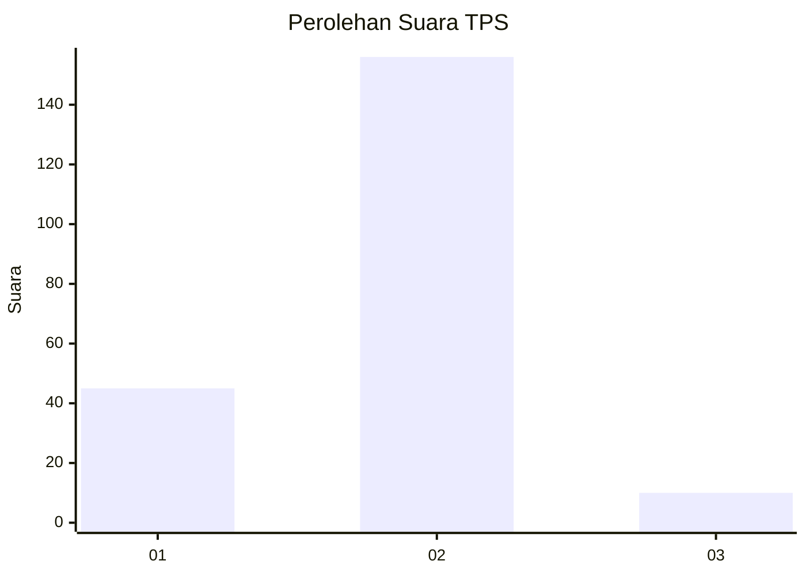
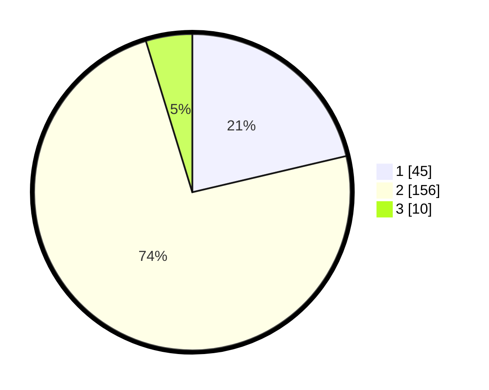

# Hasil

## Grafik

## Tabel

| No. | Nama Paslon    | Suara | Suara (raw) | Persentase |
|:--- |:-------------- | -----:| -----------:| ----------:|
| 1   | ANIES MUHAIMIN | 45    | [45][p-1]   | 21,33      |
| 2   | PRABOWO GIBRAN | 156   | [156][p-2]  | 73,93      |
| 3   | GANJAR MAHFUD  | 10    | [10][p-3]   | 4,74       |

[p-1]: https://github.com/gigit-pemilu/pemilu-2024/blob/main/pilpres/hitung-suara/sub/32-jawa-barat/sub/01-bogor/sub/27-caringin/sub/2010-pasirbuncir/sub/001-tps/sub/paslon-1.txt
[p-2]: https://github.com/gigit-pemilu/pemilu-2024/blob/main/pilpres/hitung-suara/sub/32-jawa-barat/sub/01-bogor/sub/27-caringin/sub/2010-pasirbuncir/sub/001-tps/sub/paslon-2.txt
[p-3]: https://github.com/gigit-pemilu/pemilu-2024/blob/main/pilpres/hitung-suara/sub/32-jawa-barat/sub/01-bogor/sub/27-caringin/sub/2010-pasirbuncir/sub/001-tps/sub/paslon-3.txt

## Foto C Plano

https://sirekap-obj-formc.kpu.go.id/1a60/pemilu/ppwp/32/01/27/20/10/3201272010001-20240214-204314--58dee1cb-a59f-4502-96b4-b4a7e5a36b7e.jpg

https://sirekap-obj-formc.kpu.go.id/1a60/pemilu/ppwp/32/01/27/20/10/3201272010001-20240215-000832--a4f1e22f-e9f2-40ed-b37f-c6baf516ac26.jpg

https://sirekap-obj-formc.kpu.go.id/1a60/pemilu/ppwp/32/01/27/20/10/3201272010001-20240215-022930--5ffb2bf9-7168-448e-a5d6-9970352229d3.jpg

## Metadata

| Key        | Value               |
| ---------- | ------------------- |
| Time Stamp | 2024-02-24 22:31:28 |

