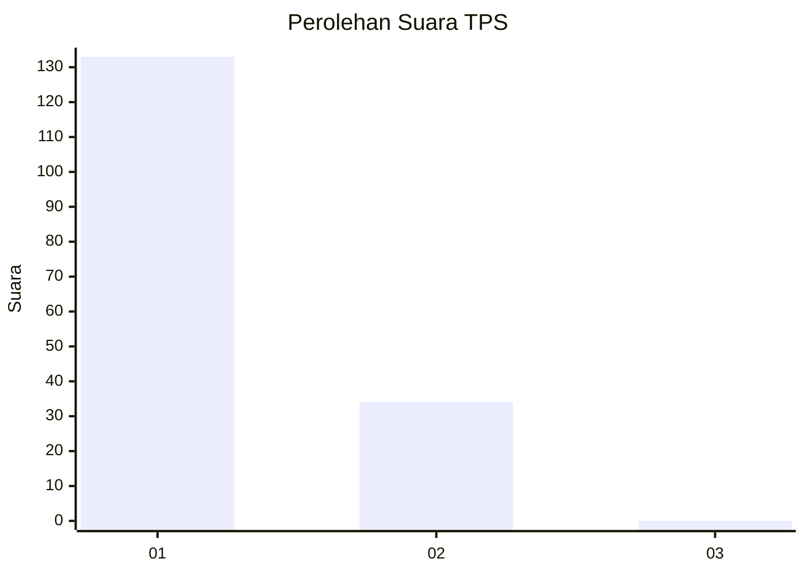
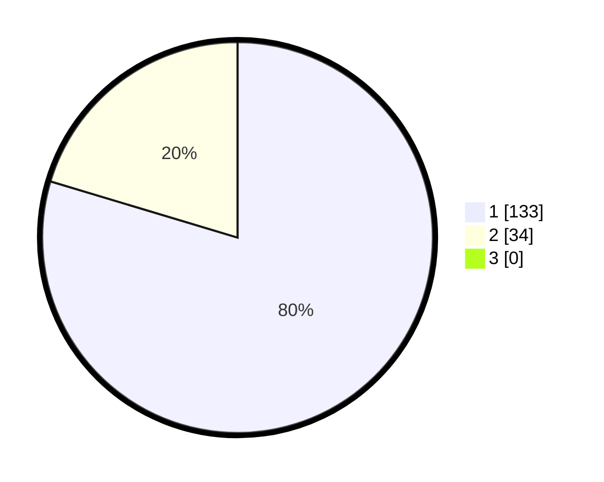

# Hasil

## Grafik

## Tabel

| No. | Nama Paslon    | Suara | Suara (raw) | Persentase |
|:--- |:-------------- | -----:| -----------:| ----------:|
| 1   | ANIES MUHAIMIN | 133   | [133][p-1]  | 79,64      |
| 2   | PRABOWO GIBRAN | 34    | [34][p-2]   | 20,36      |
| 3   | GANJAR MAHFUD  | 0     | [0][p-3]    | 0,00       |

[p-1]: https://github.com/gigit-pemilu/pemilu-2024/blob/main/pilpres/hitung-suara/sub/32-jawa-barat/sub/01-bogor/sub/28-cijeruk/sub/2002-cipelang/sub/031-tps/sub/paslon-1.txt
[p-2]: https://github.com/gigit-pemilu/pemilu-2024/blob/main/pilpres/hitung-suara/sub/32-jawa-barat/sub/01-bogor/sub/28-cijeruk/sub/2002-cipelang/sub/031-tps/sub/paslon-2.txt
[p-3]: https://github.com/gigit-pemilu/pemilu-2024/blob/main/pilpres/hitung-suara/sub/32-jawa-barat/sub/01-bogor/sub/28-cijeruk/sub/2002-cipelang/sub/031-tps/sub/paslon-3.txt

## Foto C Plano

https://sirekap-obj-formc.kpu.go.id/2604/pemilu/ppwp/32/01/28/20/02/3201282002031-20240215-122509--25b0a5fe-f096-4c37-8871-d3569f60494d.jpg

https://sirekap-obj-formc.kpu.go.id/2604/pemilu/ppwp/32/01/28/20/02/3201282002031-20240215-122611--cf0c558c-8a12-44d9-8cbd-6ed146aa29c3.jpg

https://sirekap-obj-formc.kpu.go.id/2604/pemilu/ppwp/32/01/28/20/02/3201282002031-20240215-122716--9b8c4f3c-8028-4dfb-a869-5e42b42ad4d2.jpg

## Metadata

| Key        | Value               |
| ---------- | ------------------- |
| Time Stamp | 2024-02-16 03:30:26 |

