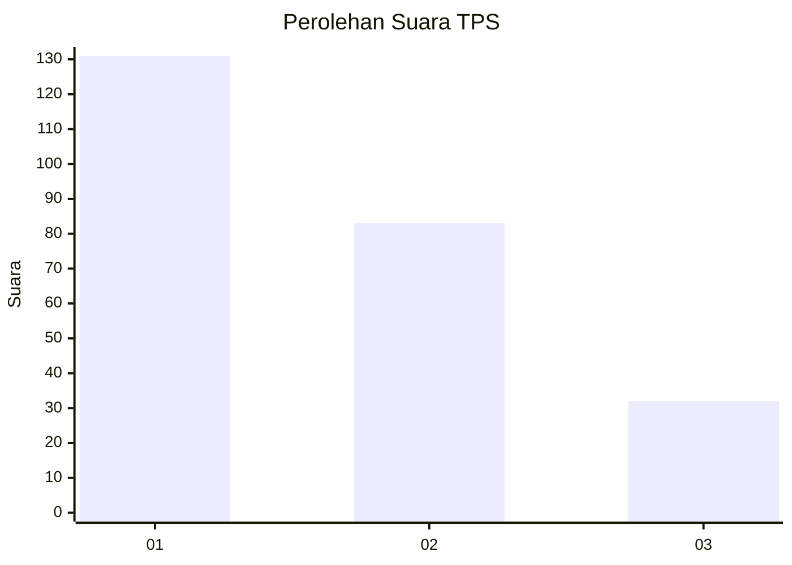
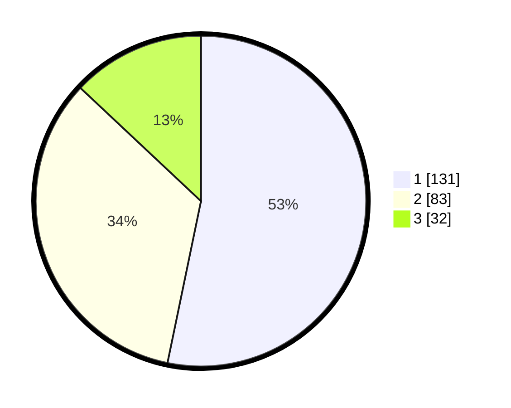

# Hasil

## Grafik

## Tabel

| No. | Nama Paslon    | Suara | Suara (raw) | Persentase |
|:--- |:-------------- | -----:| -----------:| ----------:|
| 1   | ANIES MUHAIMIN | 131   | [131][p-1]  | 53,25      |
| 2   | PRABOWO GIBRAN | 83    | [83][p-2]   | 33,74      |
| 3   | GANJAR MAHFUD  | 32    | [32][p-3]   | 13,01      |

[p-1]: https://github.com/gigit-pemilu/pemilu-2024-32-jawa-barat/blob/main/pilpres/hitung-suara/sub/32-jawa-barat/sub/01-bogor/sub/28-cijeruk/sub/2005-cipicung/sub/027-tps/sub/paslon-1.txt
[p-2]: https://github.com/gigit-pemilu/pemilu-2024-32-jawa-barat/blob/main/pilpres/hitung-suara/sub/32-jawa-barat/sub/01-bogor/sub/28-cijeruk/sub/2005-cipicung/sub/027-tps/sub/paslon-2.txt
[p-3]: https://github.com/gigit-pemilu/pemilu-2024-32-jawa-barat/blob/main/pilpres/hitung-suara/sub/32-jawa-barat/sub/01-bogor/sub/28-cijeruk/sub/2005-cipicung/sub/027-tps/sub/paslon-3.txt

## Foto C Plano

https://sirekap-obj-formc.kpu.go.id/1e9c/pemilu/ppwp/32/01/28/20/05/3201282005027-20240215-014642--a85f63f4-37a8-4f48-840b-00ee13fbd934.jpg

https://sirekap-obj-formc.kpu.go.id/1e9c/pemilu/ppwp/32/01/28/20/05/3201282005027-20240215-022340--add8c447-f7c2-4e15-948f-c23dd152e477.jpg

https://sirekap-obj-formc.kpu.go.id/1e9c/pemilu/ppwp/32/01/28/20/05/3201282005027-20240215-022444--83f41c37-4a8e-43ec-9115-1bb948ea4d0b.jpg

## Metadata

| Key        | Value               |
| ---------- | ------------------- |
| Time Stamp | 2024-02-19 06:16:00 |

