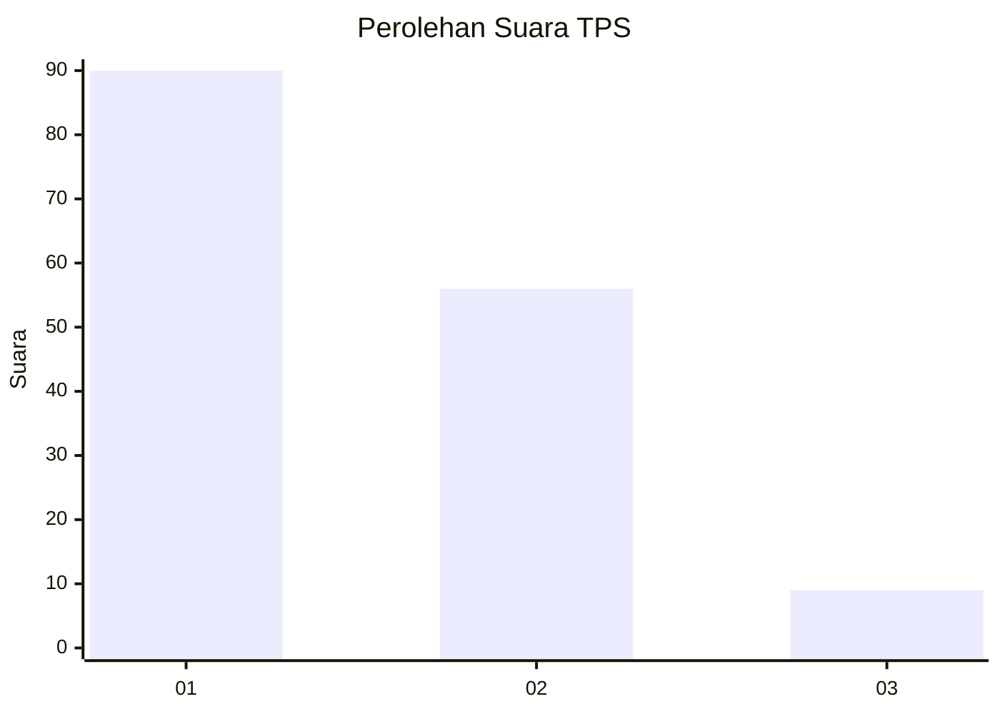
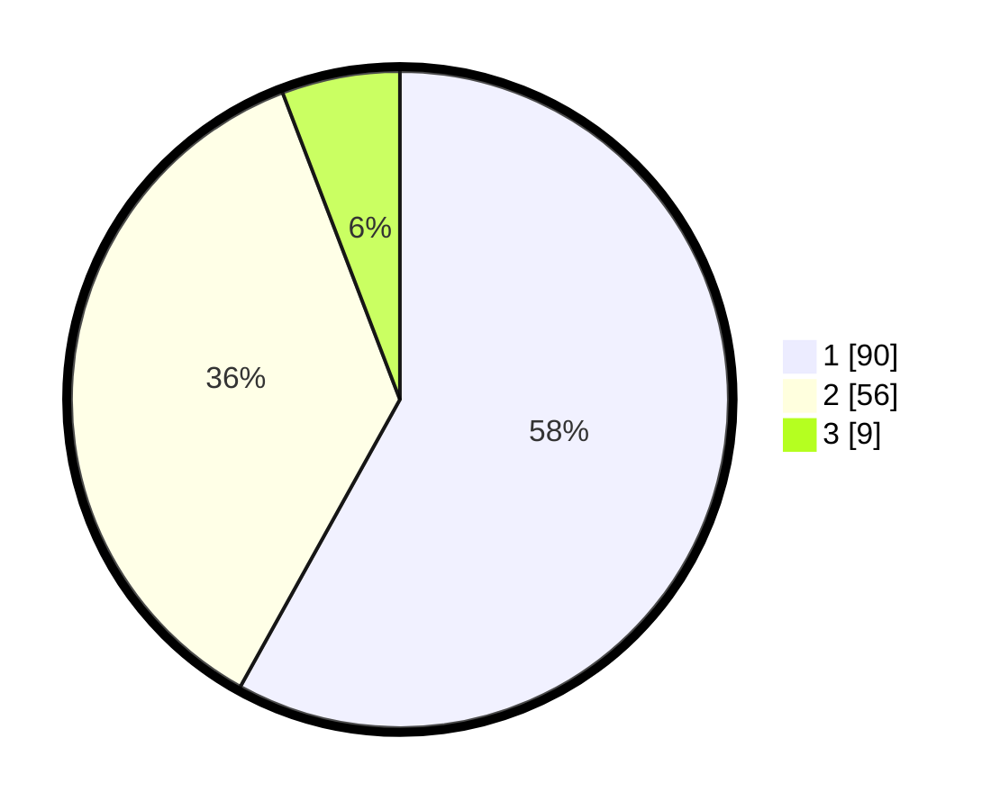

# Hasil

## Grafik

## Tabel

| No. | Nama Paslon    | Suara | Suara (raw) | Persentase |
|:--- |:-------------- | -----:| -----------:| ----------:|
| 1   | ANIES MUHAIMIN | 90    | [90][p-1]   | 58,06      |
| 2   | PRABOWO GIBRAN | 56    | [56][p-2]   | 36,13      |
| 3   | GANJAR MAHFUD  | 9     | [9][p-3]    | 5,81       |

[p-1]: https://github.com/gigit-pemilu/pemilu-2024/blob/main/pilpres/hitung-suara/sub/32-jawa-barat/sub/01-bogor/sub/28-cijeruk/sub/2006-cibalung/sub/004-tps/sub/paslon-1.txt
[p-2]: https://github.com/gigit-pemilu/pemilu-2024/blob/main/pilpres/hitung-suara/sub/32-jawa-barat/sub/01-bogor/sub/28-cijeruk/sub/2006-cibalung/sub/004-tps/sub/paslon-2.txt
[p-3]: https://github.com/gigit-pemilu/pemilu-2024/blob/main/pilpres/hitung-suara/sub/32-jawa-barat/sub/01-bogor/sub/28-cijeruk/sub/2006-cibalung/sub/004-tps/sub/paslon-3.txt

## Foto C Plano

https://sirekap-obj-formc.kpu.go.id/511a/pemilu/ppwp/32/01/28/20/06/3201282006004-20240215-015956--0c1ae26b-7d85-4a9e-aeee-28b37e58b2a5.jpg

https://sirekap-obj-formc.kpu.go.id/511a/pemilu/ppwp/32/01/28/20/06/3201282006004-20240214-225334--0a5bd38d-cd36-4e7c-9576-be224a486a9d.jpg

https://sirekap-obj-formc.kpu.go.id/511a/pemilu/ppwp/32/01/28/20/06/3201282006004-20240215-030357--fce7f1d0-0cd5-4aa2-9d5c-c149b19d74f9.jpg

## Metadata

| Key        | Value               |
| ---------- | ------------------- |
| Time Stamp | 2024-02-24 22:31:28 |

