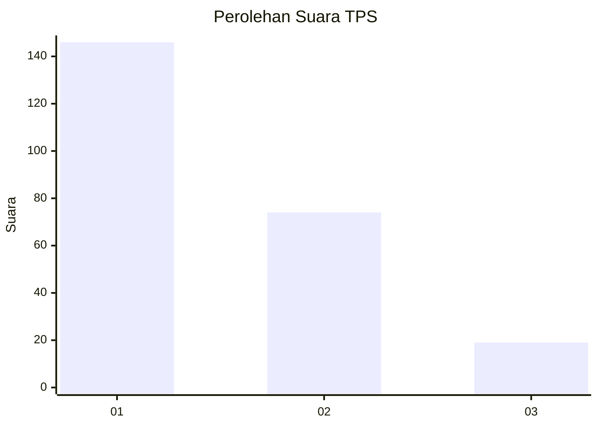
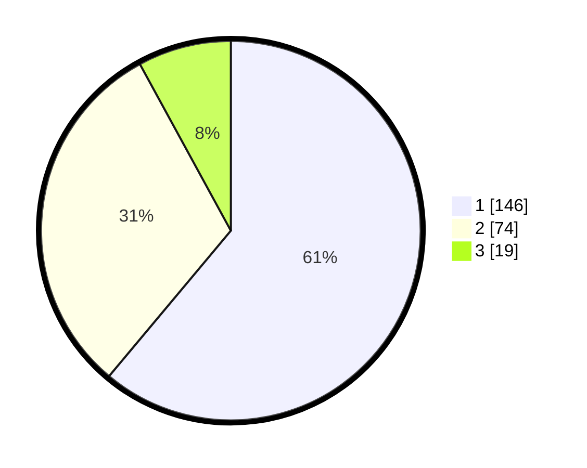

# Hasil

## Grafik

## Tabel

| No. | Nama Paslon    | Suara | Suara (raw) | Persentase |
|:--- |:-------------- | -----:| -----------:| ----------:|
| 1   | ANIES MUHAIMIN | 146   | [146][p-1]  | 61,09      |
| 2   | PRABOWO GIBRAN | 74    | [74][p-2]   | 30,96      |
| 3   | GANJAR MAHFUD  | 19    | [19][p-3]   | 7,95       |

[p-1]: https://github.com/gigit-pemilu/pemilu-2024-32-jawa-barat/blob/main/pilpres/hitung-suara/sub/32-jawa-barat/sub/01-bogor/sub/29-ciomas/sub/2001-mekarjaya/sub/022-tps/sub/paslon-1.txt
[p-2]: https://github.com/gigit-pemilu/pemilu-2024-32-jawa-barat/blob/main/pilpres/hitung-suara/sub/32-jawa-barat/sub/01-bogor/sub/29-ciomas/sub/2001-mekarjaya/sub/022-tps/sub/paslon-2.txt
[p-3]: https://github.com/gigit-pemilu/pemilu-2024-32-jawa-barat/blob/main/pilpres/hitung-suara/sub/32-jawa-barat/sub/01-bogor/sub/29-ciomas/sub/2001-mekarjaya/sub/022-tps/sub/paslon-3.txt

## Foto C Plano

https://sirekap-obj-formc.kpu.go.id/ea53/pemilu/ppwp/32/01/29/20/01/3201292001022-20240215-042828--da0ceeea-99ad-464d-a27e-1eeb20810301.jpg

https://sirekap-obj-formc.kpu.go.id/ea53/pemilu/ppwp/32/01/29/20/01/3201292001022-20240215-043041--5a81f77c-7014-4d3b-bced-a2ac066b298d.jpg

https://sirekap-obj-formc.kpu.go.id/ea53/pemilu/ppwp/32/01/29/20/01/3201292001022-20240215-043154--d7b5502a-72c9-477a-8a05-1a9ac93ed729.jpg

## Metadata

| Key        | Value               |
| ---------- | ------------------- |
| Time Stamp | 2024-02-16 02:30:27 |

