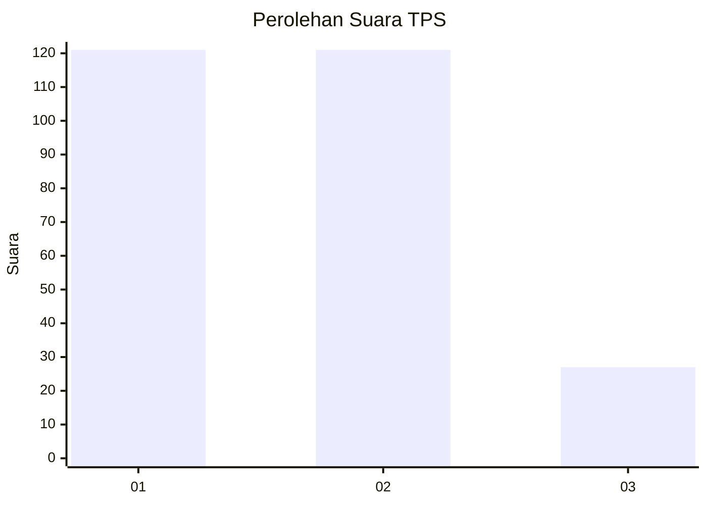
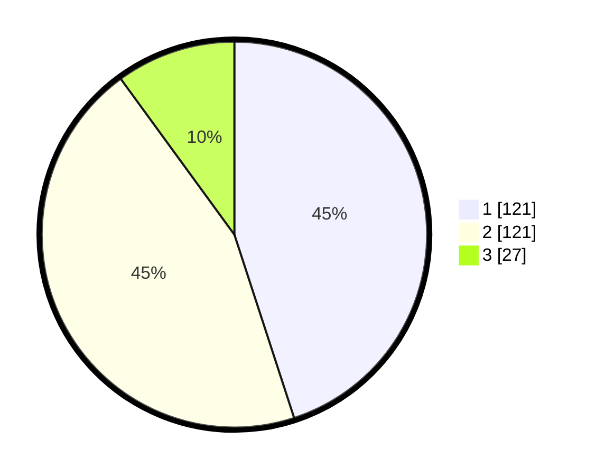

# Hasil

## Grafik

## Tabel

| No. | Nama Paslon    | Suara | Suara (raw) | Persentase |
|:--- |:-------------- | -----:| -----------:| ----------:|
| 1   | ANIES MUHAIMIN | 121   | [121][p-1]  | 44,98      |
| 2   | PRABOWO GIBRAN | 121   | [121][p-2]  | 44,98      |
| 3   | GANJAR MAHFUD  | 27    | [27][p-3]   | 10,04      |

[p-1]: https://github.com/gigit-pemilu/pemilu-2024-32-jawa-barat/blob/main/pilpres/hitung-suara/sub/32-jawa-barat/sub/01-bogor/sub/29-ciomas/sub/2011-ciomas-rahayu/sub/003-tps/sub/paslon-1.txt
[p-2]: https://github.com/gigit-pemilu/pemilu-2024-32-jawa-barat/blob/main/pilpres/hitung-suara/sub/32-jawa-barat/sub/01-bogor/sub/29-ciomas/sub/2011-ciomas-rahayu/sub/003-tps/sub/paslon-2.txt
[p-3]: https://github.com/gigit-pemilu/pemilu-2024-32-jawa-barat/blob/main/pilpres/hitung-suara/sub/32-jawa-barat/sub/01-bogor/sub/29-ciomas/sub/2011-ciomas-rahayu/sub/003-tps/sub/paslon-3.txt

## Foto C Plano

https://sirekap-obj-formc.kpu.go.id/f04e/pemilu/ppwp/32/01/29/20/11/3201292011003-20240221-171234--22bbdad1-56ce-4f3a-bce5-9a3957fe3e06.jpg

https://sirekap-obj-formc.kpu.go.id/f04e/pemilu/ppwp/32/01/29/20/11/3201292011003-20240221-171324--8a5ad43c-0251-4ae3-9851-b396b69aaf0e.jpg

https://sirekap-obj-formc.kpu.go.id/f04e/pemilu/ppwp/32/01/29/20/11/3201292011003-20240214-222519--4f9fd2bd-aae9-437f-9b3f-38f6a76fcc77.jpg

## Metadata

| Key        | Value               |
| ---------- | ------------------- |
| Time Stamp | 2024-02-25 12:00:00 |

