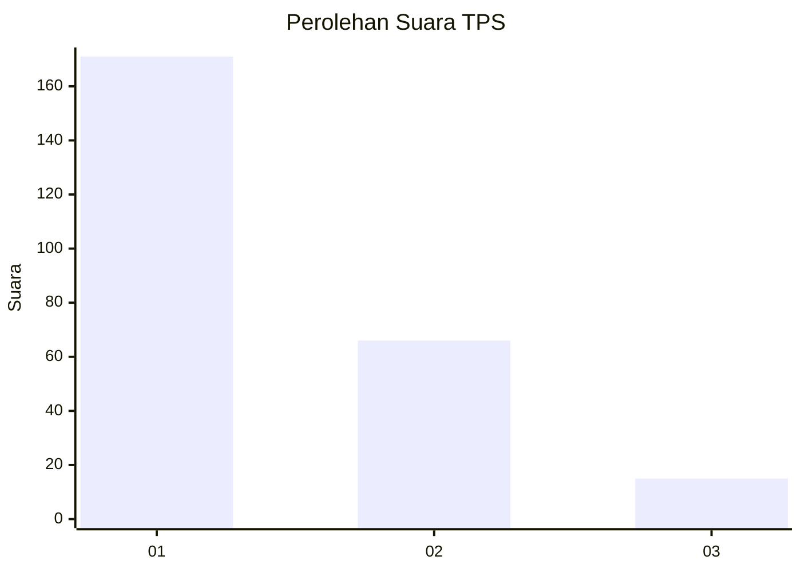
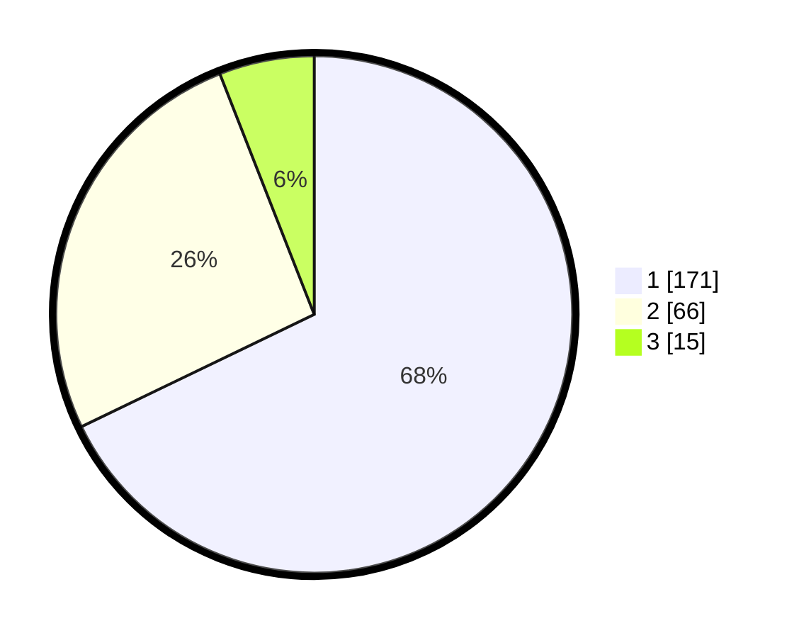

# Hasil

## Grafik

## Tabel

| No. | Nama Paslon    | Suara | Suara (raw) | Persentase |
|:--- |:-------------- | -----:| -----------:| ----------:|
| 1   | ANIES MUHAIMIN | 171   | [171][p-1]  | 67,86      |
| 2   | PRABOWO GIBRAN | 66    | [66][p-2]   | 26,19      |
| 3   | GANJAR MAHFUD  | 15    | [15][p-3]   | 5,95       |

[p-1]: https://github.com/gigit-pemilu/pemilu-2024-32-jawa-barat/blob/main/pilpres/hitung-suara/sub/32-jawa-barat/sub/01-bogor/sub/29-ciomas/sub/2011-ciomas-rahayu/sub/009-tps/sub/paslon-1.txt
[p-2]: https://github.com/gigit-pemilu/pemilu-2024-32-jawa-barat/blob/main/pilpres/hitung-suara/sub/32-jawa-barat/sub/01-bogor/sub/29-ciomas/sub/2011-ciomas-rahayu/sub/009-tps/sub/paslon-2.txt
[p-3]: https://github.com/gigit-pemilu/pemilu-2024-32-jawa-barat/blob/main/pilpres/hitung-suara/sub/32-jawa-barat/sub/01-bogor/sub/29-ciomas/sub/2011-ciomas-rahayu/sub/009-tps/sub/paslon-3.txt

## Foto C Plano

https://sirekap-obj-formc.kpu.go.id/e368/pemilu/ppwp/32/01/29/20/11/3201292011009-20240214-225442--f0b8d243-d285-49bf-9246-431273c6774d.jpg

https://sirekap-obj-formc.kpu.go.id/e368/pemilu/ppwp/32/01/29/20/11/3201292011009-20240214-225608--54d6b7eb-a091-4da1-ba65-d44fa3a910ad.jpg

https://sirekap-obj-formc.kpu.go.id/e368/pemilu/ppwp/32/01/29/20/11/3201292011009-20240214-225719--f1bb7745-9fb9-404d-b926-39ab7f60b38b.jpg

## Metadata

| Key        | Value               |
| ---------- | ------------------- |
| Time Stamp | 2024-02-16 03:30:26 |

