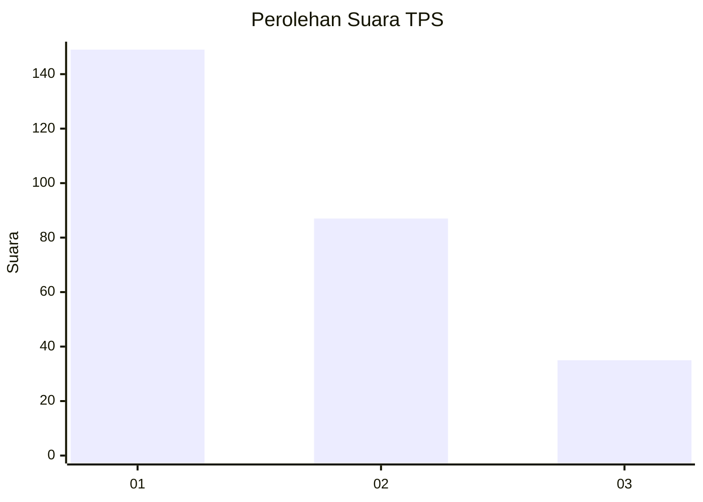
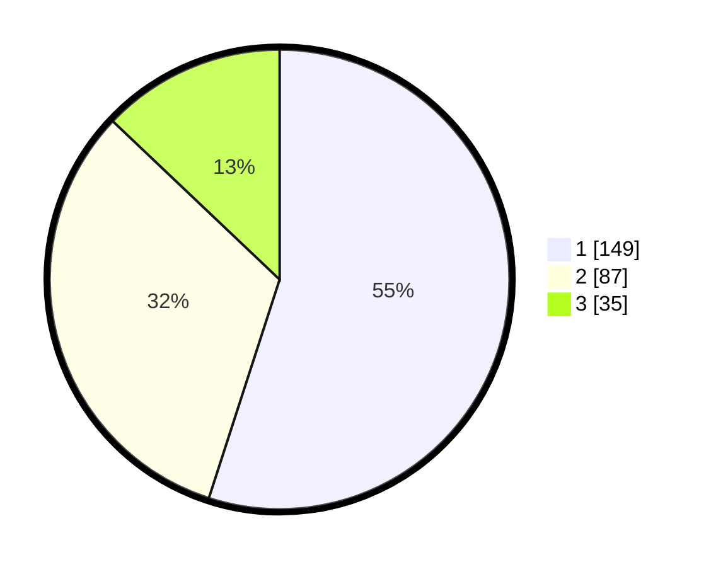

# Hasil

## Grafik

## Tabel

| No. | Nama Paslon    | Suara | Suara (raw) | Persentase |
|:--- |:-------------- | -----:| -----------:| ----------:|
| 1   | ANIES MUHAIMIN | 149   | [149][p-1]  | 54,98      |
| 2   | PRABOWO GIBRAN | 87    | [87][p-2]   | 32,10      |
| 3   | GANJAR MAHFUD  | 35    | [35][p-3]   | 12,92      |

[p-1]: https://github.com/gigit-pemilu/pemilu-2024/blob/main/pilpres/hitung-suara/sub/32-jawa-barat/sub/01-bogor/sub/29-ciomas/sub/2011-ciomas-rahayu/sub/021-tps/sub/paslon-1.txt
[p-2]: https://github.com/gigit-pemilu/pemilu-2024/blob/main/pilpres/hitung-suara/sub/32-jawa-barat/sub/01-bogor/sub/29-ciomas/sub/2011-ciomas-rahayu/sub/021-tps/sub/paslon-2.txt
[p-3]: https://github.com/gigit-pemilu/pemilu-2024/blob/main/pilpres/hitung-suara/sub/32-jawa-barat/sub/01-bogor/sub/29-ciomas/sub/2011-ciomas-rahayu/sub/021-tps/sub/paslon-3.txt

## Foto C Plano

https://sirekap-obj-formc.kpu.go.id/bbf3/pemilu/ppwp/32/01/29/20/11/3201292011021-20240215-074310--1b6a4eda-2af1-4efa-8616-6904ef463888.jpg

https://sirekap-obj-formc.kpu.go.id/bbf3/pemilu/ppwp/32/01/29/20/11/3201292011021-20240215-074316--7b861dde-3ae2-498e-be56-31abd039ba18.jpg

https://sirekap-obj-formc.kpu.go.id/bbf3/pemilu/ppwp/32/01/29/20/11/3201292011021-20240215-074325--a3982884-6b5f-4f48-8834-a3a89b637f27.jpg

## Metadata

| Key        | Value               |
| ---------- | ------------------- |
| Time Stamp | 2024-02-16 12:51:22 |

