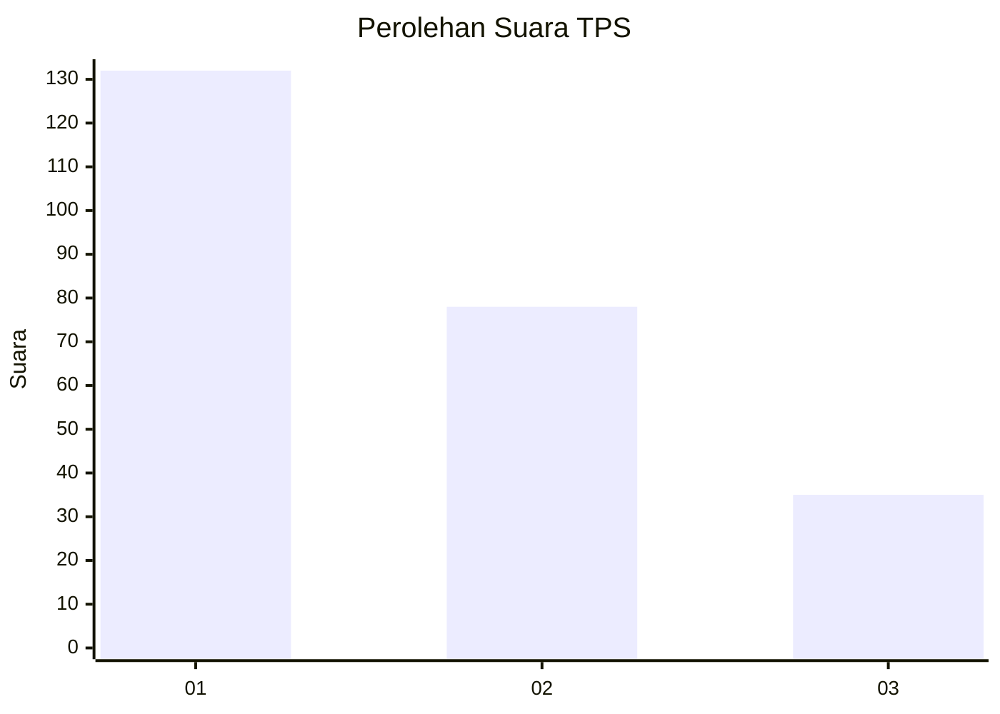
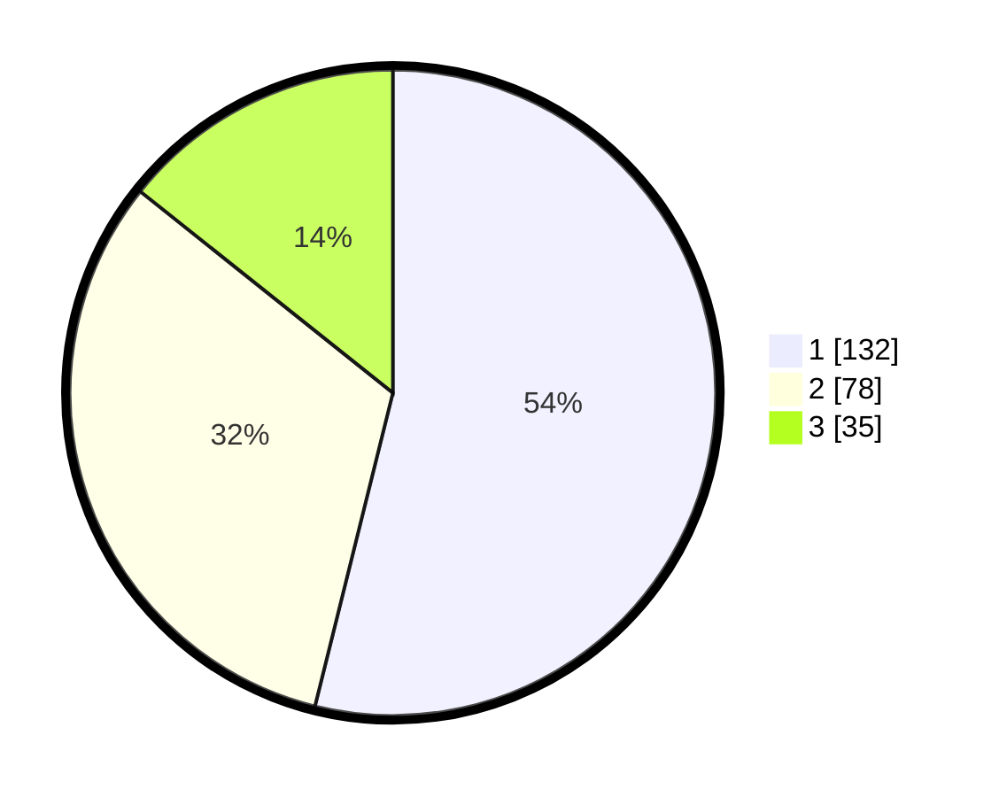

# Hasil

## Grafik

## Tabel

| No. | Nama Paslon    | Suara | Suara (raw) | Persentase |
|:--- |:-------------- | -----:| -----------:| ----------:|
| 1   | ANIES MUHAIMIN | 132   | [132][p-1]  | 53,88      |
| 2   | PRABOWO GIBRAN | 78    | [78][p-2]   | 31,84      |
| 3   | GANJAR MAHFUD  | 35    | [35][p-3]   | 14,29      |

[p-1]: https://github.com/gigit-pemilu/pemilu-2024/blob/main/pilpres/hitung-suara/sub/32-jawa-barat/sub/01-bogor/sub/29-ciomas/sub/2011-ciomas-rahayu/sub/023-tps/sub/paslon-1.txt
[p-2]: https://github.com/gigit-pemilu/pemilu-2024/blob/main/pilpres/hitung-suara/sub/32-jawa-barat/sub/01-bogor/sub/29-ciomas/sub/2011-ciomas-rahayu/sub/023-tps/sub/paslon-2.txt
[p-3]: https://github.com/gigit-pemilu/pemilu-2024/blob/main/pilpres/hitung-suara/sub/32-jawa-barat/sub/01-bogor/sub/29-ciomas/sub/2011-ciomas-rahayu/sub/023-tps/sub/paslon-3.txt

## Foto C Plano

https://sirekap-obj-formc.kpu.go.id/82c3/pemilu/ppwp/32/01/29/20/11/3201292011023-20240214-192449--4d11001a-4a3b-4429-9b30-fb5aa63e3bd4.jpg

https://sirekap-obj-formc.kpu.go.id/82c3/pemilu/ppwp/32/01/29/20/11/3201292011023-20240214-192317--d2baa035-5a64-47dd-b69a-51a7c81094ce.jpg

https://sirekap-obj-formc.kpu.go.id/82c3/pemilu/ppwp/32/01/29/20/11/3201292011023-20240214-192052--b9c2fe7d-8207-481c-9697-bd5feacdbef2.jpg

## Metadata

| Key        | Value               |
| ---------- | ------------------- |
| Time Stamp | 2024-02-16 03:30:26 |

