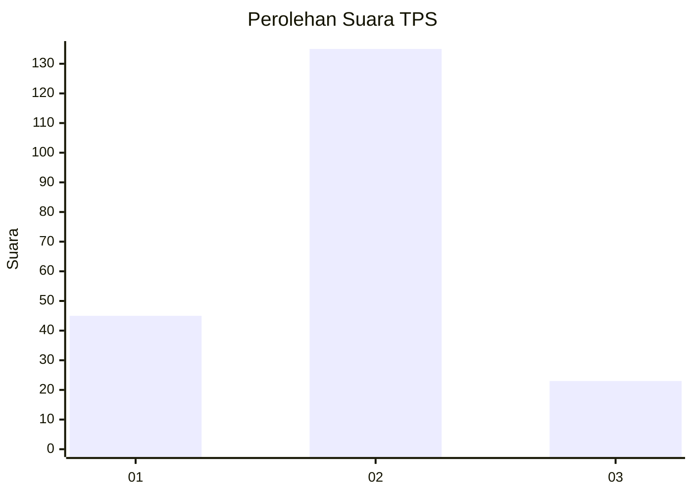
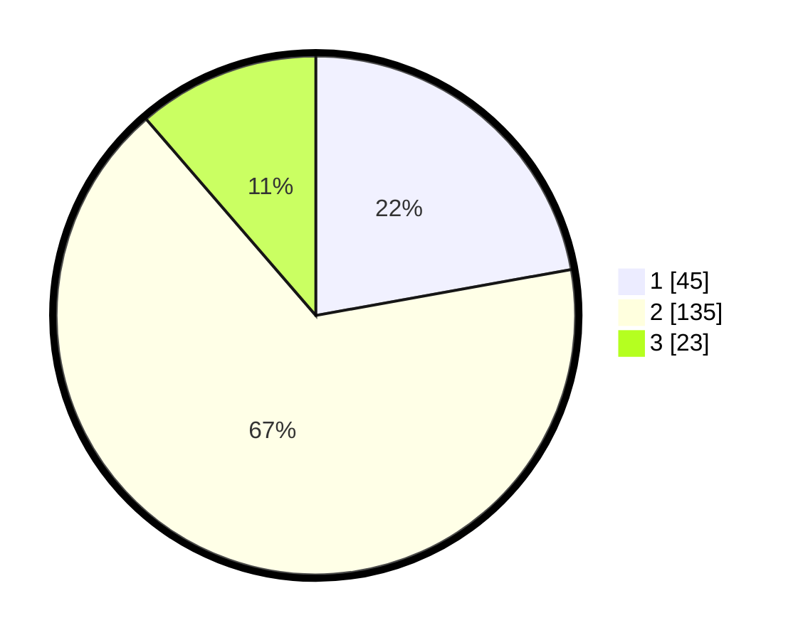

# Hasil

## Grafik

## Tabel

| No. | Nama Paslon    | Suara | Suara (raw) | Persentase |
|:--- |:-------------- | -----:| -----------:| ----------:|
| 1   | ANIES MUHAIMIN | 45    | [45][p-1]   | 22,17      |
| 2   | PRABOWO GIBRAN | 135   | [135][p-2]  | 66,50      |
| 3   | GANJAR MAHFUD  | 23    | [23][p-3]   | 11,33      |

[p-1]: https://github.com/gigit-pemilu/pemilu-2024-32-jawa-barat/blob/main/pilpres/hitung-suara/sub/32-jawa-barat/sub/01-bogor/sub/30-dramaga/sub/2001-sukadamai/sub/001-tps/sub/paslon-1.txt
[p-2]: https://github.com/gigit-pemilu/pemilu-2024-32-jawa-barat/blob/main/pilpres/hitung-suara/sub/32-jawa-barat/sub/01-bogor/sub/30-dramaga/sub/2001-sukadamai/sub/001-tps/sub/paslon-2.txt
[p-3]: https://github.com/gigit-pemilu/pemilu-2024-32-jawa-barat/blob/main/pilpres/hitung-suara/sub/32-jawa-barat/sub/01-bogor/sub/30-dramaga/sub/2001-sukadamai/sub/001-tps/sub/paslon-3.txt

## Foto C Plano

https://sirekap-obj-formc.kpu.go.id/2c8d/pemilu/ppwp/32/01/30/20/01/3201302001001-20240216-112548--654c8e81-56b1-4e5b-b357-5166e4906f5c.jpg

https://sirekap-obj-formc.kpu.go.id/2c8d/pemilu/ppwp/32/01/30/20/01/3201302001001-20240216-112604--99001caf-a95f-4866-9236-0187d06cc820.jpg

https://sirekap-obj-formc.kpu.go.id/2c8d/pemilu/ppwp/32/01/30/20/01/3201302001001-20240216-112613--0cb35292-b24a-4491-85b7-37a0f9a7fc67.jpg

## Metadata

| Key        | Value               |
| ---------- | ------------------- |
| Time Stamp | 2024-02-16 21:01:00 |

