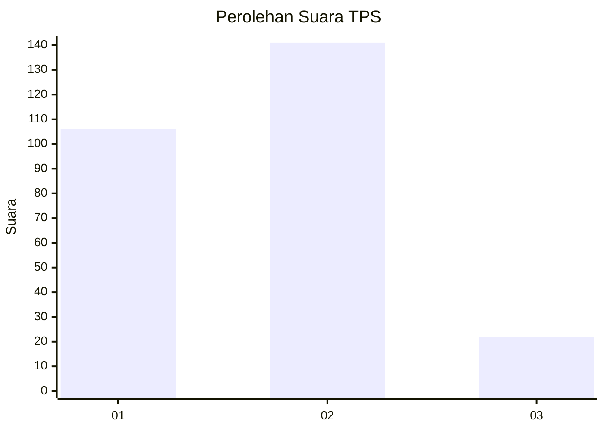
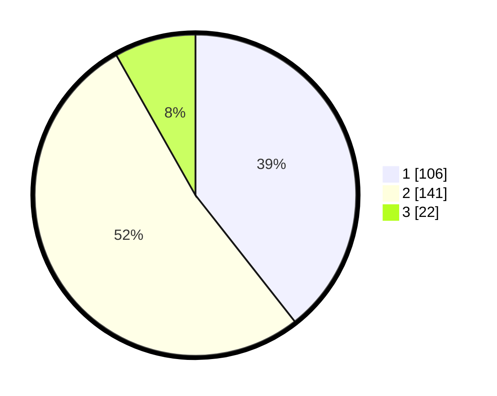

# Hasil

## Grafik

## Tabel

| No. | Nama Paslon    | Suara | Suara (raw) | Persentase |
|:--- |:-------------- | -----:| -----------:| ----------:|
| 1   | ANIES MUHAIMIN | 106   | [106][p-1]  | 39,41      |
| 2   | PRABOWO GIBRAN | 141   | [141][p-2]  | 52,42      |
| 3   | GANJAR MAHFUD  | 22    | [22][p-3]   | 8,18       |

[p-1]: https://github.com/gigit-pemilu/pemilu-2024-32-jawa-barat/blob/main/pilpres/hitung-suara/sub/32-jawa-barat/sub/01-bogor/sub/30-dramaga/sub/2001-sukadamai/sub/017-tps/sub/paslon-1.txt
[p-2]: https://github.com/gigit-pemilu/pemilu-2024-32-jawa-barat/blob/main/pilpres/hitung-suara/sub/32-jawa-barat/sub/01-bogor/sub/30-dramaga/sub/2001-sukadamai/sub/017-tps/sub/paslon-2.txt
[p-3]: https://github.com/gigit-pemilu/pemilu-2024-32-jawa-barat/blob/main/pilpres/hitung-suara/sub/32-jawa-barat/sub/01-bogor/sub/30-dramaga/sub/2001-sukadamai/sub/017-tps/sub/paslon-3.txt

## Foto C Plano

https://sirekap-obj-formc.kpu.go.id/435c/pemilu/ppwp/32/01/30/20/01/3201302001017-20240215-034705--5f99e853-1cb3-4069-ba96-c45baa7fd420.jpg

https://sirekap-obj-formc.kpu.go.id/435c/pemilu/ppwp/32/01/30/20/01/3201302001017-20240215-034748--cc1cd61e-178f-41d3-83f9-d2dbc29867e6.jpg

https://sirekap-obj-formc.kpu.go.id/435c/pemilu/ppwp/32/01/30/20/01/3201302001017-20240215-034833--f5bbabcd-7cdd-4d2d-8084-f59744b32c02.jpg

## Metadata

| Key        | Value               |
| ---------- | ------------------- |
| Time Stamp | 2024-02-15 19:30:26 |

