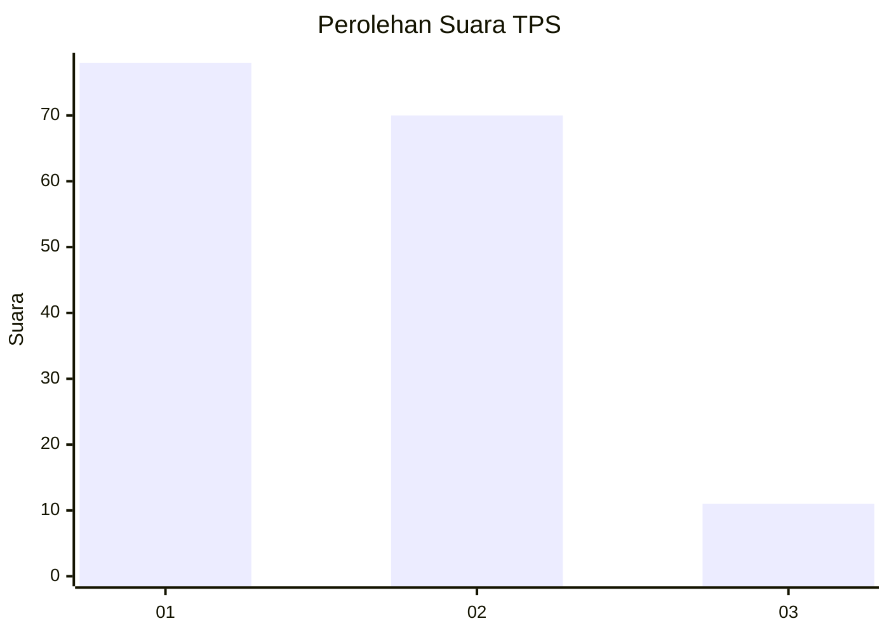
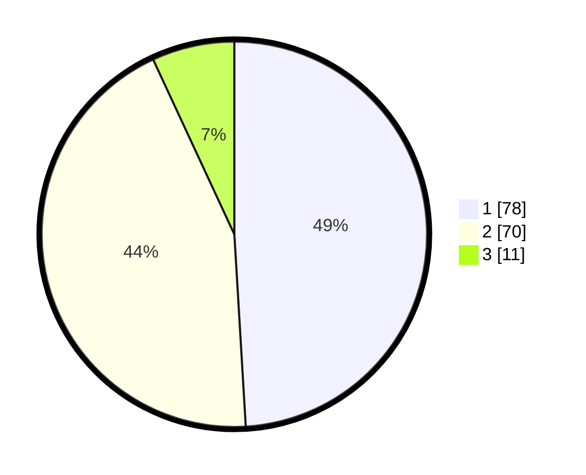

# Hasil

## Grafik

## Tabel

| No. | Nama Paslon    | Suara | Suara (raw) | Persentase |
|:--- |:-------------- | -----:| -----------:| ----------:|
| 1   | ANIES MUHAIMIN | 78    | [78][p-1]   | 49,06      |
| 2   | PRABOWO GIBRAN | 70    | [70][p-2]   | 44,03      |
| 3   | GANJAR MAHFUD  | 11    | [11][p-3]   | 6,92       |

[p-1]: https://github.com/gigit-pemilu/pemilu-2024/blob/main/pilpres/hitung-suara/sub/32-jawa-barat/sub/01-bogor/sub/30-dramaga/sub/2002-ciherang/sub/003-tps/sub/paslon-1.txt
[p-2]: https://github.com/gigit-pemilu/pemilu-2024/blob/main/pilpres/hitung-suara/sub/32-jawa-barat/sub/01-bogor/sub/30-dramaga/sub/2002-ciherang/sub/003-tps/sub/paslon-2.txt
[p-3]: https://github.com/gigit-pemilu/pemilu-2024/blob/main/pilpres/hitung-suara/sub/32-jawa-barat/sub/01-bogor/sub/30-dramaga/sub/2002-ciherang/sub/003-tps/sub/paslon-3.txt

## Foto C Plano

https://sirekap-obj-formc.kpu.go.id/6ce8/pemilu/ppwp/32/01/30/20/02/3201302002003-20240214-221156--f44f2e84-d8e0-46f6-9802-d85b0f75fbc7.jpg

https://sirekap-obj-formc.kpu.go.id/6ce8/pemilu/ppwp/32/01/30/20/02/3201302002003-20240214-221600--dd70cd51-5aa7-4154-87a6-14c999e79af1.jpg

https://sirekap-obj-formc.kpu.go.id/6ce8/pemilu/ppwp/32/01/30/20/02/3201302002003-20240214-221640--101d4ece-555d-4099-b2de-03a2daee4c55.jpg

## Metadata

| Key        | Value               |
| ---------- | ------------------- |
| Time Stamp | 2024-02-15 19:30:26 |

