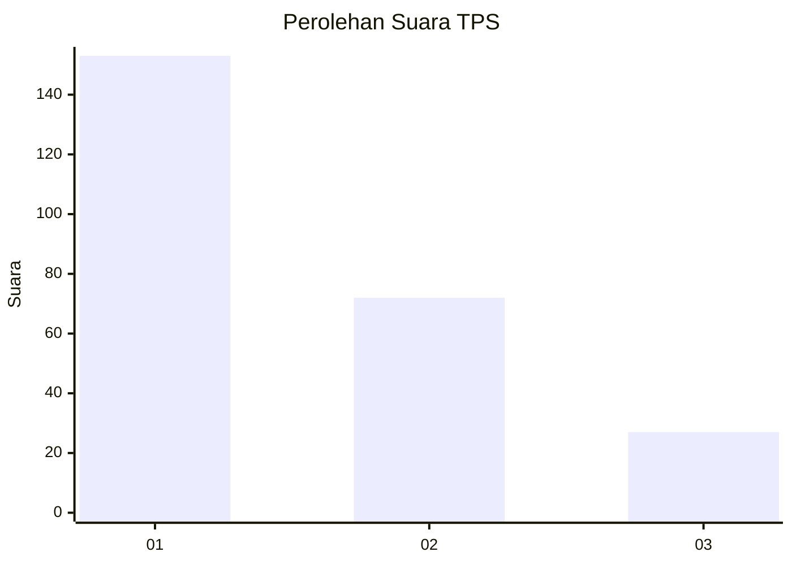
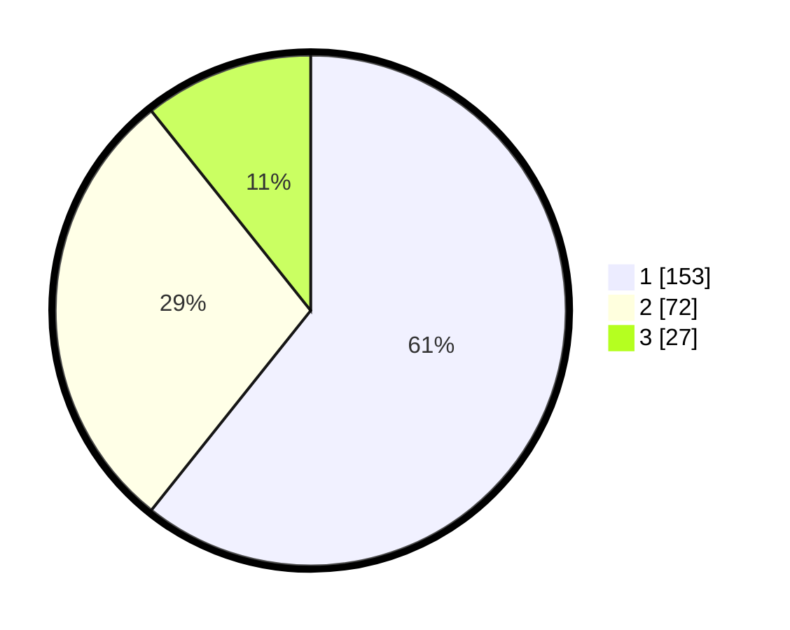

# Hasil

## Grafik

## Tabel

| No. | Nama Paslon    | Suara | Suara (raw) | Persentase |
|:--- |:-------------- | -----:| -----------:| ----------:|
| 1   | ANIES MUHAIMIN | 153   | [153][p-1]  | 60,71      |
| 2   | PRABOWO GIBRAN | 72    | [72][p-2]   | 28,57      |
| 3   | GANJAR MAHFUD  | 27    | [27][p-3]   | 10,71      |

[p-1]: https://github.com/gigit-pemilu/pemilu-2024-32-jawa-barat/blob/main/pilpres/hitung-suara/sub/32-jawa-barat/sub/01-bogor/sub/30-dramaga/sub/2003-sinarsari/sub/018-tps/sub/paslon-1.txt
[p-2]: https://github.com/gigit-pemilu/pemilu-2024-32-jawa-barat/blob/main/pilpres/hitung-suara/sub/32-jawa-barat/sub/01-bogor/sub/30-dramaga/sub/2003-sinarsari/sub/018-tps/sub/paslon-2.txt
[p-3]: https://github.com/gigit-pemilu/pemilu-2024-32-jawa-barat/blob/main/pilpres/hitung-suara/sub/32-jawa-barat/sub/01-bogor/sub/30-dramaga/sub/2003-sinarsari/sub/018-tps/sub/paslon-3.txt

## Foto C Plano

https://sirekap-obj-formc.kpu.go.id/7082/pemilu/ppwp/32/01/30/20/03/3201302003018-20240215-071226--61527d86-6fca-4d2f-9048-a9c5af78d0dc.jpg

https://sirekap-obj-formc.kpu.go.id/7082/pemilu/ppwp/32/01/30/20/03/3201302003018-20240215-071509--c1c19e07-caea-4940-a47f-759674039f92.jpg

https://sirekap-obj-formc.kpu.go.id/7082/pemilu/ppwp/32/01/30/20/03/3201302003018-20240215-081332--2018d9f4-b5b5-44ae-9c58-3e5e2969ffbc.jpg

## Metadata

| Key        | Value               |
| ---------- | ------------------- |
| Time Stamp | 2024-02-15 22:30:27 |

