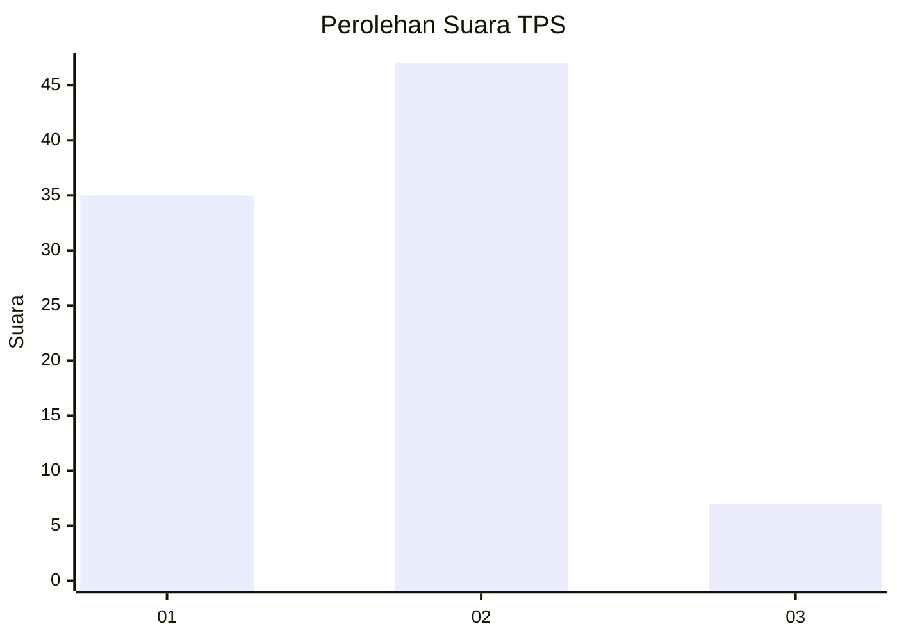

# Hasil

## Grafik

## Tabel

| No. | Nama Paslon    | Suara | Suara (raw) | Persentase |
|:--- |:-------------- | -----:| -----------:| ----------:|
| 1   | ANIES MUHAIMIN | 35    | [35][p-1]   | 39,33      |
| 2   | PRABOWO GIBRAN | 47    | [47][p-2]   | 52,81      |
| 3   | GANJAR MAHFUD  | 7     | [7][p-3]    | 7,87       |

[p-1]: https://github.com/gigit-pemilu/pemilu-2024/blob/main/pilpres/hitung-suara/sub/32-jawa-barat/sub/01-bogor/sub/30-dramaga/sub/2005-petir/sub/012-tps/sub/paslon-1.txt
[p-2]: https://github.com/gigit-pemilu/pemilu-2024/blob/main/pilpres/hitung-suara/sub/32-jawa-barat/sub/01-bogor/sub/30-dramaga/sub/2005-petir/sub/012-tps/sub/paslon-2.txt
[p-3]: https://github.com/gigit-pemilu/pemilu-2024/blob/main/pilpres/hitung-suara/sub/32-jawa-barat/sub/01-bogor/sub/30-dramaga/sub/2005-petir/sub/012-tps/sub/paslon-3.txt

## Foto C Plano

https://sirekap-obj-formc.kpu.go.id/45f0/pemilu/ppwp/32/01/30/20/05/3201302005012-20240214-221110--86563e55-3dee-46bd-8750-c85204e64cec.jpg

https://sirekap-obj-formc.kpu.go.id/45f0/pemilu/ppwp/32/01/30/20/05/3201302005012-20240214-221134--72e14068-d89f-4551-af5c-658a0db8d289.jpg

https://sirekap-obj-formc.kpu.go.id/45f0/pemilu/ppwp/32/01/30/20/05/3201302005012-20240214-221158--505e3298-b514-4bdc-9933-b0ac60a17b1f.jpg

## Metadata

| Key        | Value               |
| ---------- | ------------------- |
| Time Stamp | 2024-02-15 21:01:18 |

