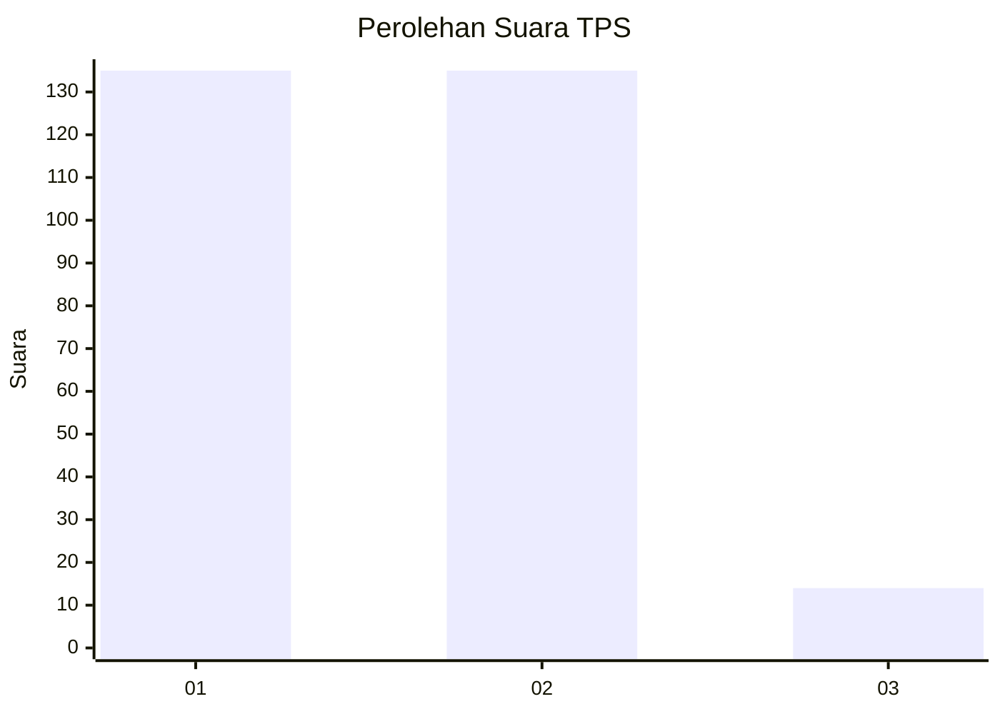
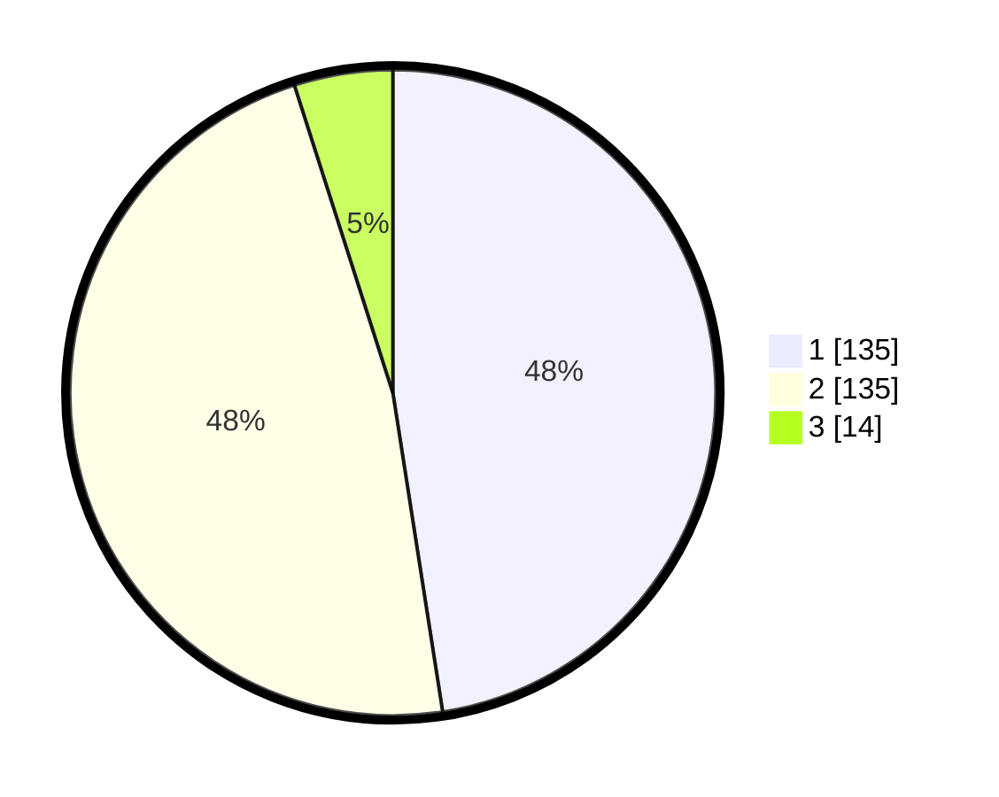

# Hasil

## Grafik

## Tabel

| No. | Nama Paslon    | Suara | Suara (raw) | Persentase |
|:--- |:-------------- | -----:| -----------:| ----------:|
| 1   | ANIES MUHAIMIN | 135   | [135][p-1]  | 47,54      |
| 2   | PRABOWO GIBRAN | 135   | [135][p-2]  | 47,54      |
| 3   | GANJAR MAHFUD  | 14    | [14][p-3]   | 4,93       |

[p-1]: https://github.com/gigit-pemilu/pemilu-2024-32-jawa-barat/blob/main/pilpres/hitung-suara/sub/32-jawa-barat/sub/01-bogor/sub/30-dramaga/sub/2007-cikarawang/sub/013-tps/sub/paslon-1.txt
[p-2]: https://github.com/gigit-pemilu/pemilu-2024-32-jawa-barat/blob/main/pilpres/hitung-suara/sub/32-jawa-barat/sub/01-bogor/sub/30-dramaga/sub/2007-cikarawang/sub/013-tps/sub/paslon-2.txt
[p-3]: https://github.com/gigit-pemilu/pemilu-2024-32-jawa-barat/blob/main/pilpres/hitung-suara/sub/32-jawa-barat/sub/01-bogor/sub/30-dramaga/sub/2007-cikarawang/sub/013-tps/sub/paslon-3.txt

## Foto C Plano

https://sirekap-obj-formc.kpu.go.id/2a62/pemilu/ppwp/32/01/30/20/07/3201302007013-20240214-231314--ab11effe-7a77-42ab-a3d5-6f09419f5650.jpg

https://sirekap-obj-formc.kpu.go.id/2a62/pemilu/ppwp/32/01/30/20/07/3201302007013-20240214-231359--8065056b-9bd6-4f45-8fae-0174520321c4.jpg

https://sirekap-obj-formc.kpu.go.id/2a62/pemilu/ppwp/32/01/30/20/07/3201302007013-20240214-231422--209e6ebe-bf5a-426e-bbbc-f10e96ccf80c.jpg

## Metadata

| Key        | Value               |
| ---------- | ------------------- |
| Time Stamp | 2024-02-15 20:30:46 |

