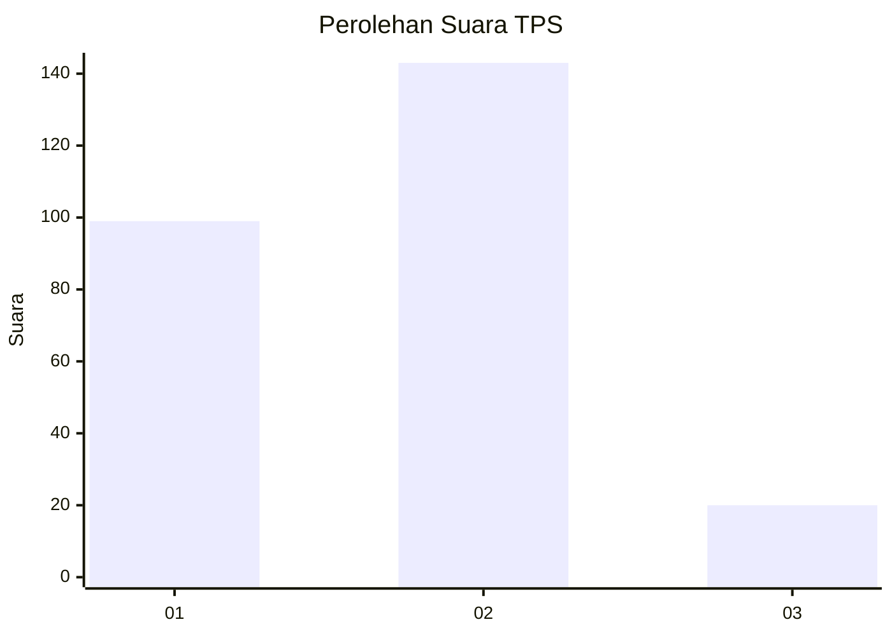

# Hasil

## Grafik

## Tabel

| No. | Nama Paslon    | Suara | Suara (raw) | Persentase |
|:--- |:-------------- | -----:| -----------:| ----------:|
| 1   | ANIES MUHAIMIN | 99    | [99][p-1]   | 37,79      |
| 2   | PRABOWO GIBRAN | 143   | [143][p-2]  | 54,58      |
| 3   | GANJAR MAHFUD  | 20    | [20][p-3]   | 7,63       |

[p-1]: https://github.com/gigit-pemilu/pemilu-2024/blob/main/pilpres/hitung-suara/sub/32-jawa-barat/sub/01-bogor/sub/30-dramaga/sub/2007-cikarawang/sub/018-tps/sub/paslon-1.txt
[p-2]: https://github.com/gigit-pemilu/pemilu-2024/blob/main/pilpres/hitung-suara/sub/32-jawa-barat/sub/01-bogor/sub/30-dramaga/sub/2007-cikarawang/sub/018-tps/sub/paslon-2.txt
[p-3]: https://github.com/gigit-pemilu/pemilu-2024/blob/main/pilpres/hitung-suara/sub/32-jawa-barat/sub/01-bogor/sub/30-dramaga/sub/2007-cikarawang/sub/018-tps/sub/paslon-3.txt

## Foto C Plano

https://sirekap-obj-formc.kpu.go.id/12a7/pemilu/ppwp/32/01/30/20/07/3201302007018-20240214-155634--5e7728f8-61ea-4d8c-a01c-8046fd2ff008.jpg

https://sirekap-obj-formc.kpu.go.id/12a7/pemilu/ppwp/32/01/30/20/07/3201302007018-20240214-155831--44f16a69-2956-49a5-a3b4-58891792a014.jpg

https://sirekap-obj-formc.kpu.go.id/12a7/pemilu/ppwp/32/01/30/20/07/3201302007018-20240214-160121--96e06221-6617-4381-b58e-6e89a78a0d72.jpg

## Metadata

| Key        | Value               |
| ---------- | ------------------- |
| Time Stamp | 2024-02-15 20:30:46 |

