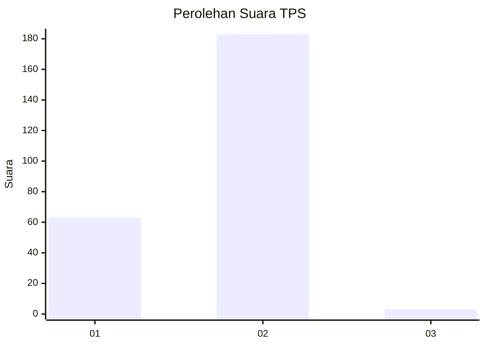
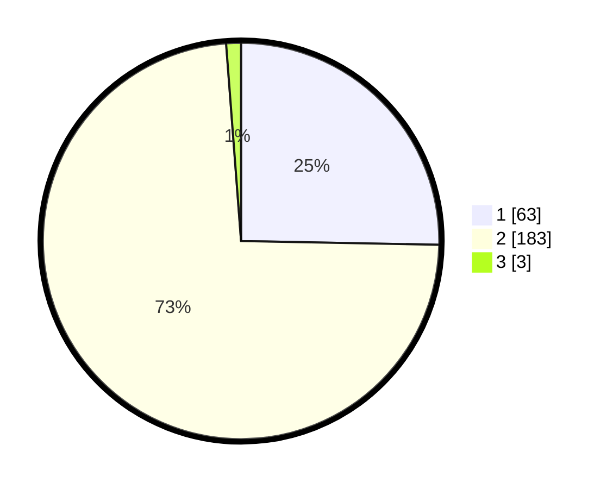

# Hasil

## Grafik

## Tabel

| No. | Nama Paslon    | Suara | Suara (raw) | Persentase |
|:--- |:-------------- | -----:| -----------:| ----------:|
| 1   | ANIES MUHAIMIN | 63    | [63][p-1]   | 25,30      |
| 2   | PRABOWO GIBRAN | 183   | [183][p-2]  | 73,49      |
| 3   | GANJAR MAHFUD  | 3     | [3][p-3]    | 1,20       |

[p-1]: https://github.com/gigit-pemilu/pemilu-2024-32-jawa-barat/blob/main/pilpres/hitung-suara/sub/32-jawa-barat/sub/01-bogor/sub/32-klapanunggal/sub/2001-klapanunggal/sub/001-tps/sub/paslon-1.txt
[p-2]: https://github.com/gigit-pemilu/pemilu-2024-32-jawa-barat/blob/main/pilpres/hitung-suara/sub/32-jawa-barat/sub/01-bogor/sub/32-klapanunggal/sub/2001-klapanunggal/sub/001-tps/sub/paslon-2.txt
[p-3]: https://github.com/gigit-pemilu/pemilu-2024-32-jawa-barat/blob/main/pilpres/hitung-suara/sub/32-jawa-barat/sub/01-bogor/sub/32-klapanunggal/sub/2001-klapanunggal/sub/001-tps/sub/paslon-3.txt

## Foto C Plano

https://sirekap-obj-formc.kpu.go.id/fbe7/pemilu/ppwp/32/01/32/20/01/3201322001001-20240215-034332--869f588b-cf05-457f-a9e8-fae96e33617e.jpg

https://sirekap-obj-formc.kpu.go.id/fbe7/pemilu/ppwp/32/01/32/20/01/3201322001001-20240215-013210--4594c1b6-cf2e-49e2-8ea9-d34c72bff939.jpg

https://sirekap-obj-formc.kpu.go.id/fbe7/pemilu/ppwp/32/01/32/20/01/3201322001001-20240215-013610--8d6c50fb-bdfc-4f00-a48f-e1108b743288.jpg

## Metadata

| Key        | Value               |
| ---------- | ------------------- |
| Time Stamp | 2024-02-17 03:30:02 |

