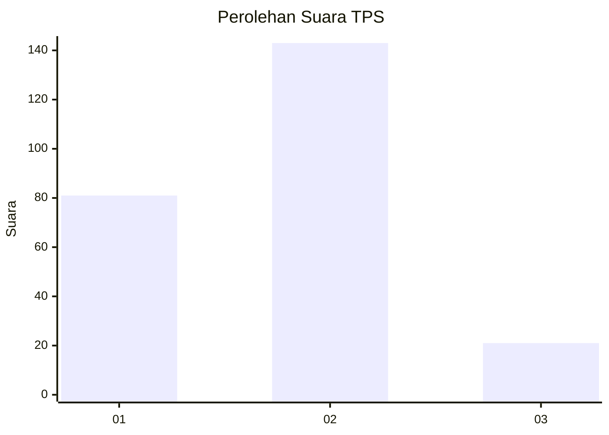
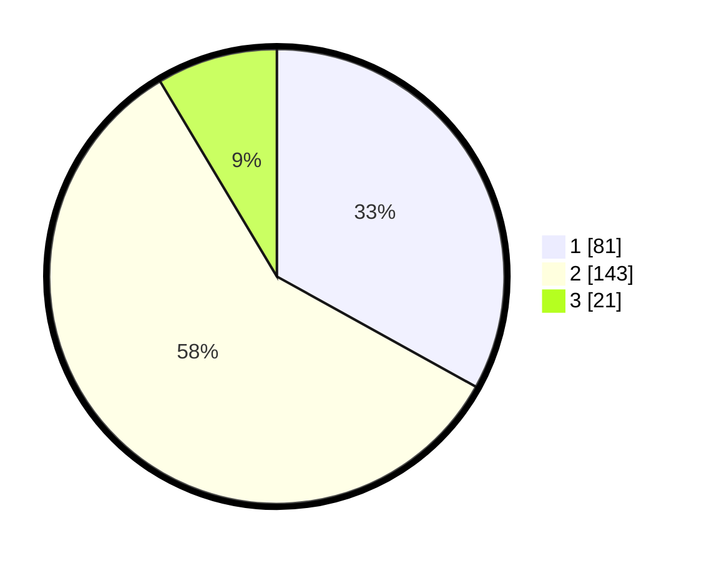

# Hasil

## Grafik

## Tabel

| No. | Nama Paslon    | Suara | Suara (raw) | Persentase |
|:--- |:-------------- | -----:| -----------:| ----------:|
| 1   | ANIES MUHAIMIN | 81    | [81][p-1]   | 33,06      |
| 2   | PRABOWO GIBRAN | 143   | [143][p-2]  | 58,37      |
| 3   | GANJAR MAHFUD  | 21    | [21][p-3]   | 8,57       |

[p-1]: https://github.com/gigit-pemilu/pemilu-2024-32-jawa-barat/blob/main/pilpres/hitung-suara/sub/32-jawa-barat/sub/01-bogor/sub/32-klapanunggal/sub/2001-klapanunggal/sub/002-tps/sub/paslon-1.txt
[p-2]: https://github.com/gigit-pemilu/pemilu-2024-32-jawa-barat/blob/main/pilpres/hitung-suara/sub/32-jawa-barat/sub/01-bogor/sub/32-klapanunggal/sub/2001-klapanunggal/sub/002-tps/sub/paslon-2.txt
[p-3]: https://github.com/gigit-pemilu/pemilu-2024-32-jawa-barat/blob/main/pilpres/hitung-suara/sub/32-jawa-barat/sub/01-bogor/sub/32-klapanunggal/sub/2001-klapanunggal/sub/002-tps/sub/paslon-3.txt

## Foto C Plano

https://sirekap-obj-formc.kpu.go.id/3963/pemilu/ppwp/32/01/32/20/01/3201322001002-20240214-230345--9722faa1-d41f-4b55-8b37-88a68d541dd4.jpg

https://sirekap-obj-formc.kpu.go.id/3963/pemilu/ppwp/32/01/32/20/01/3201322001002-20240214-230351--b0497dd0-2da8-4fc7-9cc1-ab98a6b1240a.jpg

https://sirekap-obj-formc.kpu.go.id/3963/pemilu/ppwp/32/01/32/20/01/3201322001002-20240214-230359--e976822b-6f60-4f30-8eda-2f18b2ebc57c.jpg

## Metadata

| Key        | Value               |
| ---------- | ------------------- |
| Time Stamp | 2024-02-16 00:00:26 |

