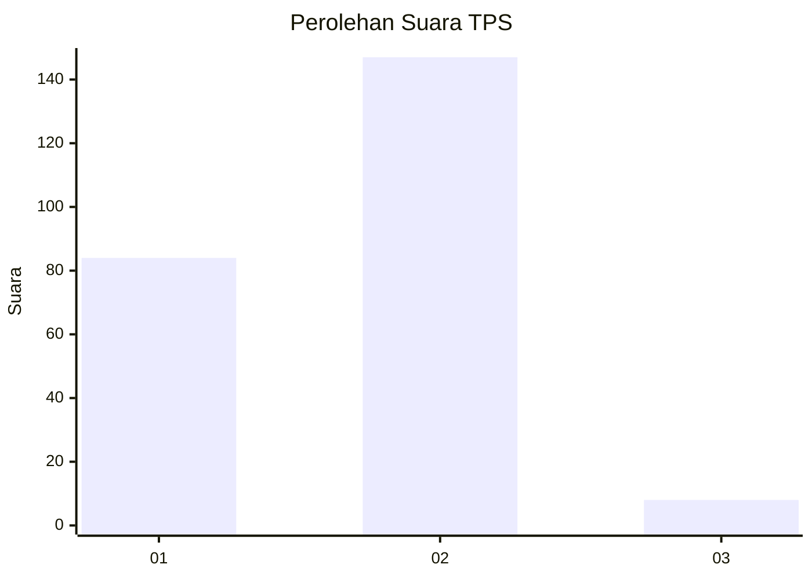
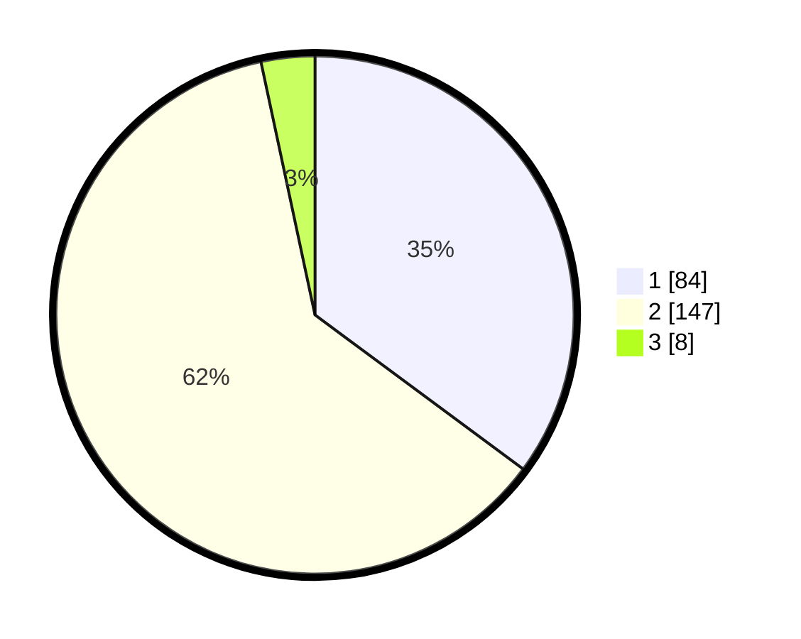

# Hasil

## Grafik

## Tabel

| No. | Nama Paslon    | Suara | Suara (raw) | Persentase |
|:--- |:-------------- | -----:| -----------:| ----------:|
| 1   | ANIES MUHAIMIN | 84    | [84][p-1]   | 35,15      |
| 2   | PRABOWO GIBRAN | 147   | [147][p-2]  | 61,51      |
| 3   | GANJAR MAHFUD  | 8     | [8][p-3]    | 3,35       |

[p-1]: https://github.com/gigit-pemilu/pemilu-2024-32-jawa-barat/blob/main/pilpres/hitung-suara/sub/32-jawa-barat/sub/01-bogor/sub/32-klapanunggal/sub/2001-klapanunggal/sub/004-tps/sub/paslon-1.txt
[p-2]: https://github.com/gigit-pemilu/pemilu-2024-32-jawa-barat/blob/main/pilpres/hitung-suara/sub/32-jawa-barat/sub/01-bogor/sub/32-klapanunggal/sub/2001-klapanunggal/sub/004-tps/sub/paslon-2.txt
[p-3]: https://github.com/gigit-pemilu/pemilu-2024-32-jawa-barat/blob/main/pilpres/hitung-suara/sub/32-jawa-barat/sub/01-bogor/sub/32-klapanunggal/sub/2001-klapanunggal/sub/004-tps/sub/paslon-3.txt

## Foto C Plano

https://sirekap-obj-formc.kpu.go.id/b035/pemilu/ppwp/32/01/32/20/01/3201322001004-20240215-061343--01e074ff-8c77-4995-8e64-d18a4e1abbee.jpg

https://sirekap-obj-formc.kpu.go.id/b035/pemilu/ppwp/32/01/32/20/01/3201322001004-20240215-061533--68c32856-cda4-4708-894d-0d5e33ccb603.jpg

https://sirekap-obj-formc.kpu.go.id/b035/pemilu/ppwp/32/01/32/20/01/3201322001004-20240215-061647--2337cc78-d086-4979-abb6-409ad9f8b131.jpg

## Metadata

| Key        | Value               |
| ---------- | ------------------- |
| Time Stamp | 2024-02-16 00:00:26 |

