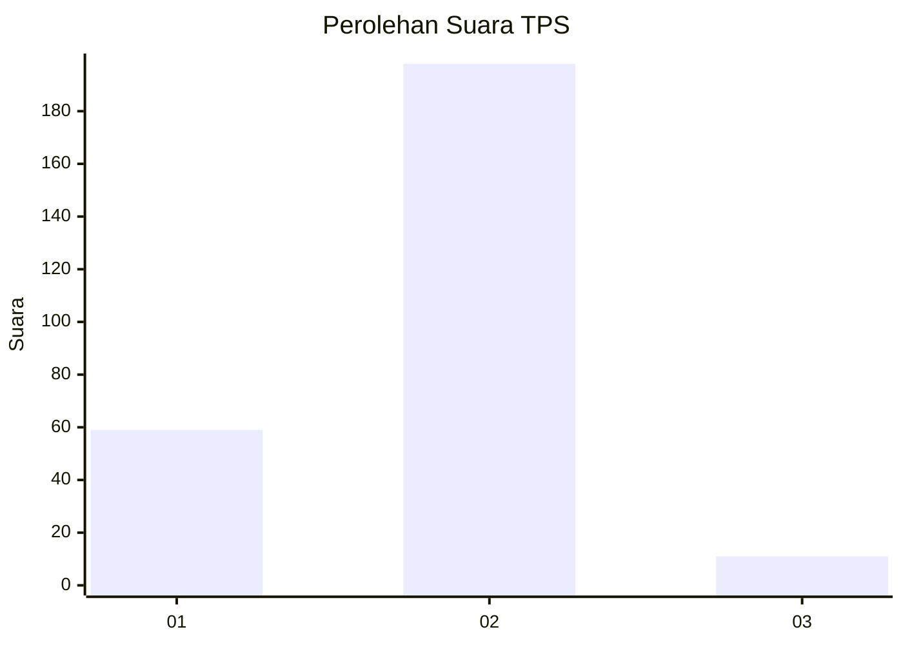
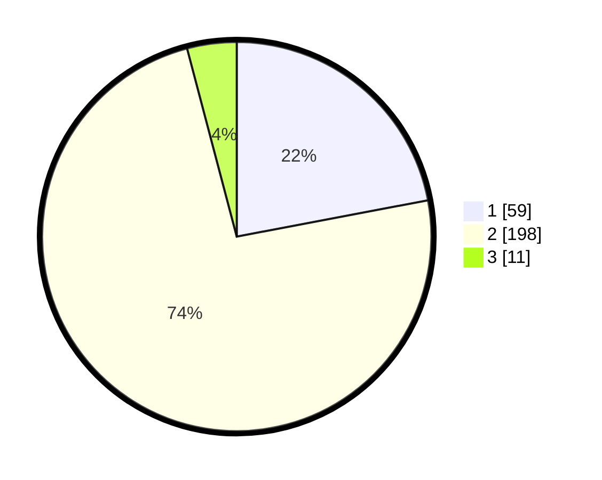

# Hasil

## Grafik

## Tabel

| No. | Nama Paslon    | Suara | Suara (raw) | Persentase |
|:--- |:-------------- | -----:| -----------:| ----------:|
| 1   | ANIES MUHAIMIN | 59    | [59][p-1]   | 22,01      |
| 2   | PRABOWO GIBRAN | 198   | [198][p-2]  | 73,88      |
| 3   | GANJAR MAHFUD  | 11    | [11][p-3]   | 4,10       |

[p-1]: https://github.com/gigit-pemilu/pemilu-2024-32-jawa-barat/blob/main/pilpres/hitung-suara/sub/32-jawa-barat/sub/01-bogor/sub/32-klapanunggal/sub/2001-klapanunggal/sub/030-tps/sub/paslon-1.txt
[p-2]: https://github.com/gigit-pemilu/pemilu-2024-32-jawa-barat/blob/main/pilpres/hitung-suara/sub/32-jawa-barat/sub/01-bogor/sub/32-klapanunggal/sub/2001-klapanunggal/sub/030-tps/sub/paslon-2.txt
[p-3]: https://github.com/gigit-pemilu/pemilu-2024-32-jawa-barat/blob/main/pilpres/hitung-suara/sub/32-jawa-barat/sub/01-bogor/sub/32-klapanunggal/sub/2001-klapanunggal/sub/030-tps/sub/paslon-3.txt

## Foto C Plano

https://sirekap-obj-formc.kpu.go.id/9f4e/pemilu/ppwp/32/01/32/20/01/3201322001030-20240217-205908--469c71e7-f6ec-40e6-88f7-ecead6bbb24c.jpg

https://sirekap-obj-formc.kpu.go.id/9f4e/pemilu/ppwp/32/01/32/20/01/3201322001030-20240217-210048--bb2ea8f5-c8d4-4027-a344-f7674ef5af20.jpg

https://sirekap-obj-formc.kpu.go.id/9f4e/pemilu/ppwp/32/01/32/20/01/3201322001030-20240217-210020--b164e2d5-d881-4a30-a87e-39bcfad93def.jpg

## Metadata

| Key        | Value               |
| ---------- | ------------------- |
| Time Stamp | 2024-02-25 15:00:00 |

