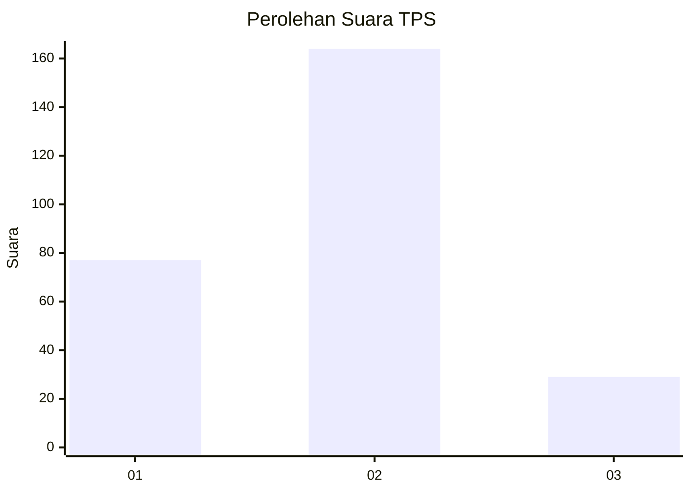
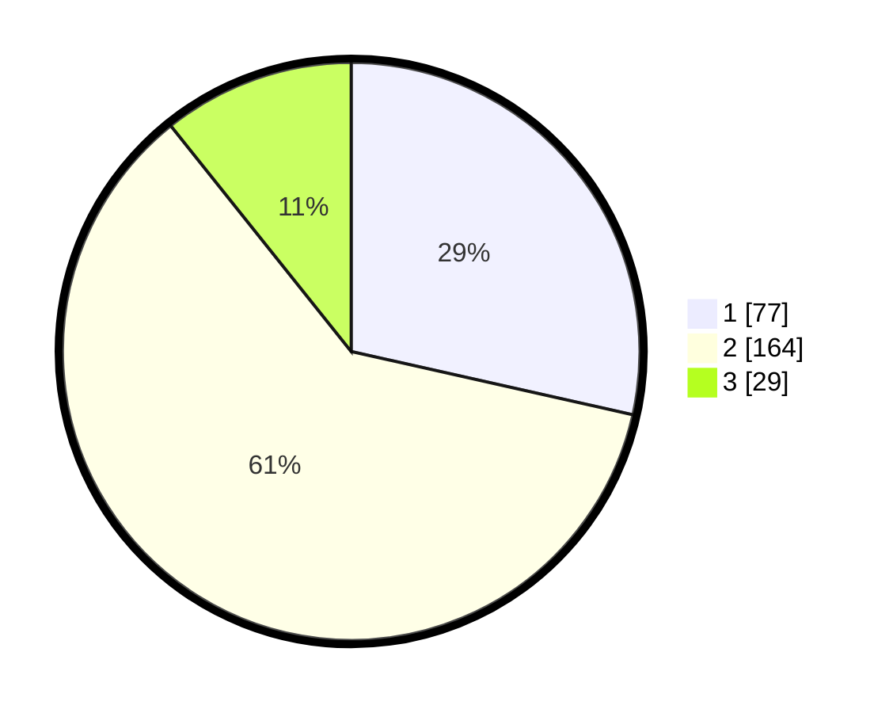

# Hasil

## Grafik

## Tabel

| No. | Nama Paslon    | Suara | Suara (raw) | Persentase |
|:--- |:-------------- | -----:| -----------:| ----------:|
| 1   | ANIES MUHAIMIN | 77    | [77][p-1]   | 28,52      |
| 2   | PRABOWO GIBRAN | 164   | [164][p-2]  | 60,74      |
| 3   | GANJAR MAHFUD  | 29    | [29][p-3]   | 10,74      |

[p-1]: https://github.com/gigit-pemilu/pemilu-2024/blob/main/pilpres/hitung-suara/sub/32-jawa-barat/sub/01-bogor/sub/32-klapanunggal/sub/2001-klapanunggal/sub/060-tps/sub/paslon-1.txt
[p-2]: https://github.com/gigit-pemilu/pemilu-2024/blob/main/pilpres/hitung-suara/sub/32-jawa-barat/sub/01-bogor/sub/32-klapanunggal/sub/2001-klapanunggal/sub/060-tps/sub/paslon-2.txt
[p-3]: https://github.com/gigit-pemilu/pemilu-2024/blob/main/pilpres/hitung-suara/sub/32-jawa-barat/sub/01-bogor/sub/32-klapanunggal/sub/2001-klapanunggal/sub/060-tps/sub/paslon-3.txt

## Foto C Plano

https://sirekap-obj-formc.kpu.go.id/ac72/pemilu/ppwp/32/01/32/20/01/3201322001060-20240217-234505--9eebe18a-935d-4872-a182-3fafea14674a.jpg

https://sirekap-obj-formc.kpu.go.id/ac72/pemilu/ppwp/32/01/32/20/01/3201322001060-20240217-234545--6fd83364-a8c8-4896-bb13-a23d63f4843c.jpg

https://sirekap-obj-formc.kpu.go.id/ac72/pemilu/ppwp/32/01/32/20/01/3201322001060-20240217-234610--177ec90b-79a4-4efc-acd6-46155ecd0eda.jpg

## Metadata

| Key        | Value               |
| ---------- | ------------------- |
| Time Stamp | 2024-02-24 22:31:28 |

