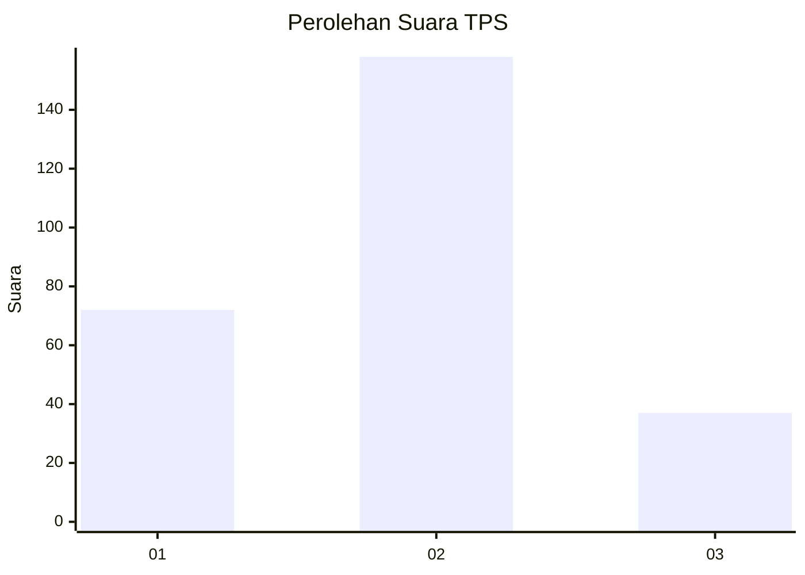
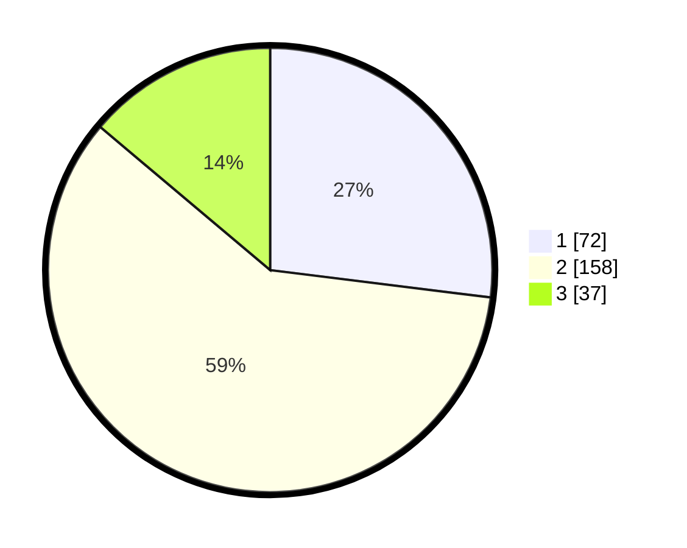

# Hasil

## Grafik

## Tabel

| No. | Nama Paslon    | Suara | Suara (raw) | Persentase |
|:--- |:-------------- | -----:| -----------:| ----------:|
| 1   | ANIES MUHAIMIN | 72    | [72][p-1]   | 26,97      |
| 2   | PRABOWO GIBRAN | 158   | [158][p-2]  | 59,18      |
| 3   | GANJAR MAHFUD  | 37    | [37][p-3]   | 13,86      |

[p-1]: https://github.com/gigit-pemilu/pemilu-2024-32-jawa-barat/blob/main/pilpres/hitung-suara/sub/32-jawa-barat/sub/01-bogor/sub/32-klapanunggal/sub/2002-bojong/sub/016-tps/sub/paslon-1.txt
[p-2]: https://github.com/gigit-pemilu/pemilu-2024-32-jawa-barat/blob/main/pilpres/hitung-suara/sub/32-jawa-barat/sub/01-bogor/sub/32-klapanunggal/sub/2002-bojong/sub/016-tps/sub/paslon-2.txt
[p-3]: https://github.com/gigit-pemilu/pemilu-2024-32-jawa-barat/blob/main/pilpres/hitung-suara/sub/32-jawa-barat/sub/01-bogor/sub/32-klapanunggal/sub/2002-bojong/sub/016-tps/sub/paslon-3.txt

## Foto C Plano

https://sirekap-obj-formc.kpu.go.id/bc20/pemilu/ppwp/32/01/32/20/02/3201322002016-20240214-210428--d0971a81-795c-43cc-a632-9931e4d0f76f.jpg

https://sirekap-obj-formc.kpu.go.id/bc20/pemilu/ppwp/32/01/32/20/02/3201322002016-20240214-224225--0fcc3e79-584c-4633-b71c-9b7a27487842.jpg

https://sirekap-obj-formc.kpu.go.id/bc20/pemilu/ppwp/32/01/32/20/02/3201322002016-20240214-210855--37560f3d-cf08-4337-8c12-8740d0a738f2.jpg

## Metadata

| Key        | Value               |
| ---------- | ------------------- |
| Time Stamp | 2024-02-16 22:01:00 |

