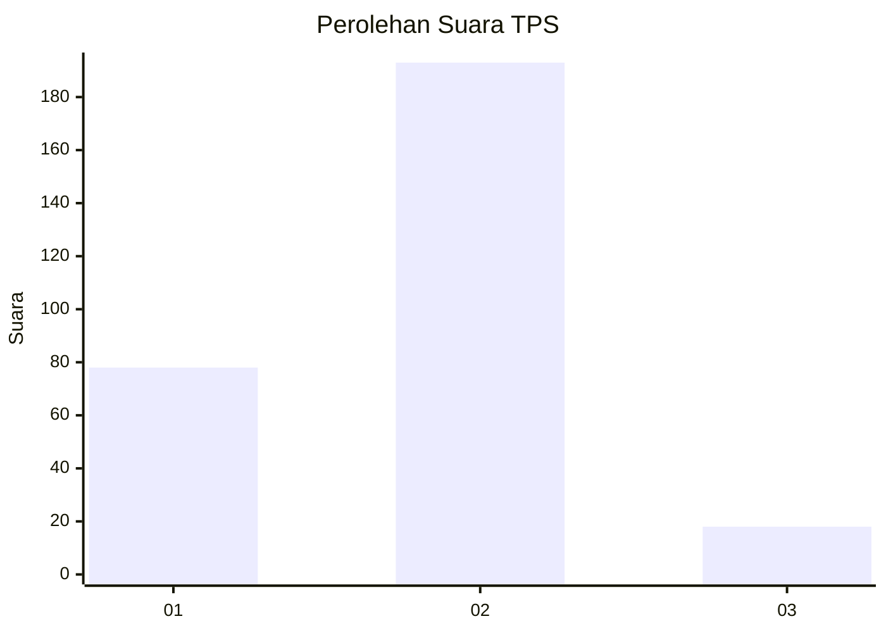
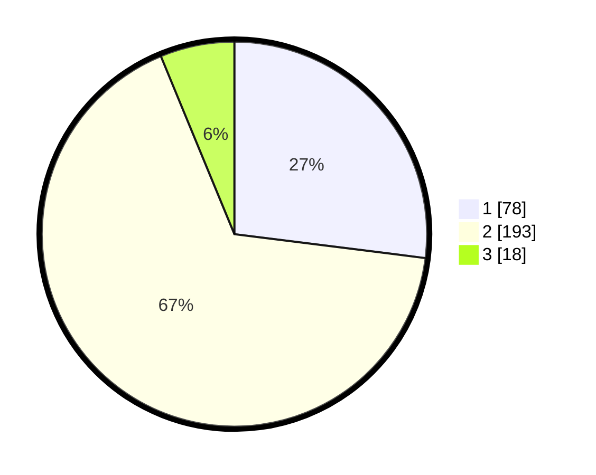

# Hasil

## Grafik

## Tabel

| No. | Nama Paslon    | Suara | Suara (raw) | Persentase |
|:--- |:-------------- | -----:| -----------:| ----------:|
| 1   | ANIES MUHAIMIN | 78    | [78][p-1]   | 26,99      |
| 2   | PRABOWO GIBRAN | 193   | [193][p-2]  | 66,78      |
| 3   | GANJAR MAHFUD  | 18    | [18][p-3]   | 6,23       |

[p-1]: https://github.com/gigit-pemilu/pemilu-2024/blob/main/pilpres/hitung-suara/sub/32-jawa-barat/sub/01-bogor/sub/32-klapanunggal/sub/2002-bojong/sub/017-tps/sub/paslon-1.txt
[p-2]: https://github.com/gigit-pemilu/pemilu-2024/blob/main/pilpres/hitung-suara/sub/32-jawa-barat/sub/01-bogor/sub/32-klapanunggal/sub/2002-bojong/sub/017-tps/sub/paslon-2.txt
[p-3]: https://github.com/gigit-pemilu/pemilu-2024/blob/main/pilpres/hitung-suara/sub/32-jawa-barat/sub/01-bogor/sub/32-klapanunggal/sub/2002-bojong/sub/017-tps/sub/paslon-3.txt

## Foto C Plano

https://sirekap-obj-formc.kpu.go.id/2a02/pemilu/ppwp/32/01/32/20/02/3201322002017-20240218-114635--658977e5-7c01-45cc-b853-a63346673fd1.jpg

https://sirekap-obj-formc.kpu.go.id/2a02/pemilu/ppwp/32/01/32/20/02/3201322002017-20240218-114659--6ec41ccd-57cb-4777-9d6d-4dd50cd8f4cd.jpg

https://sirekap-obj-formc.kpu.go.id/2a02/pemilu/ppwp/32/01/32/20/02/3201322002017-20240218-114851--0e865394-c515-4d76-a33b-a8f7eab46aee.jpg

## Metadata

| Key        | Value               |
| ---------- | ------------------- |
| Time Stamp | 2024-02-25 18:00:00 |

