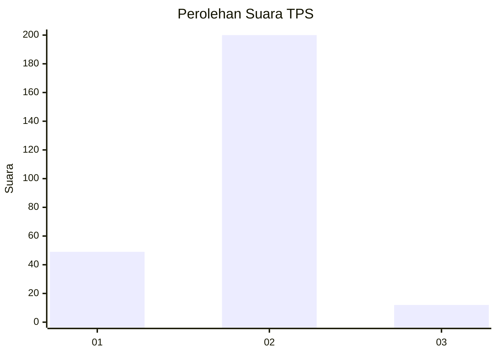
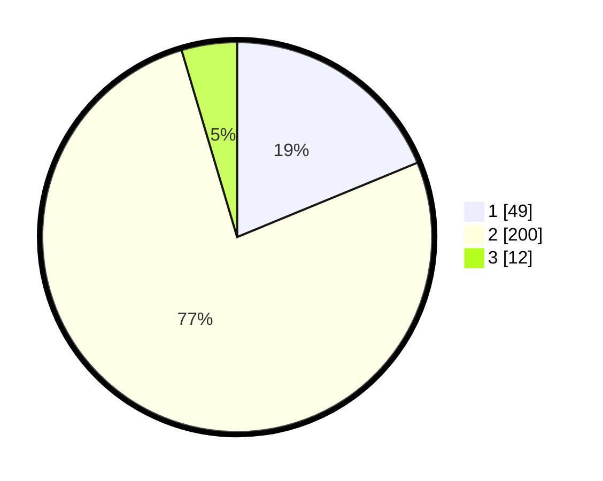

# Hasil

## Grafik

## Tabel

| No. | Nama Paslon    | Suara | Suara (raw) | Persentase |
|:--- |:-------------- | -----:| -----------:| ----------:|
| 1   | ANIES MUHAIMIN | 49    | [49][p-1]   | 18,77      |
| 2   | PRABOWO GIBRAN | 200   | [200][p-2]  | 76,63      |
| 3   | GANJAR MAHFUD  | 12    | [12][p-3]   | 4,60       |

[p-1]: https://github.com/gigit-pemilu/pemilu-2024/blob/main/pilpres/hitung-suara/sub/32-jawa-barat/sub/01-bogor/sub/32-klapanunggal/sub/2003-nambo/sub/012-tps/sub/paslon-1.txt
[p-2]: https://github.com/gigit-pemilu/pemilu-2024/blob/main/pilpres/hitung-suara/sub/32-jawa-barat/sub/01-bogor/sub/32-klapanunggal/sub/2003-nambo/sub/012-tps/sub/paslon-2.txt
[p-3]: https://github.com/gigit-pemilu/pemilu-2024/blob/main/pilpres/hitung-suara/sub/32-jawa-barat/sub/01-bogor/sub/32-klapanunggal/sub/2003-nambo/sub/012-tps/sub/paslon-3.txt

## Foto C Plano

https://sirekap-obj-formc.kpu.go.id/d08a/pemilu/ppwp/32/01/32/20/03/3201322003012-20240214-220822--3fbdae25-7fdd-4eb7-987b-df85d3f74035.jpg

https://sirekap-obj-formc.kpu.go.id/d08a/pemilu/ppwp/32/01/32/20/03/3201322003012-20240214-221017--e98b2c61-81ac-4ca3-9567-3f4c149c1e1f.jpg

https://sirekap-obj-formc.kpu.go.id/d08a/pemilu/ppwp/32/01/32/20/03/3201322003012-20240214-221104--3ad1d336-de6c-4e12-8810-c60002a6df1d.jpg

## Metadata

| Key        | Value               |
| ---------- | ------------------- |
| Time Stamp | 2024-02-16 00:30:27 |

