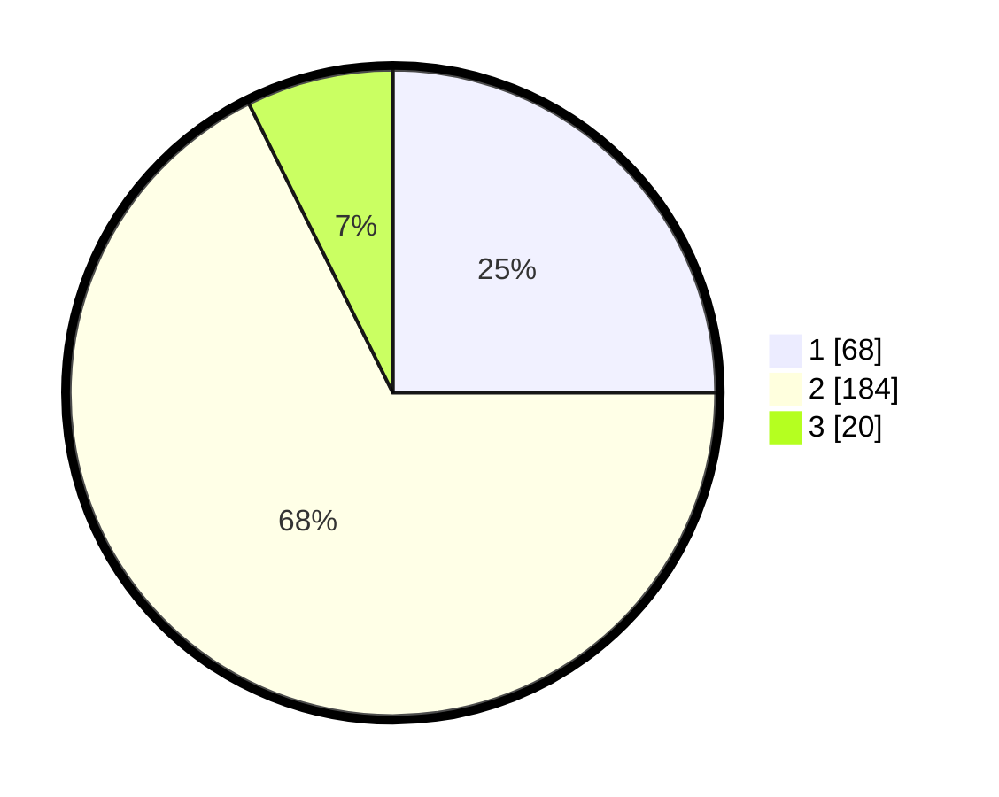

# Hasil

## Grafik

## Tabel

| No. | Nama Paslon    | Suara | Suara (raw) | Persentase |
|:--- |:-------------- | -----:| -----------:| ----------:|
| 1   | ANIES MUHAIMIN | 68    | [68][p-1]   | 25,00      |
| 2   | PRABOWO GIBRAN | 184   | [184][p-2]  | 67,65      |
| 3   | GANJAR MAHFUD  | 20    | [20][p-3]   | 7,35       |

[p-1]: https://github.com/gigit-pemilu/pemilu-2024/blob/main/pilpres/hitung-suara/sub/32-jawa-barat/sub/01-bogor/sub/32-klapanunggal/sub/2005-cikahuripan/sub/005-tps/sub/paslon-1.txt
[p-2]: https://github.com/gigit-pemilu/pemilu-2024/blob/main/pilpres/hitung-suara/sub/32-jawa-barat/sub/01-bogor/sub/32-klapanunggal/sub/2005-cikahuripan/sub/005-tps/sub/paslon-2.txt
[p-3]: https://github.com/gigit-pemilu/pemilu-2024/blob/main/pilpres/hitung-suara/sub/32-jawa-barat/sub/01-bogor/sub/32-klapanunggal/sub/2005-cikahuripan/sub/005-tps/sub/paslon-3.txt

## Foto C Plano

https://sirekap-obj-formc.kpu.go.id/411a/pemilu/ppwp/32/01/32/20/05/3201322005005-20240214-223323--b0003566-38af-4b52-b9b8-828062f4fe56.jpg

https://sirekap-obj-formc.kpu.go.id/411a/pemilu/ppwp/32/01/32/20/05/3201322005005-20240214-191957--0471873d-6f57-4480-b840-1fef7901165e.jpg

https://sirekap-obj-formc.kpu.go.id/411a/pemilu/ppwp/32/01/32/20/05/3201322005005-20240214-194935--1e9422c3-1c1c-4573-822d-5713b215e545.jpg

## Metadata

| Key        | Value               |
| ---------- | ------------------- |
| Time Stamp | 2024-02-19 06:16:00 |

