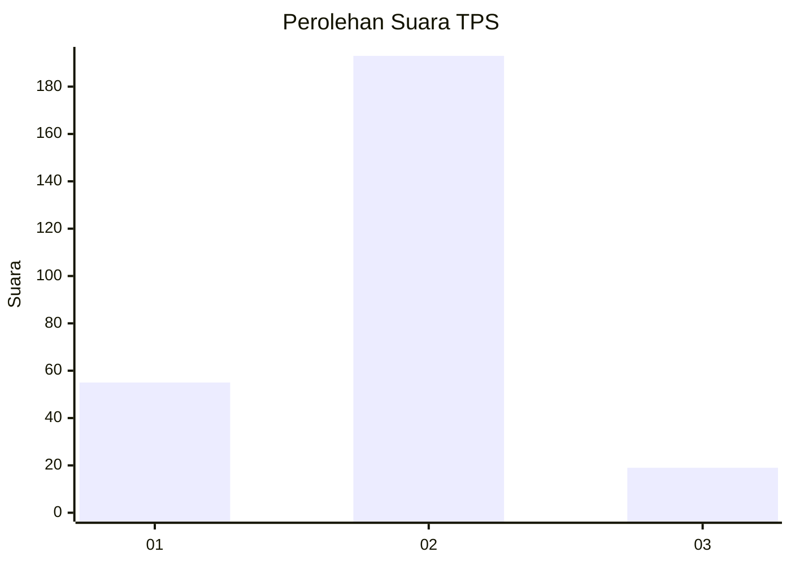
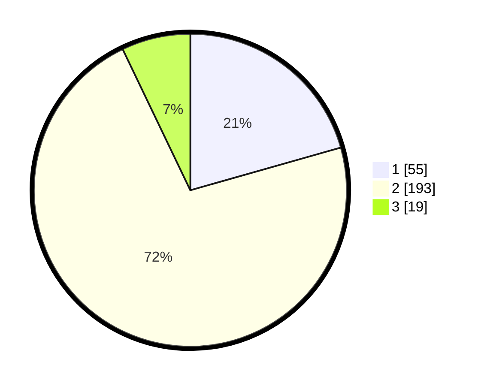

# Hasil

## Grafik

## Tabel

| No. | Nama Paslon    | Suara | Suara (raw) | Persentase |
|:--- |:-------------- | -----:| -----------:| ----------:|
| 1   | ANIES MUHAIMIN | 55    | [55][p-1]   | 20,60      |
| 2   | PRABOWO GIBRAN | 193   | [193][p-2]  | 72,28      |
| 3   | GANJAR MAHFUD  | 19    | [19][p-3]   | 7,12       |

[p-1]: https://github.com/gigit-pemilu/pemilu-2024/blob/main/pilpres/hitung-suara/sub/32-jawa-barat/sub/01-bogor/sub/32-klapanunggal/sub/2005-cikahuripan/sub/007-tps/sub/paslon-1.txt
[p-2]: https://github.com/gigit-pemilu/pemilu-2024/blob/main/pilpres/hitung-suara/sub/32-jawa-barat/sub/01-bogor/sub/32-klapanunggal/sub/2005-cikahuripan/sub/007-tps/sub/paslon-2.txt
[p-3]: https://github.com/gigit-pemilu/pemilu-2024/blob/main/pilpres/hitung-suara/sub/32-jawa-barat/sub/01-bogor/sub/32-klapanunggal/sub/2005-cikahuripan/sub/007-tps/sub/paslon-3.txt

## Foto C Plano

https://sirekap-obj-formc.kpu.go.id/5369/pemilu/ppwp/32/01/32/20/05/3201322005007-20240214-202446--4f8bff41-4de5-4baf-b40a-21d72878c876.jpg

https://sirekap-obj-formc.kpu.go.id/5369/pemilu/ppwp/32/01/32/20/05/3201322005007-20240214-202552--457ab0a7-024c-4907-81bd-1ff0084444e5.jpg

https://sirekap-obj-formc.kpu.go.id/5369/pemilu/ppwp/32/01/32/20/05/3201322005007-20240214-212433--90bed17b-b312-4f99-ac1b-c388370f8a47.jpg

## Metadata

| Key        | Value               |
| ---------- | ------------------- |
| Time Stamp | 2024-02-15 00:41:44 |

