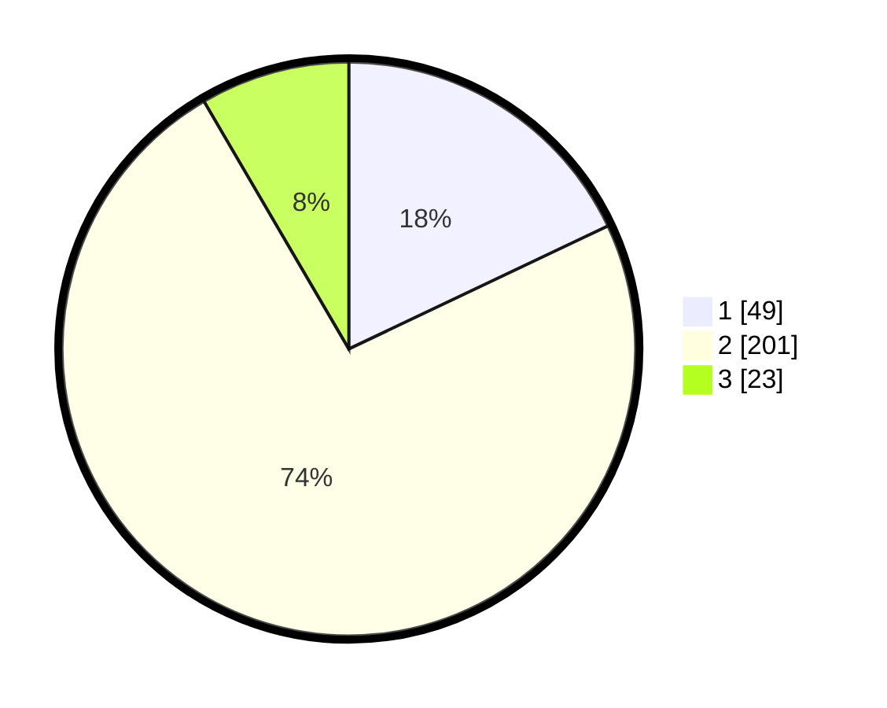

# Hasil

## Grafik

## Tabel

| No. | Nama Paslon    | Suara | Suara (raw) | Persentase |
|:--- |:-------------- | -----:| -----------:| ----------:|
| 1   | ANIES MUHAIMIN | 49    | [49][p-1]   | 17,95      |
| 2   | PRABOWO GIBRAN | 201   | [201][p-2]  | 73,63      |
| 3   | GANJAR MAHFUD  | 23    | [23][p-3]   | 8,42       |

[p-1]: https://github.com/gigit-pemilu/pemilu-2024/blob/main/pilpres/hitung-suara/sub/32-jawa-barat/sub/01-bogor/sub/32-klapanunggal/sub/2005-cikahuripan/sub/009-tps/sub/paslon-1.txt
[p-2]: https://github.com/gigit-pemilu/pemilu-2024/blob/main/pilpres/hitung-suara/sub/32-jawa-barat/sub/01-bogor/sub/32-klapanunggal/sub/2005-cikahuripan/sub/009-tps/sub/paslon-2.txt
[p-3]: https://github.com/gigit-pemilu/pemilu-2024/blob/main/pilpres/hitung-suara/sub/32-jawa-barat/sub/01-bogor/sub/32-klapanunggal/sub/2005-cikahuripan/sub/009-tps/sub/paslon-3.txt

## Foto C Plano

https://sirekap-obj-formc.kpu.go.id/83f4/pemilu/ppwp/32/01/32/20/05/3201322005009-20240215-092211--3ff2b7b2-01c0-4192-8964-201acec9260e.jpg

https://sirekap-obj-formc.kpu.go.id/83f4/pemilu/ppwp/32/01/32/20/05/3201322005009-20240215-092639--980a1676-4f1c-49e2-8657-c5086c1da19e.jpg

https://sirekap-obj-formc.kpu.go.id/83f4/pemilu/ppwp/32/01/32/20/05/3201322005009-20240215-092748--7356f327-ec49-4737-8c34-99e05611ddb0.jpg

## Metadata

| Key        | Value               |
| ---------- | ------------------- |
| Time Stamp | 2024-02-16 22:01:00 |

