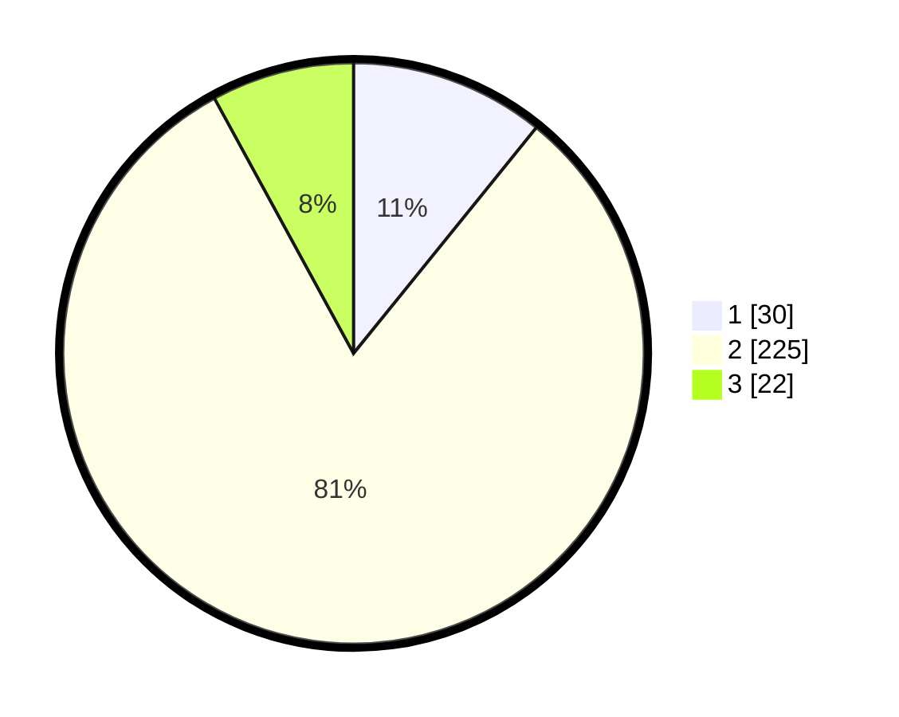

# Hasil

## Grafik

## Tabel

| No. | Nama Paslon    | Suara | Suara (raw) | Persentase |
|:--- |:-------------- | -----:| -----------:| ----------:|
| 1   | ANIES MUHAIMIN | 30    | [30][p-1]   | 10,83      |
| 2   | PRABOWO GIBRAN | 225   | [225][p-2]  | 81,23      |
| 3   | GANJAR MAHFUD  | 22    | [22][p-3]   | 7,94       |

[p-1]: https://github.com/gigit-pemilu/pemilu-2024-32-jawa-barat/blob/main/pilpres/hitung-suara/sub/32-jawa-barat/sub/01-bogor/sub/32-klapanunggal/sub/2005-cikahuripan/sub/010-tps/sub/paslon-1.txt
[p-2]: https://github.com/gigit-pemilu/pemilu-2024-32-jawa-barat/blob/main/pilpres/hitung-suara/sub/32-jawa-barat/sub/01-bogor/sub/32-klapanunggal/sub/2005-cikahuripan/sub/010-tps/sub/paslon-2.txt
[p-3]: https://github.com/gigit-pemilu/pemilu-2024-32-jawa-barat/blob/main/pilpres/hitung-suara/sub/32-jawa-barat/sub/01-bogor/sub/32-klapanunggal/sub/2005-cikahuripan/sub/010-tps/sub/paslon-3.txt

## Foto C Plano

https://sirekap-obj-formc.kpu.go.id/547d/pemilu/ppwp/32/01/32/20/05/3201322005010-20240214-155741--dc7650d4-ca44-4935-a97f-8637b2aa7e70.jpg

https://sirekap-obj-formc.kpu.go.id/547d/pemilu/ppwp/32/01/32/20/05/3201322005010-20240214-204906--d2c1d57c-19ba-47da-91e6-b9ec66128ab7.jpg

https://sirekap-obj-formc.kpu.go.id/547d/pemilu/ppwp/32/01/32/20/05/3201322005010-20240214-210858--2cd671fa-82fd-4309-9d41-ef48187fb088.jpg

## Metadata

| Key        | Value               |
| ---------- | ------------------- |
| Time Stamp | 2024-02-15 00:41:44 |

