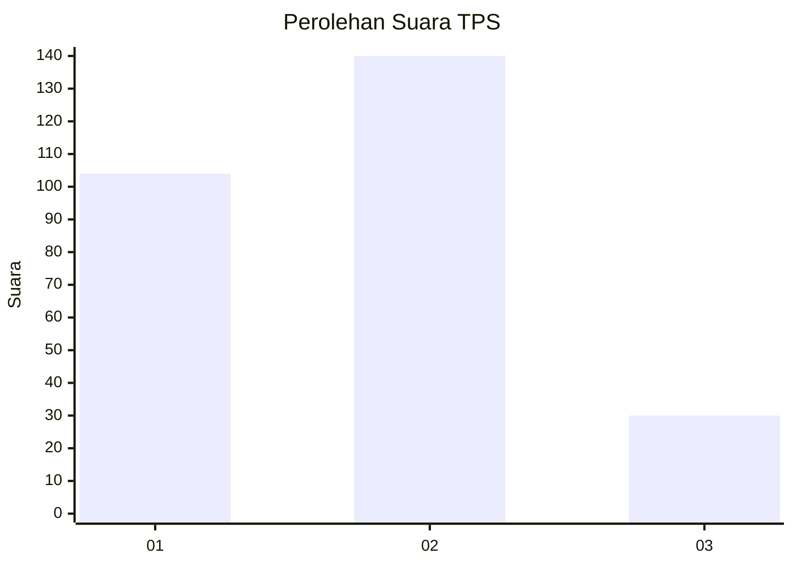
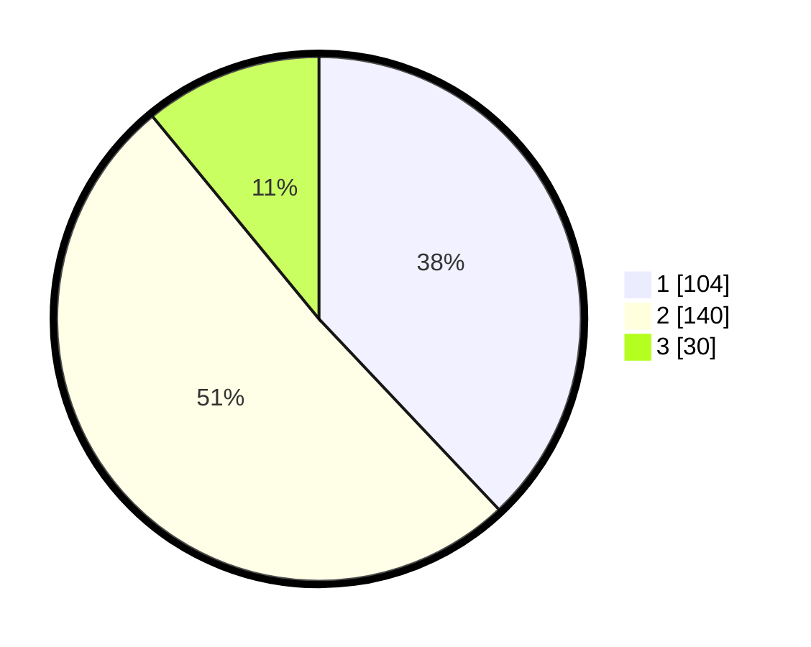

# Hasil

## Grafik

## Tabel

| No. | Nama Paslon    | Suara | Suara (raw) | Persentase |
|:--- |:-------------- | -----:| -----------:| ----------:|
| 1   | ANIES MUHAIMIN | 104   | [104][p-1]  | 37,96      |
| 2   | PRABOWO GIBRAN | 140   | [140][p-2]  | 51,09      |
| 3   | GANJAR MAHFUD  | 30    | [30][p-3]   | 10,95      |

[p-1]: https://github.com/gigit-pemilu/pemilu-2024/blob/main/pilpres/hitung-suara/sub/32-jawa-barat/sub/01-bogor/sub/32-klapanunggal/sub/2005-cikahuripan/sub/043-tps/sub/paslon-1.txt
[p-2]: https://github.com/gigit-pemilu/pemilu-2024/blob/main/pilpres/hitung-suara/sub/32-jawa-barat/sub/01-bogor/sub/32-klapanunggal/sub/2005-cikahuripan/sub/043-tps/sub/paslon-2.txt
[p-3]: https://github.com/gigit-pemilu/pemilu-2024/blob/main/pilpres/hitung-suara/sub/32-jawa-barat/sub/01-bogor/sub/32-klapanunggal/sub/2005-cikahuripan/sub/043-tps/sub/paslon-3.txt

## Foto C Plano

https://sirekap-obj-formc.kpu.go.id/3398/pemilu/ppwp/32/01/32/20/05/3201322005043-20240214-211454--b80e93ed-7a73-440d-8127-b80fb7e4b8cf.jpg

https://sirekap-obj-formc.kpu.go.id/3398/pemilu/ppwp/32/01/32/20/05/3201322005043-20240214-212751--028b1acc-0e28-44f6-bf2c-c0442b067fad.jpg

https://sirekap-obj-formc.kpu.go.id/3398/pemilu/ppwp/32/01/32/20/05/3201322005043-20240214-212804--648b1275-3a46-448d-8850-a7377da9e48f.jpg

## Metadata

| Key        | Value               |
| ---------- | ------------------- |
| Time Stamp | 2024-02-16 00:30:27 |

