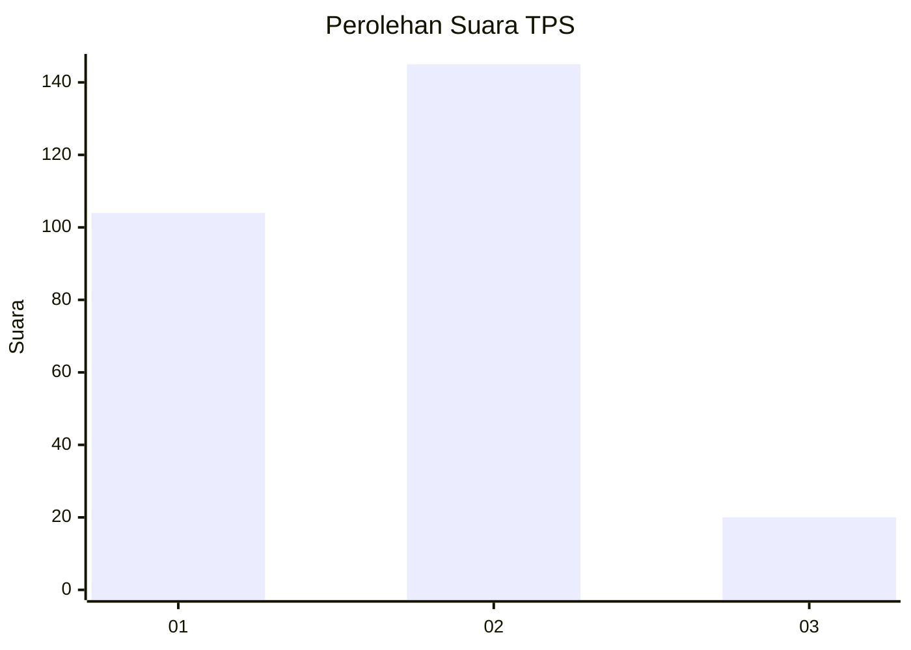

# Hasil

## Grafik

## Tabel

| No. | Nama Paslon    | Suara | Suara (raw) | Persentase |
|:--- |:-------------- | -----:| -----------:| ----------:|
| 1   | ANIES MUHAIMIN | 104   | [104][p-1]  | 38,66      |
| 2   | PRABOWO GIBRAN | 145   | [145][p-2]  | 53,90      |
| 3   | GANJAR MAHFUD  | 20    | [20][p-3]   | 7,43       |

[p-1]: https://github.com/gigit-pemilu/pemilu-2024/blob/main/pilpres/hitung-suara/sub/32-jawa-barat/sub/01-bogor/sub/32-klapanunggal/sub/2005-cikahuripan/sub/044-tps/sub/paslon-1.txt
[p-2]: https://github.com/gigit-pemilu/pemilu-2024/blob/main/pilpres/hitung-suara/sub/32-jawa-barat/sub/01-bogor/sub/32-klapanunggal/sub/2005-cikahuripan/sub/044-tps/sub/paslon-2.txt
[p-3]: https://github.com/gigit-pemilu/pemilu-2024/blob/main/pilpres/hitung-suara/sub/32-jawa-barat/sub/01-bogor/sub/32-klapanunggal/sub/2005-cikahuripan/sub/044-tps/sub/paslon-3.txt

## Foto C Plano

https://sirekap-obj-formc.kpu.go.id/e1eb/pemilu/ppwp/32/01/32/20/05/3201322005044-20240214-230706--5814df4a-37cd-42e7-b013-b610ca5d4ffc.jpg

https://sirekap-obj-formc.kpu.go.id/e1eb/pemilu/ppwp/32/01/32/20/05/3201322005044-20240215-113332--b5e425c6-38f0-4d3a-8e79-e754ffbf4e4a.jpg

https://sirekap-obj-formc.kpu.go.id/e1eb/pemilu/ppwp/32/01/32/20/05/3201322005044-20240215-113507--e38089ef-cd71-4085-8fde-905e7bfb3cbb.jpg

## Metadata

| Key        | Value               |
| ---------- | ------------------- |
| Time Stamp | 2024-02-16 00:30:27 |

