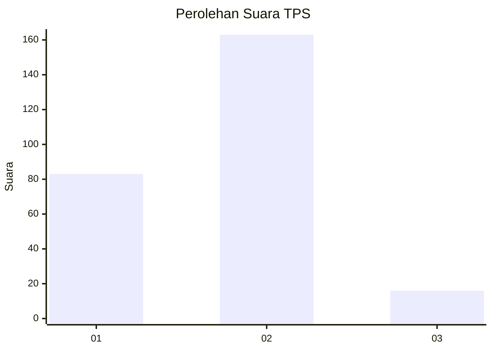
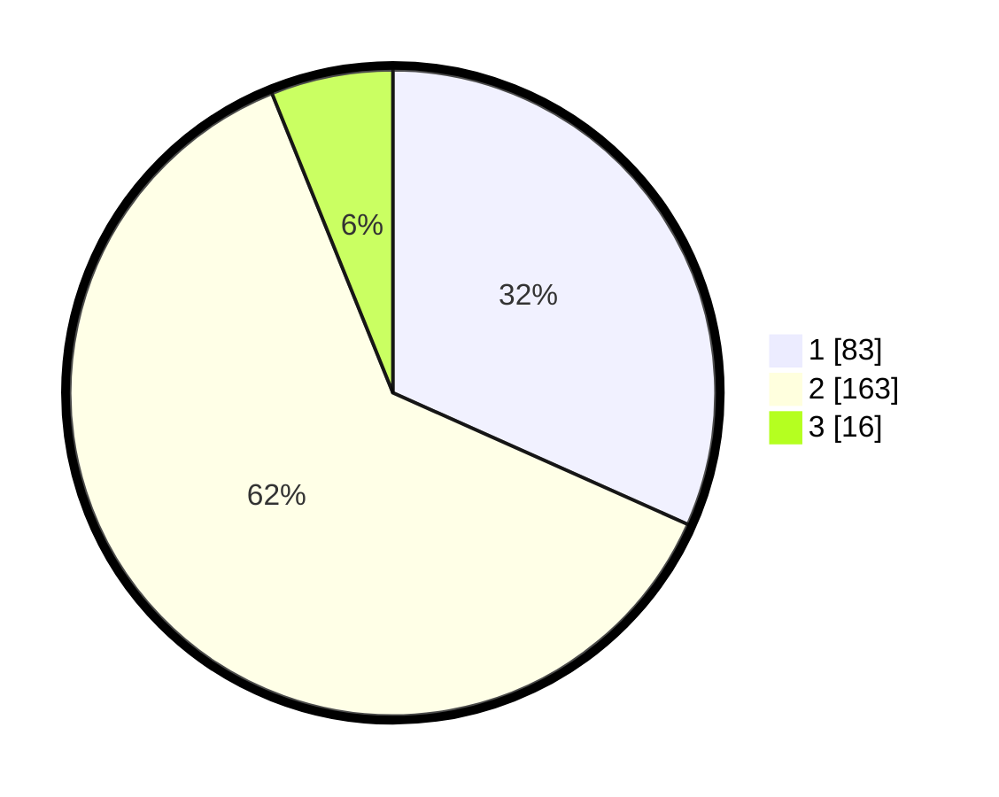

# Hasil

## Grafik

## Tabel

| No. | Nama Paslon    | Suara | Suara (raw) | Persentase |
|:--- |:-------------- | -----:| -----------:| ----------:|
| 1   | ANIES MUHAIMIN | 83    | [83][p-1]   | 31,68      |
| 2   | PRABOWO GIBRAN | 163   | [163][p-2]  | 62,21      |
| 3   | GANJAR MAHFUD  | 16    | [16][p-3]   | 6,11       |

[p-1]: https://github.com/gigit-pemilu/pemilu-2024-32-jawa-barat/blob/main/pilpres/hitung-suara/sub/32-jawa-barat/sub/01-bogor/sub/32-klapanunggal/sub/2006-kembang-kuning/sub/031-tps/sub/paslon-1.txt
[p-2]: https://github.com/gigit-pemilu/pemilu-2024-32-jawa-barat/blob/main/pilpres/hitung-suara/sub/32-jawa-barat/sub/01-bogor/sub/32-klapanunggal/sub/2006-kembang-kuning/sub/031-tps/sub/paslon-2.txt
[p-3]: https://github.com/gigit-pemilu/pemilu-2024-32-jawa-barat/blob/main/pilpres/hitung-suara/sub/32-jawa-barat/sub/01-bogor/sub/32-klapanunggal/sub/2006-kembang-kuning/sub/031-tps/sub/paslon-3.txt

## Foto C Plano

https://sirekap-obj-formc.kpu.go.id/67e6/pemilu/ppwp/32/01/32/20/06/3201322006031-20240215-010858--a7bb4bc9-fa79-4460-94f2-a47a53fff240.jpg

https://sirekap-obj-formc.kpu.go.id/67e6/pemilu/ppwp/32/01/32/20/06/3201322006031-20240215-011038--f2f6be23-5f3d-4147-a4ba-ba0a4d5466ac.jpg

https://sirekap-obj-formc.kpu.go.id/67e6/pemilu/ppwp/32/01/32/20/06/3201322006031-20240215-011355--5ee6c05b-2daf-434e-8160-ac503f30e44c.jpg

## Metadata

| Key        | Value               |
| ---------- | ------------------- |
| Time Stamp | 2024-02-16 22:01:00 |

