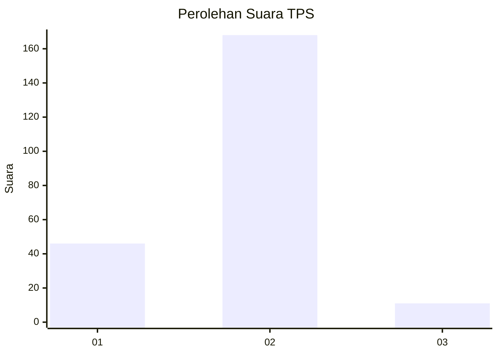
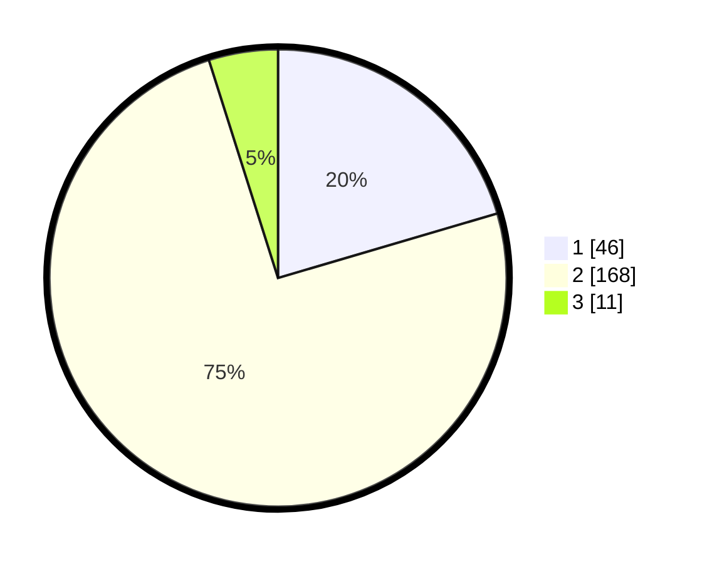

# Hasil

## Grafik

## Tabel

| No. | Nama Paslon    | Suara | Suara (raw) | Persentase |
|:--- |:-------------- | -----:| -----------:| ----------:|
| 1   | ANIES MUHAIMIN | 46    | [46][p-1]   | 20,44      |
| 2   | PRABOWO GIBRAN | 168   | [168][p-2]  | 74,67      |
| 3   | GANJAR MAHFUD  | 11    | [11][p-3]   | 4,89       |

[p-1]: https://github.com/gigit-pemilu/pemilu-2024-32-jawa-barat/blob/main/pilpres/hitung-suara/sub/32-jawa-barat/sub/01-bogor/sub/33-ciseeng/sub/2001-putat-nutug/sub/001-tps/sub/paslon-1.txt
[p-2]: https://github.com/gigit-pemilu/pemilu-2024-32-jawa-barat/blob/main/pilpres/hitung-suara/sub/32-jawa-barat/sub/01-bogor/sub/33-ciseeng/sub/2001-putat-nutug/sub/001-tps/sub/paslon-2.txt
[p-3]: https://github.com/gigit-pemilu/pemilu-2024-32-jawa-barat/blob/main/pilpres/hitung-suara/sub/32-jawa-barat/sub/01-bogor/sub/33-ciseeng/sub/2001-putat-nutug/sub/001-tps/sub/paslon-3.txt

## Foto C Plano

https://sirekap-obj-formc.kpu.go.id/4625/pemilu/ppwp/32/01/33/20/01/3201332001001-20240215-010233--28512f4a-b3bb-4a4a-a7a8-411fd1da3fc6.jpg

https://sirekap-obj-formc.kpu.go.id/4625/pemilu/ppwp/32/01/33/20/01/3201332001001-20240215-010357--c397cd09-9108-4fd3-9282-8f15e82567bc.jpg

https://sirekap-obj-formc.kpu.go.id/4625/pemilu/ppwp/32/01/33/20/01/3201332001001-20240215-010550--d3321707-0ba6-41d9-97e9-5c68116fb574.jpg

## Metadata

| Key        | Value               |
| ---------- | ------------------- |
| Time Stamp | 2024-02-16 22:01:00 |

